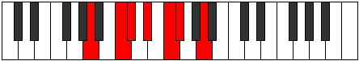

# Mode Aeolydimic

## Links

- [Documentation](index.md)
- [Scales Index](Scales.md)
- [Modes Index](Modes.md)
- [Chords Index](Chords.md)

## Parent Scale

[Dagimic](ScaleDagimic.md)

## Number

[857](https://ianring.com/musictheory/scales/857)

## Perfection

- 2 Perfect notes
- 4 Perfect notes

## Perfection Profile

[false false false false true true]

## Permutations

| Tonic | Notes | Signature | Illustration | Audio |
|-------|-------|-----------|--------------|-------|
| [C](ModeCNaturalAeolydimic.md) | **C**, **D#**, **E**, **F#**, G#, A, **C** | C |  | [midi](ModeCNaturalAeolydimic.mid) [ogg](ModeCNaturalAeolydimic.ogg) |
| [C#](ModeCSharpAeolydimic.md) | **C#**, **D##**, **E#**, **F##**, G##, A#, **C#** | C |  | [midi](ModeCSharpAeolydimic.mid) [ogg](ModeCSharpAeolydimic.ogg) |
| [Db](ModeDFlatAeolydimic.md) | **Db**, **E**, **F**, **G**, A, Bb, **Db** | C |  | [midi](ModeDFlatAeolydimic.mid) [ogg](ModeDFlatAeolydimic.ogg) |
| [D](ModeDNaturalAeolydimic.md) | **D**, **E#**, **F#**, **G#**, A#, B, **D** | C |  | [midi](ModeDNaturalAeolydimic.mid) [ogg](ModeDNaturalAeolydimic.ogg) |
| [D#](ModeDSharpAeolydimic.md) | **D#**, **E##**, **F##**, **G##**, A##, B#, **D#** | C |  | [midi](ModeDSharpAeolydimic.mid) [ogg](ModeDSharpAeolydimic.ogg) |
| [Eb](ModeEFlatAeolydimic.md) | **Eb**, **F#**, **G**, **A**, B, C, **Eb** | C |  | [midi](ModeEFlatAeolydimic.mid) [ogg](ModeEFlatAeolydimic.ogg) |
| [E](ModeENaturalAeolydimic.md) | **E**, **F##**, **G#**, **A#**, B#, C#, **E** | C |  | [midi](ModeENaturalAeolydimic.mid) [ogg](ModeENaturalAeolydimic.ogg) |
| [F](ModeFNaturalAeolydimic.md) | **F**, **G#**, **A**, **B**, C#, D, **F** | C |  | [midi](ModeFNaturalAeolydimic.mid) [ogg](ModeFNaturalAeolydimic.ogg) |
| [F#](ModeFSharpAeolydimic.md) | **F#**, **G##**, **A#**, **B#**, C##, D#, **F#** | C |  | [midi](ModeFSharpAeolydimic.mid) [ogg](ModeFSharpAeolydimic.ogg) |
| [Gb](ModeGFlatAeolydimic.md) | **Gb**, **A**, **Bb**, **C**, D, Eb, **Gb** | C |  | [midi](ModeGFlatAeolydimic.mid) [ogg](ModeGFlatAeolydimic.ogg) |
| [G](ModeGNaturalAeolydimic.md) | **G**, **A#**, **B**, **C#**, D#, E, **G** | C |  | [midi](ModeGNaturalAeolydimic.mid) [ogg](ModeGNaturalAeolydimic.ogg) |
| [G#](ModeGSharpAeolydimic.md) | **G#**, **A##**, **B#**, **C##**, D##, E#, **G#** | C |  | [midi](ModeGSharpAeolydimic.mid) [ogg](ModeGSharpAeolydimic.ogg) |
| [Ab](ModeAFlatAeolydimic.md) | **Ab**, **B**, **C**, **D**, E, F, **Ab** | C |  | [midi](ModeAFlatAeolydimic.mid) [ogg](ModeAFlatAeolydimic.ogg) |
| [A](ModeANaturalAeolydimic.md) | **A**, **B#**, **C#**, **D#**, E#, F#, **A** | C |  | [midi](ModeANaturalAeolydimic.mid) [ogg](ModeANaturalAeolydimic.ogg) |
| [A#](ModeASharpAeolydimic.md) | **A#**, **B##**, **C##**, **D##**, E##, F##, **A#** | C |  | [midi](ModeASharpAeolydimic.mid) [ogg](ModeASharpAeolydimic.ogg) |
| [Bb](ModeBFlatAeolydimic.md) | **Bb**, **C#**, **D**, **E**, F#, G, **Bb** | C |  | [midi](ModeBFlatAeolydimic.mid) [ogg](ModeBFlatAeolydimic.ogg) |
| [B](ModeBNaturalAeolydimic.md) | **B**, **C##**, **D#**, **E#**, F##, G#, **B** | C |  | [midi](ModeBNaturalAeolydimic.mid) [ogg](ModeBNaturalAeolydimic.ogg) |
