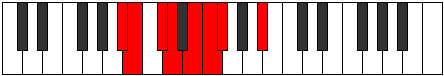

# Mode Aeolygian

## Links

- [Documentation](index.md)
- [Scales Index](Scales.md)
- [Modes Index](Modes.md)
- [Chords Index](Chords.md)

## Parent Scale

[Stygian](ScaleStygian.md)

## Number

[475](https://ianring.com/musictheory/scales/475)

## Interval Pattern

1, 2, 1, 2, 1, 1, 4

## Chord Pattern

i⁰, ii⁰

## Perfection

- 4 Perfect notes
- 3 Perfect notes

## Perfection Profile

[true true false false true false true]

## Permutations

| Tonic | Notes | Signature | Illustration | Audio |
|-------|-------|-----------|--------------|-------|
| [C](ModeCNaturalAeolygian.md) | C, Db, **Eb**, **Fb**, Gb, **Abb**, Bbbb, C | C |  | [midi](https://github.com/edipermadi/music/blob/main/docs/ModeCNaturalAeolygian.mid?raw=true) |
| [C#](ModeCSharpAeolygian.md) | C#, D, **E**, **F**, G, **Ab**, Bbb, C# | C |  | [midi](https://github.com/edipermadi/music/blob/main/docs/ModeCSharpAeolygian.mid?raw=true) |
| [Db](ModeDFlatAeolygian.md) | Db, Ebb, **Fb**, **Gbb**, Abb, **Bbbb**, Cbbb, Db | C |  | [midi](https://github.com/edipermadi/music/blob/main/docs/ModeDFlatAeolygian.mid?raw=true) |
| [D](ModeDNaturalAeolygian.md) | D, Eb, **F**, **Gb**, Ab, **Bbb**, Cbb, D | C |  | [midi](https://github.com/edipermadi/music/blob/main/docs/ModeDNaturalAeolygian.mid?raw=true) |
| [D#](ModeDSharpAeolygian.md) | D#, E, **F#**, **G**, A, **Bb**, Cb, D# | C |  | [midi](https://github.com/edipermadi/music/blob/main/docs/ModeDSharpAeolygian.mid?raw=true) |
| [Eb](ModeEFlatAeolygian.md) | Eb, Fb, **Gb**, **Abb**, Bbb, **Cbb**, Dbbb, Eb | C |  | [midi](https://github.com/edipermadi/music/blob/main/docs/ModeEFlatAeolygian.mid?raw=true) |
| [E](ModeENaturalAeolygian.md) | E, F, **G**, **Ab**, Bb, **Cb**, Dbb, E | C |  | [midi](https://github.com/edipermadi/music/blob/main/docs/ModeENaturalAeolygian.mid?raw=true) |
| [F](ModeFNaturalAeolygian.md) | F, Gb, **Ab**, **Bbb**, Cb, **Dbb**, Ebbb, F | C |  | [midi](https://github.com/edipermadi/music/blob/main/docs/ModeFNaturalAeolygian.mid?raw=true) |
| [F#](ModeFSharpAeolygian.md) | F#, G, **A**, **Bb**, C, **Db**, Ebb, F# | C |  | [midi](https://github.com/edipermadi/music/blob/main/docs/ModeFSharpAeolygian.mid?raw=true) |
| [Gb](ModeGFlatAeolygian.md) | Gb, Abb, **Bbb**, **Cbb**, Dbb, **Ebbb**, Fbbb, Gb | C |  | [midi](https://github.com/edipermadi/music/blob/main/docs/ModeGFlatAeolygian.mid?raw=true) |
| [G](ModeGNaturalAeolygian.md) | G, Ab, **Bb**, **Cb**, Db, **Ebb**, Fbb, G | C |  | [midi](https://github.com/edipermadi/music/blob/main/docs/ModeGNaturalAeolygian.mid?raw=true) |
| [G#](ModeGSharpAeolygian.md) | G#, A, **B**, **C**, D, **Eb**, Fb, G# | C |  | [midi](https://github.com/edipermadi/music/blob/main/docs/ModeGSharpAeolygian.mid?raw=true) |
| [Ab](ModeAFlatAeolygian.md) | Ab, Bbb, **Cb**, **Dbb**, Ebb, **Fbb**, Gbbb, Ab | C |  | [midi](https://github.com/edipermadi/music/blob/main/docs/ModeAFlatAeolygian.mid?raw=true) |
| [A](ModeANaturalAeolygian.md) | A, Bb, **C**, **Db**, Eb, **Fb**, Gbb, A | C |  | [midi](https://github.com/edipermadi/music/blob/main/docs/ModeANaturalAeolygian.mid?raw=true) |
| [A#](ModeASharpAeolygian.md) | A#, B, **C#**, **D**, E, **F**, Gb, A# | C |  | [midi](https://github.com/edipermadi/music/blob/main/docs/ModeASharpAeolygian.mid?raw=true) |
| [Bb](ModeBFlatAeolygian.md) | Bb, Cb, **Db**, **Ebb**, Fb, **Gbb**, Abbb, Bb | C |  | [midi](https://github.com/edipermadi/music/blob/main/docs/ModeBFlatAeolygian.mid?raw=true) |
| [B](ModeBNaturalAeolygian.md) | B, C, **D**, **Eb**, F, **Gb**, Abb, B | C |  | [midi](https://github.com/edipermadi/music/blob/main/docs/ModeBNaturalAeolygian.mid?raw=true) |
