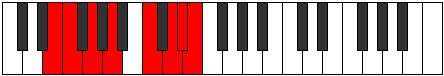

# Mode Aeolylian

## Links

- [Documentation](index.md)
- [Scales Index](Scales.md)
- [Modes Index](Modes.md)
- [Chords Index](Chords.md)

## Parent Scale

[Stathian](ScaleStathian.md)

## Number

[3371](https://ianring.com/musictheory/scales/3371)

## Perfection

- 5 Perfect notes
- 2 Perfect notes

## Perfection Profile

[false true true true true true false]

## Permutations

| Tonic | Notes | Signature | Illustration | Audio |
|-------|-------|-----------|--------------|-------|
| [C](ModeCNaturalAeolylian.md) | **C**, Db, Eb, F, G#, A#, **B**, **C** | C |  | [midi](ModeCNaturalAeolylian.mid) [ogg](ModeCNaturalAeolylian.ogg) |
| [C#](ModeCSharpAeolylian.md) | **C#**, D, E, F#, G##, A##, **B#**, **C#** | C |  | [midi](ModeCSharpAeolylian.mid) [ogg](ModeCSharpAeolylian.ogg) |
| [Db](ModeDFlatAeolylian.md) | **Db**, Ebb, Fb, Gb, A, B, **C**, **Db** | C |  | [midi](ModeDFlatAeolylian.mid) [ogg](ModeDFlatAeolylian.ogg) |
| [D](ModeDNaturalAeolylian.md) | **D**, Eb, F, G, A#, B#, **C#**, **D** | C |  | [midi](ModeDNaturalAeolylian.mid) [ogg](ModeDNaturalAeolylian.ogg) |
| [D#](ModeDSharpAeolylian.md) | **D#**, E, F#, G#, A##, B##, **C##**, **D#** | C |  | [midi](ModeDSharpAeolylian.mid) [ogg](ModeDSharpAeolylian.ogg) |
| [Eb](ModeEFlatAeolylian.md) | **Eb**, Fb, Gb, Ab, B, C#, **D**, **Eb** | C |  | [midi](ModeEFlatAeolylian.mid) [ogg](ModeEFlatAeolylian.ogg) |
| [E](ModeENaturalAeolylian.md) | **E**, F, G, A, B#, C##, **D#**, **E** | C |  | [midi](ModeENaturalAeolylian.mid) [ogg](ModeENaturalAeolylian.ogg) |
| [F](ModeFNaturalAeolylian.md) | **F**, Gb, Ab, Bb, C#, D#, **E**, **F** | C |  | [midi](ModeFNaturalAeolylian.mid) [ogg](ModeFNaturalAeolylian.ogg) |
| [F#](ModeFSharpAeolylian.md) | **F#**, G, A, B, C##, D##, **E#**, **F#** | C |  | [midi](ModeFSharpAeolylian.mid) [ogg](ModeFSharpAeolylian.ogg) |
| [Gb](ModeGFlatAeolylian.md) | **Gb**, Abb, Bbb, Cb, D, E, **F**, **Gb** | C |  | [midi](ModeGFlatAeolylian.mid) [ogg](ModeGFlatAeolylian.ogg) |
| [G](ModeGNaturalAeolylian.md) | **G**, Ab, Bb, C, D#, E#, **F#**, **G** | C |  | [midi](ModeGNaturalAeolylian.mid) [ogg](ModeGNaturalAeolylian.ogg) |
| [G#](ModeGSharpAeolylian.md) | **G#**, A, B, C#, D##, E##, **F##**, **G#** | C |  | [midi](ModeGSharpAeolylian.mid) [ogg](ModeGSharpAeolylian.ogg) |
| [Ab](ModeAFlatAeolylian.md) | **Ab**, Bbb, Cb, Db, E, F#, **G**, **Ab** | C |  | [midi](ModeAFlatAeolylian.mid) [ogg](ModeAFlatAeolylian.ogg) |
| [A](ModeANaturalAeolylian.md) | **A**, Bb, C, D, E#, F##, **G#**, **A** | C |  | [midi](ModeANaturalAeolylian.mid) [ogg](ModeANaturalAeolylian.ogg) |
| [A#](ModeASharpAeolylian.md) | **A#**, B, C#, D#, E##, F###, **G##**, **A#** | C |  | [midi](ModeASharpAeolylian.mid) [ogg](ModeASharpAeolylian.ogg) |
| [Bb](ModeBFlatAeolylian.md) | **Bb**, Cb, Db, Eb, F#, G#, **A**, **Bb** | C |  | [midi](ModeBFlatAeolylian.mid) [ogg](ModeBFlatAeolylian.ogg) |
| [B](ModeBNaturalAeolylian.md) | **B**, C, D, E, F##, G##, **A#**, **B** | C |  | [midi](ModeBNaturalAeolylian.mid) [ogg](ModeBNaturalAeolylian.ogg) |
