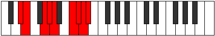

# Mode Aeolylyllic

## Links

- [Documentation](README.md)
- [Scales Index](Scales.md)
- [Modes Index](Modes.md)
- [Chords Index](Chords.md)

## Parent Scale

[Locryllic](ScaleLocryllic.md)

## Number

[3699](https://ianring.com/musictheory/scales/3699)

## Luminosity

-1

## Transposition

1, 3, 1, 1, 3, 1, 1, 1

## Chord Pattern

Ib5, II⁺, iii⁰b3, IVb5, Vb5, vii⁰b3, viii⁰b3

## Perfection

- 6 Perfect notes
- 2 Perfect notes

## Perfection Profile

false, false, true, true, true, true, true, true

## Permutations

| Tonic | Notes | Signature | Illustration | Audio |
|-------|-------|-----------|--------------|-------|
| [C](ModeCNaturalAeolylyllic.md) | **C**, **C#**, E, F, F#, A, A#, B, **C** | C |  | [midi](https://github.com/edipermadi/music/blob/main/docs/ModeCNaturalAeolylyllic.mid?raw=true) |
| [C#](ModeCSharpAeolylyllic.md) | **C#**, **D**, F, F#, G, A#, B, C, **C#** | C |  | [midi](https://github.com/edipermadi/music/blob/main/docs/ModeCSharpAeolylyllic.mid?raw=true) |
| [Db](ModeDFlatAeolylyllic.md) | **Db**, **D**, F, Gb, G, Bb, B, C, **Db** | C |  | [midi](https://github.com/edipermadi/music/blob/main/docs/ModeDFlatAeolylyllic.mid?raw=true) |
| [D](ModeDNaturalAeolylyllic.md) | **D**, **D#**, F#, G, G#, B, C, C#, **D** | C |  | [midi](https://github.com/edipermadi/music/blob/main/docs/ModeDNaturalAeolylyllic.mid?raw=true) |
| [D#](ModeDSharpAeolylyllic.md) | **D#**, **E**, G, G#, A, C, C#, D, **D#** | C |  | [midi](https://github.com/edipermadi/music/blob/main/docs/ModeDSharpAeolylyllic.mid?raw=true) |
| [Eb](ModeEFlatAeolylyllic.md) | **Eb**, **E**, G, Ab, A, C, Db, D, **Eb** | C |  | [midi](https://github.com/edipermadi/music/blob/main/docs/ModeEFlatAeolylyllic.mid?raw=true) |
| [E](ModeENaturalAeolylyllic.md) | **E**, **F**, G#, A, A#, C#, D, D#, **E** | C |  | [midi](https://github.com/edipermadi/music/blob/main/docs/ModeENaturalAeolylyllic.mid?raw=true) |
| [F](ModeFNaturalAeolylyllic.md) | **F**, **F#**, A, A#, B, D, D#, E, **F** | C |  | [midi](https://github.com/edipermadi/music/blob/main/docs/ModeFNaturalAeolylyllic.mid?raw=true) |
| [F#](ModeFSharpAeolylyllic.md) | **F#**, **G**, A#, B, C, D#, E, F, **F#** | C |  | [midi](https://github.com/edipermadi/music/blob/main/docs/ModeFSharpAeolylyllic.mid?raw=true) |
| [Gb](ModeGFlatAeolylyllic.md) | **Gb**, **G**, Bb, B, C, Eb, E, F, **Gb** | C |  | [midi](https://github.com/edipermadi/music/blob/main/docs/ModeGFlatAeolylyllic.mid?raw=true) |
| [G](ModeGNaturalAeolylyllic.md) | **G**, **G#**, B, C, C#, E, F, F#, **G** | C |  | [midi](https://github.com/edipermadi/music/blob/main/docs/ModeGNaturalAeolylyllic.mid?raw=true) |
| [G#](ModeGSharpAeolylyllic.md) | **G#**, **A**, C, C#, D, F, F#, G, **G#** | C |  | [midi](https://github.com/edipermadi/music/blob/main/docs/ModeGSharpAeolylyllic.mid?raw=true) |
| [Ab](ModeAFlatAeolylyllic.md) | **Ab**, **A**, C, Db, D, F, Gb, G, **Ab** | C |  | [midi](https://github.com/edipermadi/music/blob/main/docs/ModeAFlatAeolylyllic.mid?raw=true) |
| [A](ModeANaturalAeolylyllic.md) | **A**, **A#**, C#, D, D#, F#, G, G#, **A** | C |  | [midi](https://github.com/edipermadi/music/blob/main/docs/ModeANaturalAeolylyllic.mid?raw=true) |
| [A#](ModeASharpAeolylyllic.md) | **A#**, **B**, D, D#, E, G, G#, A, **A#** | C |  | [midi](https://github.com/edipermadi/music/blob/main/docs/ModeASharpAeolylyllic.mid?raw=true) |
| [Bb](ModeBFlatAeolylyllic.md) | **Bb**, **B**, D, Eb, E, G, Ab, A, **Bb** | C |  | [midi](https://github.com/edipermadi/music/blob/main/docs/ModeBFlatAeolylyllic.mid?raw=true) |
| [B](ModeBNaturalAeolylyllic.md) | **B**, **C**, D#, E, F, G#, A, A#, **B** | C |  | [midi](https://github.com/edipermadi/music/blob/main/docs/ModeBNaturalAeolylyllic.mid?raw=true) |
