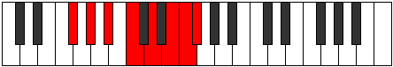
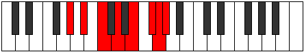

# Mode Aeolynian

## Links

- [Documentation](README.md)
- [Scales Index](Scales.md)
- [Modes Index](Modes.md)
- [Chords Index](Chords.md)

## Parent Scale

[Aeolynian](ScaleAeolynian.md)

## Number

[3413](https://ianring.com/musictheory/scales/3413)

## Luminosity

-1

## Transposition

2, 2, 2, 2, 2, 1, 1

## Chord Pattern

I⁺, II⁺, III, IVb5, v⁰, vi⁰b3, vii

## Perfection

- 2 Perfect notes
- 5 Perfect notes

## Perfection Profile

false, false, true, false, false, false, true

## Permutations

| Tonic | Notes | Signature | Illustration | Audio |
|-------|-------|-----------|--------------|-------|
| [C](ModeCNaturalAeolynian.md) | **C**, **D**, E, **F#**, **G#**, **A#**, B, **C** | C |  | [midi](https://github.com/edipermadi/music/blob/main/docs/ModeCNaturalAeolynian.mid?raw=true) |
| [C#](ModeCSharpAeolynian.md) | **C#**, **D#**, E#, **F##**, **G##**, **A##**, B#, **C#** | C |  | [midi](https://github.com/edipermadi/music/blob/main/docs/ModeCSharpAeolynian.mid?raw=true) |
| [Db](ModeDFlatAeolynian.md) | **Db**, **Eb**, F, **G**, **A**, **B**, C, **Db** | C |  | [midi](https://github.com/edipermadi/music/blob/main/docs/ModeDFlatAeolynian.mid?raw=true) |
| [D](ModeDNaturalAeolynian.md) | **D**, **E**, F#, **G#**, **A#**, **B#**, C#, **D** | C |  | [midi](https://github.com/edipermadi/music/blob/main/docs/ModeDNaturalAeolynian.mid?raw=true) |
| [D#](ModeDSharpAeolynian.md) | **D#**, **E#**, F##, **G##**, **A##**, **B##**, C##, **D#** | C |  | [midi](https://github.com/edipermadi/music/blob/main/docs/ModeDSharpAeolynian.mid?raw=true) |
| [Eb](ModeEFlatAeolynian.md) | **Eb**, **F**, G, **A**, **B**, **C#**, D, **Eb** | C |  | [midi](https://github.com/edipermadi/music/blob/main/docs/ModeEFlatAeolynian.mid?raw=true) |
| [E](ModeENaturalAeolynian.md) | **E**, **F#**, G#, **A#**, **B#**, **C##**, D#, **E** | C |  | [midi](https://github.com/edipermadi/music/blob/main/docs/ModeENaturalAeolynian.mid?raw=true) |
| [F](ModeFNaturalAeolynian.md) | **F**, **G**, A, **B**, **C#**, **D#**, E, **F** | C |  | [midi](https://github.com/edipermadi/music/blob/main/docs/ModeFNaturalAeolynian.mid?raw=true) |
| [F#](ModeFSharpAeolynian.md) | **F#**, **G#**, A#, **B#**, **C##**, **D##**, E#, **F#** | C |  | [midi](https://github.com/edipermadi/music/blob/main/docs/ModeFSharpAeolynian.mid?raw=true) |
| [Gb](ModeGFlatAeolynian.md) | **Gb**, **Ab**, Bb, **C**, **D**, **E**, F, **Gb** | C |  | [midi](https://github.com/edipermadi/music/blob/main/docs/ModeGFlatAeolynian.mid?raw=true) |
| [G](ModeGNaturalAeolynian.md) | **G**, **A**, B, **C#**, **D#**, **E#**, F#, **G** | C |  | [midi](https://github.com/edipermadi/music/blob/main/docs/ModeGNaturalAeolynian.mid?raw=true) |
| [G#](ModeGSharpAeolynian.md) | **G#**, **A#**, B#, **C##**, **D##**, **E##**, F##, **G#** | C |  | [midi](https://github.com/edipermadi/music/blob/main/docs/ModeGSharpAeolynian.mid?raw=true) |
| [Ab](ModeAFlatAeolynian.md) | **Ab**, **Bb**, C, **D**, **E**, **F#**, G, **Ab** | C |  | [midi](https://github.com/edipermadi/music/blob/main/docs/ModeAFlatAeolynian.mid?raw=true) |
| [A](ModeANaturalAeolynian.md) | **A**, **B**, C#, **D#**, **E#**, **F##**, G#, **A** | C |  | [midi](https://github.com/edipermadi/music/blob/main/docs/ModeANaturalAeolynian.mid?raw=true) |
| [A#](ModeASharpAeolynian.md) | **A#**, **B#**, C##, **D##**, **E##**, **F###**, G##, **A#** | C |  | [midi](https://github.com/edipermadi/music/blob/main/docs/ModeASharpAeolynian.mid?raw=true) |
| [Bb](ModeBFlatAeolynian.md) | **Bb**, **C**, D, **E**, **F#**, **G#**, A, **Bb** | C |  | [midi](https://github.com/edipermadi/music/blob/main/docs/ModeBFlatAeolynian.mid?raw=true) |
| [B](ModeBNaturalAeolynian.md) | **B**, **C#**, D#, **E#**, **F##**, **G##**, A#, **B** | C |  | [midi](https://github.com/edipermadi/music/blob/main/docs/ModeBNaturalAeolynian.mid?raw=true) |
