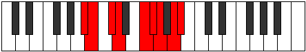

# Mode Aeolynyllic

## Links

- [Documentation](index.md)
- [Scales Index](Scales.md)
- [Modes Index](Modes.md)
- [Chords Index](Chords.md)

## Parent Scale

[Lonyllic](ScaleLonyllic.md)

## Number

[2971](https://ianring.com/musictheory/scales/2971)

## Perfection

- 5 Perfect notes
- 3 Perfect notes

## Interval Pattern

1, 2, 1, 3, 1, 1, 2, 1

## Perfection Profile

[true true false true false true true false]

## Permutations

| Tonic | Notes | Signature | Illustration | Audio |
|-------|-------|-----------|--------------|-------|
| [C](ModeCNaturalAeolynyllic.md) | C, C#, **D#**, E, **G**, G#, A, **B**, C | C |  | [midi](https://github.com/edipermadi/music/blob/main/docs/ModeCNaturalAeolynyllic.mid?raw=true) |
| [C#](ModeCSharpAeolynyllic.md) | C#, D, **E**, F, **G#**, A, A#, **C**, C# | C |  | [midi](https://github.com/edipermadi/music/blob/main/docs/ModeCSharpAeolynyllic.mid?raw=true) |
| [Db](ModeDFlatAeolynyllic.md) | Db, D, **E**, F, **Ab**, A, Bb, **C**, Db | C |  | [midi](https://github.com/edipermadi/music/blob/main/docs/ModeDFlatAeolynyllic.mid?raw=true) |
| [D](ModeDNaturalAeolynyllic.md) | D, D#, **F**, F#, **A**, A#, B, **C#**, D | C |  | [midi](https://github.com/edipermadi/music/blob/main/docs/ModeDNaturalAeolynyllic.mid?raw=true) |
| [D#](ModeDSharpAeolynyllic.md) | D#, E, **F#**, G, **A#**, B, C, **D**, D# | C |  | [midi](https://github.com/edipermadi/music/blob/main/docs/ModeDSharpAeolynyllic.mid?raw=true) |
| [Eb](ModeEFlatAeolynyllic.md) | Eb, E, **Gb**, G, **Bb**, B, C, **D**, Eb | C |  | [midi](https://github.com/edipermadi/music/blob/main/docs/ModeEFlatAeolynyllic.mid?raw=true) |
| [E](ModeENaturalAeolynyllic.md) | E, F, **G**, G#, **B**, C, C#, **D#**, E | C |  | [midi](https://github.com/edipermadi/music/blob/main/docs/ModeENaturalAeolynyllic.mid?raw=true) |
| [F](ModeFNaturalAeolynyllic.md) | F, F#, **G#**, A, **C**, C#, D, **E**, F | C |  | [midi](https://github.com/edipermadi/music/blob/main/docs/ModeFNaturalAeolynyllic.mid?raw=true) |
| [F#](ModeFSharpAeolynyllic.md) | F#, G, **A**, A#, **C#**, D, D#, **F**, F# | C |  | [midi](https://github.com/edipermadi/music/blob/main/docs/ModeFSharpAeolynyllic.mid?raw=true) |
| [Gb](ModeGFlatAeolynyllic.md) | Gb, G, **A**, Bb, **Db**, D, Eb, **F**, Gb | C |  | [midi](https://github.com/edipermadi/music/blob/main/docs/ModeGFlatAeolynyllic.mid?raw=true) |
| [G](ModeGNaturalAeolynyllic.md) | G, G#, **A#**, B, **D**, D#, E, **F#**, G | C |  | [midi](https://github.com/edipermadi/music/blob/main/docs/ModeGNaturalAeolynyllic.mid?raw=true) |
| [G#](ModeGSharpAeolynyllic.md) | G#, A, **B**, C, **D#**, E, F, **G**, G# | C |  | [midi](https://github.com/edipermadi/music/blob/main/docs/ModeGSharpAeolynyllic.mid?raw=true) |
| [Ab](ModeAFlatAeolynyllic.md) | Ab, A, **B**, C, **Eb**, E, F, **G**, Ab | C |  | [midi](https://github.com/edipermadi/music/blob/main/docs/ModeAFlatAeolynyllic.mid?raw=true) |
| [A](ModeANaturalAeolynyllic.md) | A, A#, **C**, C#, **E**, F, F#, **G#**, A | C |  | [midi](https://github.com/edipermadi/music/blob/main/docs/ModeANaturalAeolynyllic.mid?raw=true) |
| [A#](ModeASharpAeolynyllic.md) | A#, B, **C#**, D, **F**, F#, G, **A**, A# | C |  | [midi](https://github.com/edipermadi/music/blob/main/docs/ModeASharpAeolynyllic.mid?raw=true) |
| [Bb](ModeBFlatAeolynyllic.md) | Bb, B, **Db**, D, **F**, Gb, G, **A**, Bb | C |  | [midi](https://github.com/edipermadi/music/blob/main/docs/ModeBFlatAeolynyllic.mid?raw=true) |
| [B](ModeBNaturalAeolynyllic.md) | B, C, **D**, D#, **F#**, G, G#, **A#**, B | C |  | [midi](https://github.com/edipermadi/music/blob/main/docs/ModeBNaturalAeolynyllic.mid?raw=true) |
