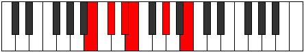

# Mode Aeolyphritonic

## Links

- [Documentation](README.md)
- [Scales Index](Scales.md)
- [Modes Index](Modes.md)
- [Chords Index](Chords.md)

## Parent Scale

[Magitonic](ScaleMagitonic.md)

## Number

[565](https://ianring.com/musictheory/scales/565)

## Interval Pattern

2, 2, 1, 4, 3

## Chord Pattern

## Perfection

- 3 Perfect notes
- 2 Perfect notes

## Perfection Profile

[false true false true true]

## Permutations

| Tonic | Notes | Signature | Illustration | Audio |
|-------|-------|-----------|--------------|-------|
| [C](ModeCNaturalAeolyphritonic.md) | **C**, D, **E**, F, A, **C** | C |  | [midi](https://github.com/edipermadi/music/blob/main/docs/ModeCNaturalAeolyphritonic.mid?raw=true) |
| [C#](ModeCSharpAeolyphritonic.md) | **C#**, D#, **F**, F#, A#, **C#** | C |  | [midi](https://github.com/edipermadi/music/blob/main/docs/ModeCSharpAeolyphritonic.mid?raw=true) |
| [Db](ModeDFlatAeolyphritonic.md) | **Db**, Eb, **F**, Gb, Bb, **Db** | C |  | [midi](https://github.com/edipermadi/music/blob/main/docs/ModeDFlatAeolyphritonic.mid?raw=true) |
| [D](ModeDNaturalAeolyphritonic.md) | **D**, E, **F#**, G, B, **D** | C |  | [midi](https://github.com/edipermadi/music/blob/main/docs/ModeDNaturalAeolyphritonic.mid?raw=true) |
| [D#](ModeDSharpAeolyphritonic.md) | **D#**, F, **G**, G#, C, **D#** | C |  | [midi](https://github.com/edipermadi/music/blob/main/docs/ModeDSharpAeolyphritonic.mid?raw=true) |
| [Eb](ModeEFlatAeolyphritonic.md) | **Eb**, F, **G**, Ab, C, **Eb** | C |  | [midi](https://github.com/edipermadi/music/blob/main/docs/ModeEFlatAeolyphritonic.mid?raw=true) |
| [E](ModeENaturalAeolyphritonic.md) | **E**, F#, **G#**, A, C#, **E** | C |  | [midi](https://github.com/edipermadi/music/blob/main/docs/ModeENaturalAeolyphritonic.mid?raw=true) |
| [F](ModeFNaturalAeolyphritonic.md) | **F**, G, **A**, A#, D, **F** | C |  | [midi](https://github.com/edipermadi/music/blob/main/docs/ModeFNaturalAeolyphritonic.mid?raw=true) |
| [F#](ModeFSharpAeolyphritonic.md) | **F#**, G#, **A#**, B, D#, **F#** | C |  | [midi](https://github.com/edipermadi/music/blob/main/docs/ModeFSharpAeolyphritonic.mid?raw=true) |
| [Gb](ModeGFlatAeolyphritonic.md) | **Gb**, Ab, **Bb**, B, Eb, **Gb** | C |  | [midi](https://github.com/edipermadi/music/blob/main/docs/ModeGFlatAeolyphritonic.mid?raw=true) |
| [G](ModeGNaturalAeolyphritonic.md) | **G**, A, **B**, C, E, **G** | C |  | [midi](https://github.com/edipermadi/music/blob/main/docs/ModeGNaturalAeolyphritonic.mid?raw=true) |
| [G#](ModeGSharpAeolyphritonic.md) | **G#**, A#, **C**, C#, F, **G#** | C |  | [midi](https://github.com/edipermadi/music/blob/main/docs/ModeGSharpAeolyphritonic.mid?raw=true) |
| [Ab](ModeAFlatAeolyphritonic.md) | **Ab**, Bb, **C**, Db, F, **Ab** | C |  | [midi](https://github.com/edipermadi/music/blob/main/docs/ModeAFlatAeolyphritonic.mid?raw=true) |
| [A](ModeANaturalAeolyphritonic.md) | **A**, B, **C#**, D, F#, **A** | C |  | [midi](https://github.com/edipermadi/music/blob/main/docs/ModeANaturalAeolyphritonic.mid?raw=true) |
| [A#](ModeASharpAeolyphritonic.md) | **A#**, C, **D**, D#, G, **A#** | C |  | [midi](https://github.com/edipermadi/music/blob/main/docs/ModeASharpAeolyphritonic.mid?raw=true) |
| [Bb](ModeBFlatAeolyphritonic.md) | **Bb**, C, **D**, Eb, G, **Bb** | C |  | [midi](https://github.com/edipermadi/music/blob/main/docs/ModeBFlatAeolyphritonic.mid?raw=true) |
| [B](ModeBNaturalAeolyphritonic.md) | **B**, C#, **D#**, E, G#, **B** | C |  | [midi](https://github.com/edipermadi/music/blob/main/docs/ModeBNaturalAeolyphritonic.mid?raw=true) |
