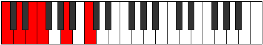
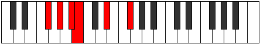

# Mode Aeolyphritonic

## Links

- [Documentation](index.md)
- [Scales Index](Scales.md)
- [Modes Index](Modes.md)
- [Chords Index](Chords.md)

## Parent Scale

[Magitonic](ScaleMagitonic.md)

## Number

[565](https://ianring.com/musictheory/scales/565)

## Perfection

- 3 Perfect notes
- 2 Perfect notes

## Perfection Profile

[false true false true true]

## Permutations

| Tonic | Notes | Signature | Illustration | Audio |
|-------|-------|-----------|--------------|-------|
| [C](ModeCNaturalAeolyphritonic.md) | **C**, D, **E**, F, A, **C** | C |  | [midi](ModeCNaturalAeolyphritonic.mid) [ogg](ModeCNaturalAeolyphritonic.ogg) |
| [C#](ModeCSharpAeolyphritonic.md) | **C#**, D#, **F**, F#, A#, **C#** | C |  | [midi](ModeCSharpAeolyphritonic.mid) [ogg](ModeCSharpAeolyphritonic.ogg) |
| [Db](ModeDFlatAeolyphritonic.md) | **Db**, Eb, **F**, Gb, Bb, **Db** | C |  | [midi](ModeDFlatAeolyphritonic.mid) [ogg](ModeDFlatAeolyphritonic.ogg) |
| [D](ModeDNaturalAeolyphritonic.md) | **D**, E, **F#**, G, B, **D** | C |  | [midi](ModeDNaturalAeolyphritonic.mid) [ogg](ModeDNaturalAeolyphritonic.ogg) |
| [D#](ModeDSharpAeolyphritonic.md) | **D#**, F, **G**, G#, C, **D#** | C |  | [midi](ModeDSharpAeolyphritonic.mid) [ogg](ModeDSharpAeolyphritonic.ogg) |
| [Eb](ModeEFlatAeolyphritonic.md) | **Eb**, F, **G**, Ab, C, **Eb** | C |  | [midi](ModeEFlatAeolyphritonic.mid) [ogg](ModeEFlatAeolyphritonic.ogg) |
| [E](ModeENaturalAeolyphritonic.md) | **E**, F#, **G#**, A, C#, **E** | C |  | [midi](ModeENaturalAeolyphritonic.mid) [ogg](ModeENaturalAeolyphritonic.ogg) |
| [F](ModeFNaturalAeolyphritonic.md) | **F**, G, **A**, A#, D, **F** | C |  | [midi](ModeFNaturalAeolyphritonic.mid) [ogg](ModeFNaturalAeolyphritonic.ogg) |
| [F#](ModeFSharpAeolyphritonic.md) | **F#**, G#, **A#**, B, D#, **F#** | C |  | [midi](ModeFSharpAeolyphritonic.mid) [ogg](ModeFSharpAeolyphritonic.ogg) |
| [Gb](ModeGFlatAeolyphritonic.md) | **Gb**, Ab, **Bb**, B, Eb, **Gb** | C |  | [midi](ModeGFlatAeolyphritonic.mid) [ogg](ModeGFlatAeolyphritonic.ogg) |
| [G](ModeGNaturalAeolyphritonic.md) | **G**, A, **B**, C, E, **G** | C |  | [midi](ModeGNaturalAeolyphritonic.mid) [ogg](ModeGNaturalAeolyphritonic.ogg) |
| [G#](ModeGSharpAeolyphritonic.md) | **G#**, A#, **C**, C#, F, **G#** | C |  | [midi](ModeGSharpAeolyphritonic.mid) [ogg](ModeGSharpAeolyphritonic.ogg) |
| [Ab](ModeAFlatAeolyphritonic.md) | **Ab**, Bb, **C**, Db, F, **Ab** | C |  | [midi](ModeAFlatAeolyphritonic.mid) [ogg](ModeAFlatAeolyphritonic.ogg) |
| [A](ModeANaturalAeolyphritonic.md) | **A**, B, **C#**, D, F#, **A** | C |  | [midi](ModeANaturalAeolyphritonic.mid) [ogg](ModeANaturalAeolyphritonic.ogg) |
| [A#](ModeASharpAeolyphritonic.md) | **A#**, C, **D**, D#, G, **A#** | C |  | [midi](ModeASharpAeolyphritonic.mid) [ogg](ModeASharpAeolyphritonic.ogg) |
| [Bb](ModeBFlatAeolyphritonic.md) | **Bb**, C, **D**, Eb, G, **Bb** | C |  | [midi](ModeBFlatAeolyphritonic.mid) [ogg](ModeBFlatAeolyphritonic.ogg) |
| [B](ModeBNaturalAeolyphritonic.md) | **B**, C#, **D#**, E, G#, **B** | C |  | [midi](ModeBNaturalAeolyphritonic.mid) [ogg](ModeBNaturalAeolyphritonic.ogg) |
