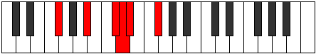
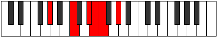
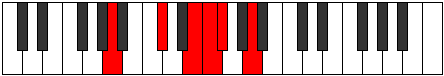

# Mode Aeolyritonic

## Links

- [Documentation](index.md)
- [Scales Index](Scales.md)
- [Modes Index](Modes.md)
- [Chords Index](Chords.md)

## Parent Scale

[Aeolyritonic](ScaleAeolyritonic.md)

## Number

[913](https://ianring.com/musictheory/scales/913)

## Perfection

- 2 Perfect notes
- 3 Perfect notes

## Perfection Profile

[true false false false true]

## Permutations

| Tonic | Notes | Signature | Illustration | Audio |
|-------|-------|-----------|--------------|-------|
| [C](ModeCNaturalAeolyritonic.md) | C, **E**, **G**, **G#**, A, C | C |  | [midi](ModeCNaturalAeolyritonic.mid) [ogg](ModeCNaturalAeolyritonic.ogg) |
| [C#](ModeCSharpAeolyritonic.md) | C#, **F**, **G#**, **A**, A#, C# | C |  | [midi](ModeCSharpAeolyritonic.mid) [ogg](ModeCSharpAeolyritonic.ogg) |
| [Db](ModeDFlatAeolyritonic.md) | Db, **F**, **Ab**, **A**, Bb, Db | C |  | [midi](ModeDFlatAeolyritonic.mid) [ogg](ModeDFlatAeolyritonic.ogg) |
| [D](ModeDNaturalAeolyritonic.md) | D, **F#**, **A**, **A#**, B, D | C |  | [midi](ModeDNaturalAeolyritonic.mid) [ogg](ModeDNaturalAeolyritonic.ogg) |
| [D#](ModeDSharpAeolyritonic.md) | D#, **G**, **A#**, **B**, C, D# | C |  | [midi](ModeDSharpAeolyritonic.mid) [ogg](ModeDSharpAeolyritonic.ogg) |
| [Eb](ModeEFlatAeolyritonic.md) | Eb, **G**, **Bb**, **B**, C, Eb | C |  | [midi](ModeEFlatAeolyritonic.mid) [ogg](ModeEFlatAeolyritonic.ogg) |
| [E](ModeENaturalAeolyritonic.md) | E, **G#**, **B**, **C**, C#, E | C |  | [midi](ModeENaturalAeolyritonic.mid) [ogg](ModeENaturalAeolyritonic.ogg) |
| [F](ModeFNaturalAeolyritonic.md) | F, **A**, **C**, **C#**, D, F | C |  | [midi](ModeFNaturalAeolyritonic.mid) [ogg](ModeFNaturalAeolyritonic.ogg) |
| [F#](ModeFSharpAeolyritonic.md) | F#, **A#**, **C#**, **D**, D#, F# | C |  | [midi](ModeFSharpAeolyritonic.mid) [ogg](ModeFSharpAeolyritonic.ogg) |
| [Gb](ModeGFlatAeolyritonic.md) | Gb, **Bb**, **Db**, **D**, Eb, Gb | C |  | [midi](ModeGFlatAeolyritonic.mid) [ogg](ModeGFlatAeolyritonic.ogg) |
| [G](ModeGNaturalAeolyritonic.md) | G, **B**, **D**, **D#**, E, G | C |  | [midi](ModeGNaturalAeolyritonic.mid) [ogg](ModeGNaturalAeolyritonic.ogg) |
| [G#](ModeGSharpAeolyritonic.md) | G#, **C**, **D#**, **E**, F, G# | C |  | [midi](ModeGSharpAeolyritonic.mid) [ogg](ModeGSharpAeolyritonic.ogg) |
| [Ab](ModeAFlatAeolyritonic.md) | Ab, **C**, **Eb**, **E**, F, Ab | C |  | [midi](ModeAFlatAeolyritonic.mid) [ogg](ModeAFlatAeolyritonic.ogg) |
| [A](ModeANaturalAeolyritonic.md) | A, **C#**, **E**, **F**, F#, A | C |  | [midi](ModeANaturalAeolyritonic.mid) [ogg](ModeANaturalAeolyritonic.ogg) |
| [A#](ModeASharpAeolyritonic.md) | A#, **D**, **F**, **F#**, G, A# | C |  | [midi](ModeASharpAeolyritonic.mid) [ogg](ModeASharpAeolyritonic.ogg) |
| [Bb](ModeBFlatAeolyritonic.md) | Bb, **D**, **F**, **Gb**, G, Bb | C |  | [midi](ModeBFlatAeolyritonic.mid) [ogg](ModeBFlatAeolyritonic.ogg) |
| [B](ModeBNaturalAeolyritonic.md) | B, **D#**, **F#**, **G**, G#, B | C |  | [midi](ModeBNaturalAeolyritonic.mid) [ogg](ModeBNaturalAeolyritonic.ogg) |
