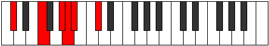
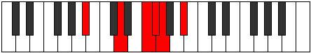

# Mode Aeolyritonic

## Links

- [Documentation](index.md)
- [Scales Index](Scales.md)
- [Modes Index](Modes.md)
- [Chords Index](Chords.md)

## Parent Scale

[Aeolyritonic](ScaleAeolyritonic.md)

## Number

[913](https://ianring.com/musictheory/scales/913)

## Interval Pattern

4, 3, 1, 1, 3

## Chord Pattern

II⁺

## Perfection

- 2 Perfect notes
- 3 Perfect notes

## Perfection Profile

[true false false false true]

## Permutations

| Tonic | Notes | Signature | Illustration | Audio |
|-------|-------|-----------|--------------|-------|
| [C](ModeCNaturalAeolyritonic.md) | C, **E**, **G**, **G#**, A, C | C |  | [midi](https://github.com/edipermadi/music/blob/main/docs/ModeCNaturalAeolyritonic.mid?raw=true) |
| [C#](ModeCSharpAeolyritonic.md) | C#, **F**, **G#**, **A**, A#, C# | C |  | [midi](https://github.com/edipermadi/music/blob/main/docs/ModeCSharpAeolyritonic.mid?raw=true) |
| [Db](ModeDFlatAeolyritonic.md) | Db, **F**, **Ab**, **A**, Bb, Db | C |  | [midi](https://github.com/edipermadi/music/blob/main/docs/ModeDFlatAeolyritonic.mid?raw=true) |
| [D](ModeDNaturalAeolyritonic.md) | D, **F#**, **A**, **A#**, B, D | C |  | [midi](https://github.com/edipermadi/music/blob/main/docs/ModeDNaturalAeolyritonic.mid?raw=true) |
| [D#](ModeDSharpAeolyritonic.md) | D#, **G**, **A#**, **B**, C, D# | C |  | [midi](https://github.com/edipermadi/music/blob/main/docs/ModeDSharpAeolyritonic.mid?raw=true) |
| [Eb](ModeEFlatAeolyritonic.md) | Eb, **G**, **Bb**, **B**, C, Eb | C |  | [midi](https://github.com/edipermadi/music/blob/main/docs/ModeEFlatAeolyritonic.mid?raw=true) |
| [E](ModeENaturalAeolyritonic.md) | E, **G#**, **B**, **C**, C#, E | C |  | [midi](https://github.com/edipermadi/music/blob/main/docs/ModeENaturalAeolyritonic.mid?raw=true) |
| [F](ModeFNaturalAeolyritonic.md) | F, **A**, **C**, **C#**, D, F | C |  | [midi](https://github.com/edipermadi/music/blob/main/docs/ModeFNaturalAeolyritonic.mid?raw=true) |
| [F#](ModeFSharpAeolyritonic.md) | F#, **A#**, **C#**, **D**, D#, F# | C |  | [midi](https://github.com/edipermadi/music/blob/main/docs/ModeFSharpAeolyritonic.mid?raw=true) |
| [Gb](ModeGFlatAeolyritonic.md) | Gb, **Bb**, **Db**, **D**, Eb, Gb | C |  | [midi](https://github.com/edipermadi/music/blob/main/docs/ModeGFlatAeolyritonic.mid?raw=true) |
| [G](ModeGNaturalAeolyritonic.md) | G, **B**, **D**, **D#**, E, G | C |  | [midi](https://github.com/edipermadi/music/blob/main/docs/ModeGNaturalAeolyritonic.mid?raw=true) |
| [G#](ModeGSharpAeolyritonic.md) | G#, **C**, **D#**, **E**, F, G# | C |  | [midi](https://github.com/edipermadi/music/blob/main/docs/ModeGSharpAeolyritonic.mid?raw=true) |
| [Ab](ModeAFlatAeolyritonic.md) | Ab, **C**, **Eb**, **E**, F, Ab | C |  | [midi](https://github.com/edipermadi/music/blob/main/docs/ModeAFlatAeolyritonic.mid?raw=true) |
| [A](ModeANaturalAeolyritonic.md) | A, **C#**, **E**, **F**, F#, A | C |  | [midi](https://github.com/edipermadi/music/blob/main/docs/ModeANaturalAeolyritonic.mid?raw=true) |
| [A#](ModeASharpAeolyritonic.md) | A#, **D**, **F**, **F#**, G, A# | C |  | [midi](https://github.com/edipermadi/music/blob/main/docs/ModeASharpAeolyritonic.mid?raw=true) |
| [Bb](ModeBFlatAeolyritonic.md) | Bb, **D**, **F**, **Gb**, G, Bb | C |  | [midi](https://github.com/edipermadi/music/blob/main/docs/ModeBFlatAeolyritonic.mid?raw=true) |
| [B](ModeBNaturalAeolyritonic.md) | B, **D#**, **F#**, **G**, G#, B | C |  | [midi](https://github.com/edipermadi/music/blob/main/docs/ModeBNaturalAeolyritonic.mid?raw=true) |
