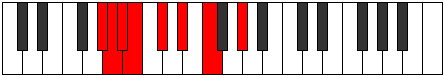

# Mode Aeolythian

## Links

- [Documentation](index.md)
- [Scales Index](Scales.md)
- [Modes Index](Modes.md)
- [Chords Index](Chords.md)

## Parent Scale

[Pagian](ScalePagian.md)

## Number

[687](https://ianring.com/musictheory/scales/687)

## Perfection

- 4 Perfect notes
- 3 Perfect notes

## Perfection Profile

[true false true false true true false]

## Permutations

| Tonic | Notes | Signature | Illustration | Audio |
|-------|-------|-----------|--------------|-------|
| [C](ModeCNaturalAeolythian.md) | C, **Db**, Ebb, **Fbb**, Gbb, Abb, **Bbb**, C | C |  | [midi](ModeCNaturalAeolythian.mid) [ogg](ModeCNaturalAeolythian.ogg) |
| [C#](ModeCSharpAeolythian.md) | C#, **D**, Eb, **Fb**, Gb, Ab, **Bb**, C# | C |  | [midi](ModeCSharpAeolythian.mid) [ogg](ModeCSharpAeolythian.ogg) |
| [Db](ModeDFlatAeolythian.md) | Db, **Ebb**, Fbb, **Gbbb**, Abbb, Bbbb, **Cbb**, Db | C |  | [midi](ModeDFlatAeolythian.mid) [ogg](ModeDFlatAeolythian.ogg) |
| [D](ModeDNaturalAeolythian.md) | D, **Eb**, Fb, **Gbb**, Abb, Bbb, **Cb**, D | C |  | [midi](ModeDNaturalAeolythian.mid) [ogg](ModeDNaturalAeolythian.ogg) |
| [D#](ModeDSharpAeolythian.md) | D#, **E**, F, **Gb**, Ab, Bb, **C**, D# | C |  | [midi](ModeDSharpAeolythian.mid) [ogg](ModeDSharpAeolythian.ogg) |
| [Eb](ModeEFlatAeolythian.md) | Eb, **Fb**, Gbb, **Abbb**, Bbbb, Cbb, **Dbb**, Eb | C |  | [midi](ModeEFlatAeolythian.mid) [ogg](ModeEFlatAeolythian.ogg) |
| [E](ModeENaturalAeolythian.md) | E, **F**, Gb, **Abb**, Bbb, Cb, **Db**, E | C |  | [midi](ModeENaturalAeolythian.mid) [ogg](ModeENaturalAeolythian.ogg) |
| [F](ModeFNaturalAeolythian.md) | F, **Gb**, Abb, **Bbbb**, Cbb, Dbb, **Ebb**, F | C |  | [midi](ModeFNaturalAeolythian.mid) [ogg](ModeFNaturalAeolythian.ogg) |
| [F#](ModeFSharpAeolythian.md) | F#, **G**, Ab, **Bbb**, Cb, Db, **Eb**, F# | C |  | [midi](ModeFSharpAeolythian.mid) [ogg](ModeFSharpAeolythian.ogg) |
| [Gb](ModeGFlatAeolythian.md) | Gb, **Abb**, Bbbb, **Cbbb**, Dbbb, Ebbb, **Fbb**, Gb | C |  | [midi](ModeGFlatAeolythian.mid) [ogg](ModeGFlatAeolythian.ogg) |
| [G](ModeGNaturalAeolythian.md) | G, **Ab**, Bbb, **Cbb**, Dbb, Ebb, **Fb**, G | C |  | [midi](ModeGNaturalAeolythian.mid) [ogg](ModeGNaturalAeolythian.ogg) |
| [G#](ModeGSharpAeolythian.md) | G#, **A**, Bb, **Cb**, Db, Eb, **F**, G# | C |  | [midi](ModeGSharpAeolythian.mid) [ogg](ModeGSharpAeolythian.ogg) |
| [Ab](ModeAFlatAeolythian.md) | Ab, **Bbb**, Cbb, **Dbbb**, Ebbb, Fbb, **Gbb**, Ab | C |  | [midi](ModeAFlatAeolythian.mid) [ogg](ModeAFlatAeolythian.ogg) |
| [A](ModeANaturalAeolythian.md) | A, **Bb**, Cb, **Dbb**, Ebb, Fb, **Gb**, A | C |  | [midi](ModeANaturalAeolythian.mid) [ogg](ModeANaturalAeolythian.ogg) |
| [A#](ModeASharpAeolythian.md) | A#, **B**, C, **Db**, Eb, F, **G**, A# | C |  | [midi](ModeASharpAeolythian.mid) [ogg](ModeASharpAeolythian.ogg) |
| [Bb](ModeBFlatAeolythian.md) | Bb, **Cb**, Dbb, **Ebbb**, Fbb, Gbb, **Abb**, Bb | C |  | [midi](ModeBFlatAeolythian.mid) [ogg](ModeBFlatAeolythian.ogg) |
| [B](ModeBNaturalAeolythian.md) | B, **C**, Db, **Ebb**, Fb, Gb, **Ab**, B | C |  | [midi](ModeBNaturalAeolythian.mid) [ogg](ModeBNaturalAeolythian.ogg) |
