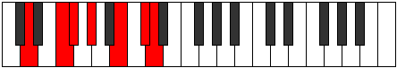
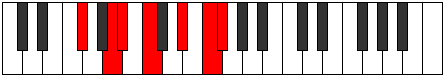

# Mode Aeolythimic

## Links

- [Documentation](index.md)
- [Scales Index](Scales.md)
- [Modes Index](Modes.md)
- [Chords Index](Chords.md)

## Parent Scale

[Bocrimic](ScaleBocrimic.md)

## Number

[2649](https://ianring.com/musictheory/scales/2649)

## Perfection

- 3 Perfect notes
- 3 Perfect notes

## Perfection Profile

[false false true false true true]

## Permutations

| Tonic | Notes | Signature | Illustration | Audio |
|-------|-------|-----------|--------------|-------|
| [C](ModeCNaturalAeolythimic.md) | **C**, **D#**, E, **F#**, G##, A##, **C** | C |  | [midi](ModeCNaturalAeolythimic.mid) [ogg](ModeCNaturalAeolythimic.ogg) |
| [C#](ModeCSharpAeolythimic.md) | **C#**, **D##**, E#, **F##**, G###, A###, **C#** | C |  | [midi](ModeCSharpAeolythimic.mid) [ogg](ModeCSharpAeolythimic.ogg) |
| [Db](ModeDFlatAeolythimic.md) | **Db**, **E**, F, **G**, A#, B#, **Db** | C |  | [midi](ModeDFlatAeolythimic.mid) [ogg](ModeDFlatAeolythimic.ogg) |
| [D](ModeDNaturalAeolythimic.md) | **D**, **E#**, F#, **G#**, A##, B##, **D** | C |  | [midi](ModeDNaturalAeolythimic.mid) [ogg](ModeDNaturalAeolythimic.ogg) |
| [D#](ModeDSharpAeolythimic.md) | **D#**, **E##**, F##, **G##**, A###, B###, **D#** | C |  | [midi](ModeDSharpAeolythimic.mid) [ogg](ModeDSharpAeolythimic.ogg) |
| [Eb](ModeEFlatAeolythimic.md) | **Eb**, **F#**, G, **A**, B#, C##, **Eb** | C |  | [midi](ModeEFlatAeolythimic.mid) [ogg](ModeEFlatAeolythimic.ogg) |
| [E](ModeENaturalAeolythimic.md) | **E**, **F##**, G#, **A#**, B##, C###, **E** | C |  | [midi](ModeENaturalAeolythimic.mid) [ogg](ModeENaturalAeolythimic.ogg) |
| [F](ModeFNaturalAeolythimic.md) | **F**, **G#**, A, **B**, C##, D##, **F** | C |  | [midi](ModeFNaturalAeolythimic.mid) [ogg](ModeFNaturalAeolythimic.ogg) |
| [F#](ModeFSharpAeolythimic.md) | **F#**, **G##**, A#, **B#**, C###, D###, **F#** | C |  | [midi](ModeFSharpAeolythimic.mid) [ogg](ModeFSharpAeolythimic.ogg) |
| [Gb](ModeGFlatAeolythimic.md) | **Gb**, **A**, Bb, **C**, D#, E#, **Gb** | C |  | [midi](ModeGFlatAeolythimic.mid) [ogg](ModeGFlatAeolythimic.ogg) |
| [G](ModeGNaturalAeolythimic.md) | **G**, **A#**, B, **C#**, D##, E##, **G** | C |  | [midi](ModeGNaturalAeolythimic.mid) [ogg](ModeGNaturalAeolythimic.ogg) |
| [G#](ModeGSharpAeolythimic.md) | **G#**, **A##**, B#, **C##**, D###, E###, **G#** | C |  | [midi](ModeGSharpAeolythimic.mid) [ogg](ModeGSharpAeolythimic.ogg) |
| [Ab](ModeAFlatAeolythimic.md) | **Ab**, **B**, C, **D**, E#, F##, **Ab** | C |  | [midi](ModeAFlatAeolythimic.mid) [ogg](ModeAFlatAeolythimic.ogg) |
| [A](ModeANaturalAeolythimic.md) | **A**, **B#**, C#, **D#**, E##, F###, **A** | C |  | [midi](ModeANaturalAeolythimic.mid) [ogg](ModeANaturalAeolythimic.ogg) |
| [A#](ModeASharpAeolythimic.md) | **A#**, **B##**, C##, **D##**, E###, Cbbb, **A#** | C |  | [midi](ModeASharpAeolythimic.mid) [ogg](ModeASharpAeolythimic.ogg) |
| [Bb](ModeBFlatAeolythimic.md) | **Bb**, **C#**, D, **E**, F##, G##, **Bb** | C |  | [midi](ModeBFlatAeolythimic.mid) [ogg](ModeBFlatAeolythimic.ogg) |
| [B](ModeBNaturalAeolythimic.md) | **B**, **C##**, D#, **E#**, F###, G###, **B** | C |  | [midi](ModeBNaturalAeolythimic.mid) [ogg](ModeBNaturalAeolythimic.ogg) |
