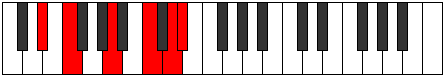

# Mode Aeolythitonic

## Links

- [Documentation](index.md)
- [Scales Index](Scales.md)
- [Modes Index](Modes.md)
- [Chords Index](Chords.md)

## Parent Scale

[Ionaditonic](ScaleIonaditonic.md)

## Number

[2629](https://ianring.com/musictheory/scales/2629)

## Perfection

- 2 Perfect notes
- 3 Perfect notes

## Perfection Profile

[false true false false true]

## Permutations

| Tonic | Notes | Signature | Illustration | Audio |
|-------|-------|-----------|--------------|-------|
| [C](ModeCNaturalAeolythitonic.md) | **C**, D, **F#**, **A**, B, **C** | C |  | [midi](ModeCNaturalAeolythitonic.mid) [ogg](ModeCNaturalAeolythitonic.ogg) |
| [C#](ModeCSharpAeolythitonic.md) | **C#**, D#, **G**, **A#**, C, **C#** | C |  | [midi](ModeCSharpAeolythitonic.mid) [ogg](ModeCSharpAeolythitonic.ogg) |
| [Db](ModeDFlatAeolythitonic.md) | **Db**, Eb, **G**, **Bb**, C, **Db** | C |  | [midi](ModeDFlatAeolythitonic.mid) [ogg](ModeDFlatAeolythitonic.ogg) |
| [D](ModeDNaturalAeolythitonic.md) | **D**, E, **G#**, **B**, C#, **D** | C |  | [midi](ModeDNaturalAeolythitonic.mid) [ogg](ModeDNaturalAeolythitonic.ogg) |
| [D#](ModeDSharpAeolythitonic.md) | **D#**, F, **A**, **C**, D, **D#** | C |  | [midi](ModeDSharpAeolythitonic.mid) [ogg](ModeDSharpAeolythitonic.ogg) |
| [Eb](ModeEFlatAeolythitonic.md) | **Eb**, F, **A**, **C**, D, **Eb** | C |  | [midi](ModeEFlatAeolythitonic.mid) [ogg](ModeEFlatAeolythitonic.ogg) |
| [E](ModeENaturalAeolythitonic.md) | **E**, F#, **A#**, **C#**, D#, **E** | C |  | [midi](ModeENaturalAeolythitonic.mid) [ogg](ModeENaturalAeolythitonic.ogg) |
| [F](ModeFNaturalAeolythitonic.md) | **F**, G, **B**, **D**, E, **F** | C |  | [midi](ModeFNaturalAeolythitonic.mid) [ogg](ModeFNaturalAeolythitonic.ogg) |
| [F#](ModeFSharpAeolythitonic.md) | **F#**, G#, **C**, **D#**, F, **F#** | C |  | [midi](ModeFSharpAeolythitonic.mid) [ogg](ModeFSharpAeolythitonic.ogg) |
| [Gb](ModeGFlatAeolythitonic.md) | **Gb**, Ab, **C**, **Eb**, F, **Gb** | C |  | [midi](ModeGFlatAeolythitonic.mid) [ogg](ModeGFlatAeolythitonic.ogg) |
| [G](ModeGNaturalAeolythitonic.md) | **G**, A, **C#**, **E**, F#, **G** | C |  | [midi](ModeGNaturalAeolythitonic.mid) [ogg](ModeGNaturalAeolythitonic.ogg) |
| [G#](ModeGSharpAeolythitonic.md) | **G#**, A#, **D**, **F**, G, **G#** | C |  | [midi](ModeGSharpAeolythitonic.mid) [ogg](ModeGSharpAeolythitonic.ogg) |
| [Ab](ModeAFlatAeolythitonic.md) | **Ab**, Bb, **D**, **F**, G, **Ab** | C |  | [midi](ModeAFlatAeolythitonic.mid) [ogg](ModeAFlatAeolythitonic.ogg) |
| [A](ModeANaturalAeolythitonic.md) | **A**, B, **D#**, **F#**, G#, **A** | C |  | [midi](ModeANaturalAeolythitonic.mid) [ogg](ModeANaturalAeolythitonic.ogg) |
| [A#](ModeASharpAeolythitonic.md) | **A#**, C, **E**, **G**, A, **A#** | C |  | [midi](ModeASharpAeolythitonic.mid) [ogg](ModeASharpAeolythitonic.ogg) |
| [Bb](ModeBFlatAeolythitonic.md) | **Bb**, C, **E**, **G**, A, **Bb** | C |  | [midi](ModeBFlatAeolythitonic.mid) [ogg](ModeBFlatAeolythitonic.ogg) |
| [B](ModeBNaturalAeolythitonic.md) | **B**, C#, **F**, **G#**, A#, **B** | C |  | [midi](ModeBNaturalAeolythitonic.mid) [ogg](ModeBNaturalAeolythitonic.ogg) |
