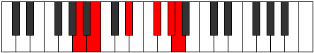
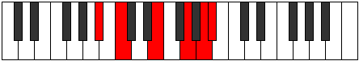

# Mode Aeolythitonic

## Links

- [Documentation](README.md)
- [Scales Index](Scales.md)
- [Modes Index](Modes.md)
- [Chords Index](Chords.md)

## Parent Scale

[Ionaditonic](ScaleIonaditonic.md)

## Number

[2629](https://ianring.com/musictheory/scales/2629)

## Transposition

2, 4, 3, 2, 1

## Chord Pattern

## Perfection

- 2 Perfect notes
- 3 Perfect notes

## Perfection Profile

false, true, false, false, true

## Permutations

| Tonic | Notes | Signature | Illustration | Audio |
|-------|-------|-----------|--------------|-------|
| [C](ModeCNaturalAeolythitonic.md) | **C**, D, **F#**, **A**, B, **C** | C |  | [midi](https://github.com/edipermadi/music/blob/main/docs/ModeCNaturalAeolythitonic.mid?raw=true) |
| [C#](ModeCSharpAeolythitonic.md) | **C#**, D#, **G**, **A#**, C, **C#** | C |  | [midi](https://github.com/edipermadi/music/blob/main/docs/ModeCSharpAeolythitonic.mid?raw=true) |
| [Db](ModeDFlatAeolythitonic.md) | **Db**, Eb, **G**, **Bb**, C, **Db** | C |  | [midi](https://github.com/edipermadi/music/blob/main/docs/ModeDFlatAeolythitonic.mid?raw=true) |
| [D](ModeDNaturalAeolythitonic.md) | **D**, E, **G#**, **B**, C#, **D** | C |  | [midi](https://github.com/edipermadi/music/blob/main/docs/ModeDNaturalAeolythitonic.mid?raw=true) |
| [D#](ModeDSharpAeolythitonic.md) | **D#**, F, **A**, **C**, D, **D#** | C |  | [midi](https://github.com/edipermadi/music/blob/main/docs/ModeDSharpAeolythitonic.mid?raw=true) |
| [Eb](ModeEFlatAeolythitonic.md) | **Eb**, F, **A**, **C**, D, **Eb** | C |  | [midi](https://github.com/edipermadi/music/blob/main/docs/ModeEFlatAeolythitonic.mid?raw=true) |
| [E](ModeENaturalAeolythitonic.md) | **E**, F#, **A#**, **C#**, D#, **E** | C |  | [midi](https://github.com/edipermadi/music/blob/main/docs/ModeENaturalAeolythitonic.mid?raw=true) |
| [F](ModeFNaturalAeolythitonic.md) | **F**, G, **B**, **D**, E, **F** | C |  | [midi](https://github.com/edipermadi/music/blob/main/docs/ModeFNaturalAeolythitonic.mid?raw=true) |
| [F#](ModeFSharpAeolythitonic.md) | **F#**, G#, **C**, **D#**, F, **F#** | C |  | [midi](https://github.com/edipermadi/music/blob/main/docs/ModeFSharpAeolythitonic.mid?raw=true) |
| [Gb](ModeGFlatAeolythitonic.md) | **Gb**, Ab, **C**, **Eb**, F, **Gb** | C |  | [midi](https://github.com/edipermadi/music/blob/main/docs/ModeGFlatAeolythitonic.mid?raw=true) |
| [G](ModeGNaturalAeolythitonic.md) | **G**, A, **C#**, **E**, F#, **G** | C |  | [midi](https://github.com/edipermadi/music/blob/main/docs/ModeGNaturalAeolythitonic.mid?raw=true) |
| [G#](ModeGSharpAeolythitonic.md) | **G#**, A#, **D**, **F**, G, **G#** | C |  | [midi](https://github.com/edipermadi/music/blob/main/docs/ModeGSharpAeolythitonic.mid?raw=true) |
| [Ab](ModeAFlatAeolythitonic.md) | **Ab**, Bb, **D**, **F**, G, **Ab** | C |  | [midi](https://github.com/edipermadi/music/blob/main/docs/ModeAFlatAeolythitonic.mid?raw=true) |
| [A](ModeANaturalAeolythitonic.md) | **A**, B, **D#**, **F#**, G#, **A** | C |  | [midi](https://github.com/edipermadi/music/blob/main/docs/ModeANaturalAeolythitonic.mid?raw=true) |
| [A#](ModeASharpAeolythitonic.md) | **A#**, C, **E**, **G**, A, **A#** | C |  | [midi](https://github.com/edipermadi/music/blob/main/docs/ModeASharpAeolythitonic.mid?raw=true) |
| [Bb](ModeBFlatAeolythitonic.md) | **Bb**, C, **E**, **G**, A, **Bb** | C |  | [midi](https://github.com/edipermadi/music/blob/main/docs/ModeBFlatAeolythitonic.mid?raw=true) |
| [B](ModeBNaturalAeolythitonic.md) | **B**, C#, **F**, **G#**, A#, **B** | C |  | [midi](https://github.com/edipermadi/music/blob/main/docs/ModeBNaturalAeolythitonic.mid?raw=true) |
