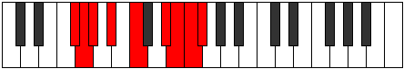

# Mode Aeonyllic

## Links

- [Documentation](index.md)
- [Scales Index](Scales.md)
- [Modes Index](Modes.md)
- [Chords Index](Chords.md)

## Parent Scale

[Kataryllic](ScaleKataryllic.md)

## Number

[3671](https://ianring.com/musictheory/scales/3671)

## Perfection

- 5 Perfect notes
- 3 Perfect notes

## Perfection Profile

[false false true true true true false true]

## Permutations

| Tonic | Notes | Signature | Illustration | Audio |
|-------|-------|-----------|--------------|-------|
| [C](ModeCNaturalAeonyllic.md) | **C**, **C#**, D, E, F#, A, **A#**, B, **C** | C |  | [midi](ModeCNaturalAeonyllic.mid) [ogg](ModeCNaturalAeonyllic.ogg) |
| [C#](ModeCSharpAeonyllic.md) | **C#**, **D**, D#, F, G, A#, **B**, C, **C#** | C |  | [midi](ModeCSharpAeonyllic.mid) [ogg](ModeCSharpAeonyllic.ogg) |
| [Db](ModeDFlatAeonyllic.md) | **Db**, **D**, Eb, F, G, Bb, **B**, C, **Db** | C |  | [midi](ModeDFlatAeonyllic.mid) [ogg](ModeDFlatAeonyllic.ogg) |
| [D](ModeDNaturalAeonyllic.md) | **D**, **D#**, E, F#, G#, B, **C**, C#, **D** | C |  | [midi](ModeDNaturalAeonyllic.mid) [ogg](ModeDNaturalAeonyllic.ogg) |
| [D#](ModeDSharpAeonyllic.md) | **D#**, **E**, F, G, A, C, **C#**, D, **D#** | C |  | [midi](ModeDSharpAeonyllic.mid) [ogg](ModeDSharpAeonyllic.ogg) |
| [Eb](ModeEFlatAeonyllic.md) | **Eb**, **E**, F, G, A, C, **Db**, D, **Eb** | C |  | [midi](ModeEFlatAeonyllic.mid) [ogg](ModeEFlatAeonyllic.ogg) |
| [E](ModeENaturalAeonyllic.md) | **E**, **F**, F#, G#, A#, C#, **D**, D#, **E** | C |  | [midi](ModeENaturalAeonyllic.mid) [ogg](ModeENaturalAeonyllic.ogg) |
| [F](ModeFNaturalAeonyllic.md) | **F**, **F#**, G, A, B, D, **D#**, E, **F** | C |  | [midi](ModeFNaturalAeonyllic.mid) [ogg](ModeFNaturalAeonyllic.ogg) |
| [F#](ModeFSharpAeonyllic.md) | **F#**, **G**, G#, A#, C, D#, **E**, F, **F#** | C |  | [midi](ModeFSharpAeonyllic.mid) [ogg](ModeFSharpAeonyllic.ogg) |
| [Gb](ModeGFlatAeonyllic.md) | **Gb**, **G**, Ab, Bb, C, Eb, **E**, F, **Gb** | C |  | [midi](ModeGFlatAeonyllic.mid) [ogg](ModeGFlatAeonyllic.ogg) |
| [G](ModeGNaturalAeonyllic.md) | **G**, **G#**, A, B, C#, E, **F**, F#, **G** | C |  | [midi](ModeGNaturalAeonyllic.mid) [ogg](ModeGNaturalAeonyllic.ogg) |
| [G#](ModeGSharpAeonyllic.md) | **G#**, **A**, A#, C, D, F, **F#**, G, **G#** | C |  | [midi](ModeGSharpAeonyllic.mid) [ogg](ModeGSharpAeonyllic.ogg) |
| [Ab](ModeAFlatAeonyllic.md) | **Ab**, **A**, Bb, C, D, F, **Gb**, G, **Ab** | C |  | [midi](ModeAFlatAeonyllic.mid) [ogg](ModeAFlatAeonyllic.ogg) |
| [A](ModeANaturalAeonyllic.md) | **A**, **A#**, B, C#, D#, F#, **G**, G#, **A** | C |  | [midi](ModeANaturalAeonyllic.mid) [ogg](ModeANaturalAeonyllic.ogg) |
| [A#](ModeASharpAeonyllic.md) | **A#**, **B**, C, D, E, G, **G#**, A, **A#** | C |  | [midi](ModeASharpAeonyllic.mid) [ogg](ModeASharpAeonyllic.ogg) |
| [Bb](ModeBFlatAeonyllic.md) | **Bb**, **B**, C, D, E, G, **Ab**, A, **Bb** | C |  | [midi](ModeBFlatAeonyllic.mid) [ogg](ModeBFlatAeonyllic.ogg) |
| [B](ModeBNaturalAeonyllic.md) | **B**, **C**, C#, D#, F, G#, **A**, A#, **B** | C |  | [midi](ModeBNaturalAeonyllic.mid) [ogg](ModeBNaturalAeonyllic.ogg) |
