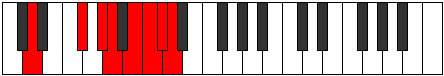

# Mode Aeopian

## Links

- [Documentation](README.md)
- [Scales Index](Scales.md)
- [Modes Index](Modes.md)
- [Chords Index](Chords.md)

## Parent Scale

[Aeopian](ScaleAeopian.md)

## Number

[3793](https://ianring.com/musictheory/scales/3793)

## Luminosity

-1

## Transposition

4, 2, 1, 2, 1, 1, 1

## Chord Pattern

ii⁰

## Perfection

- 4 Perfect notes
- 3 Perfect notes

## Perfection Profile

true, true, false, false, true, false, true

## Permutations

| Tonic | Notes | Signature | Illustration | Audio |
|-------|-------|-----------|--------------|-------|
| [C](ModeCNaturalAeopian.md) | C, D##, **E##**, **F##**, G##, **A#**, B, C | C |  | [midi](https://github.com/edipermadi/music/blob/main/docs/ModeCNaturalAeopian.mid?raw=true) |
| [C#](ModeCSharpAeopian.md) | C#, D###, **E###**, **F###**, G###, **A##**, B#, C# | C |  | [midi](https://github.com/edipermadi/music/blob/main/docs/ModeCSharpAeopian.mid?raw=true) |
| [Db](ModeDFlatAeopian.md) | Db, E#, **F##**, **G#**, A#, **B**, C, Db | C |  | [midi](https://github.com/edipermadi/music/blob/main/docs/ModeDFlatAeopian.mid?raw=true) |
| [D](ModeDNaturalAeopian.md) | D, E##, **F###**, **G##**, A##, **B#**, C#, D | C |  | [midi](https://github.com/edipermadi/music/blob/main/docs/ModeDNaturalAeopian.mid?raw=true) |
| [D#](ModeDSharpAeopian.md) | D#, E###, **Cbbb**, **Cbb**, Dbb, **Ebbb**, Fbbb, D# | C |  | [midi](https://github.com/edipermadi/music/blob/main/docs/ModeDSharpAeopian.mid?raw=true) |
| [Eb](ModeEFlatAeopian.md) | Eb, F##, **G##**, **A#**, B#, **C#**, D, Eb | C |  | [midi](https://github.com/edipermadi/music/blob/main/docs/ModeEFlatAeopian.mid?raw=true) |
| [E](ModeENaturalAeopian.md) | E, F###, **G###**, **A##**, B##, **C##**, D#, E | C |  | [midi](https://github.com/edipermadi/music/blob/main/docs/ModeENaturalAeopian.mid?raw=true) |
| [F](ModeFNaturalAeopian.md) | F, G##, **A##**, **B#**, C##, **D#**, E, F | C |  | [midi](https://github.com/edipermadi/music/blob/main/docs/ModeFNaturalAeopian.mid?raw=true) |
| [F#](ModeFSharpAeopian.md) | F#, G###, **A###**, **B##**, C###, **D##**, E#, F# | C |  | [midi](https://github.com/edipermadi/music/blob/main/docs/ModeFSharpAeopian.mid?raw=true) |
| [Gb](ModeGFlatAeopian.md) | Gb, A#, **B#**, **C#**, D#, **E**, F, Gb | C |  | [midi](https://github.com/edipermadi/music/blob/main/docs/ModeGFlatAeopian.mid?raw=true) |
| [G](ModeGNaturalAeopian.md) | G, A##, **B##**, **C##**, D##, **E#**, F#, G | C |  | [midi](https://github.com/edipermadi/music/blob/main/docs/ModeGNaturalAeopian.mid?raw=true) |
| [G#](ModeGSharpAeopian.md) | G#, A###, **B###**, **C###**, D###, **E##**, F##, G# | C |  | [midi](https://github.com/edipermadi/music/blob/main/docs/ModeGSharpAeopian.mid?raw=true) |
| [Ab](ModeAFlatAeopian.md) | Ab, B#, **C##**, **D#**, E#, **F#**, G, Ab | C |  | [midi](https://github.com/edipermadi/music/blob/main/docs/ModeAFlatAeopian.mid?raw=true) |
| [A](ModeANaturalAeopian.md) | A, B##, **C###**, **D##**, E##, **F##**, G#, A | C |  | [midi](https://github.com/edipermadi/music/blob/main/docs/ModeANaturalAeopian.mid?raw=true) |
| [A#](ModeASharpAeopian.md) | A#, B###, **D##**, **E#**, F##, **G#**, A, A# | C |  | [midi](https://github.com/edipermadi/music/blob/main/docs/ModeASharpAeopian.mid?raw=true) |
| [Bb](ModeBFlatAeopian.md) | Bb, C##, **D##**, **E#**, F##, **G#**, A, Bb | C |  | [midi](https://github.com/edipermadi/music/blob/main/docs/ModeBFlatAeopian.mid?raw=true) |
| [B](ModeBNaturalAeopian.md) | B, C###, **D###**, **E##**, F###, **G##**, A#, B | C |  | [midi](https://github.com/edipermadi/music/blob/main/docs/ModeBNaturalAeopian.mid?raw=true) |
