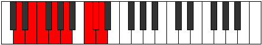

# Mode Aeracrian

## Links

- [Documentation](index.md)
- [Scales Index](Scales.md)
- [Modes Index](Modes.md)
- [Chords Index](Chords.md)

## Parent Scale

[Aerathian](ScaleAerathian.md)

## Number

[3245](https://ianring.com/musictheory/scales/3245)

## Perfection

- 5 Perfect notes
- 2 Perfect notes

## Perfection Profile

[true false true true true true false]

## Permutations

| Tonic | Notes | Signature | Illustration | Audio |
|-------|-------|-----------|--------------|-------|
| [C](ModeCNaturalAeracrian.md) | C, **D**, Eb, F, G, A#, **B**, C | C |  | [midi](ModeCNaturalAeracrian.mid) [ogg](ModeCNaturalAeracrian.ogg) |
| [C#](ModeCSharpAeracrian.md) | C#, **D#**, E, F#, G#, A##, **B#**, C# | C |  | [midi](ModeCSharpAeracrian.mid) [ogg](ModeCSharpAeracrian.ogg) |
| [Db](ModeDFlatAeracrian.md) | Db, **Eb**, Fb, Gb, Ab, B, **C**, Db | C |  | [midi](ModeDFlatAeracrian.mid) [ogg](ModeDFlatAeracrian.ogg) |
| [D](ModeDNaturalAeracrian.md) | D, **E**, F, G, A, B#, **C#**, D | C |  | [midi](ModeDNaturalAeracrian.mid) [ogg](ModeDNaturalAeracrian.ogg) |
| [D#](ModeDSharpAeracrian.md) | D#, **E#**, F#, G#, A#, B##, **C##**, D# | C |  | [midi](ModeDSharpAeracrian.mid) [ogg](ModeDSharpAeracrian.ogg) |
| [Eb](ModeEFlatAeracrian.md) | Eb, **F**, Gb, Ab, Bb, C#, **D**, Eb | C |  | [midi](ModeEFlatAeracrian.mid) [ogg](ModeEFlatAeracrian.ogg) |
| [E](ModeENaturalAeracrian.md) | E, **F#**, G, A, B, C##, **D#**, E | C |  | [midi](ModeENaturalAeracrian.mid) [ogg](ModeENaturalAeracrian.ogg) |
| [F](ModeFNaturalAeracrian.md) | F, **G**, Ab, Bb, C, D#, **E**, F | C |  | [midi](ModeFNaturalAeracrian.mid) [ogg](ModeFNaturalAeracrian.ogg) |
| [F#](ModeFSharpAeracrian.md) | F#, **G#**, A, B, C#, D##, **E#**, F# | C |  | [midi](ModeFSharpAeracrian.mid) [ogg](ModeFSharpAeracrian.ogg) |
| [Gb](ModeGFlatAeracrian.md) | Gb, **Ab**, Bbb, Cb, Db, E, **F**, Gb | C |  | [midi](ModeGFlatAeracrian.mid) [ogg](ModeGFlatAeracrian.ogg) |
| [G](ModeGNaturalAeracrian.md) | G, **A**, Bb, C, D, E#, **F#**, G | C |  | [midi](ModeGNaturalAeracrian.mid) [ogg](ModeGNaturalAeracrian.ogg) |
| [G#](ModeGSharpAeracrian.md) | G#, **A#**, B, C#, D#, E##, **F##**, G# | C |  | [midi](ModeGSharpAeracrian.mid) [ogg](ModeGSharpAeracrian.ogg) |
| [Ab](ModeAFlatAeracrian.md) | Ab, **Bb**, Cb, Db, Eb, F#, **G**, Ab | C |  | [midi](ModeAFlatAeracrian.mid) [ogg](ModeAFlatAeracrian.ogg) |
| [A](ModeANaturalAeracrian.md) | A, **B**, C, D, E, F##, **G#**, A | C |  | [midi](ModeANaturalAeracrian.mid) [ogg](ModeANaturalAeracrian.ogg) |
| [A#](ModeASharpAeracrian.md) | A#, **B#**, C#, D#, E#, F###, **G##**, A# | C |  | [midi](ModeASharpAeracrian.mid) [ogg](ModeASharpAeracrian.ogg) |
| [Bb](ModeBFlatAeracrian.md) | Bb, **C**, Db, Eb, F, G#, **A**, Bb | C |  | [midi](ModeBFlatAeracrian.mid) [ogg](ModeBFlatAeracrian.ogg) |
| [B](ModeBNaturalAeracrian.md) | B, **C#**, D, E, F#, G##, **A#**, B | C |  | [midi](ModeBNaturalAeracrian.mid) [ogg](ModeBNaturalAeracrian.ogg) |
