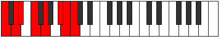

# Mode Aeracrian

## Links

- [Documentation](README.md)
- [Scales Index](Scales.md)
- [Modes Index](Modes.md)
- [Chords Index](Chords.md)

## Parent Scale

[Aerathian](ScaleAerathian.md)

## Number

[3245](https://ianring.com/musictheory/scales/3245)

## Interval Pattern

2, 1, 2, 2, 3, 1, 1

## Chord Pattern

i, III⁺, V, vii⁰

## Perfection

- 5 Perfect notes
- 2 Perfect notes

## Perfection Profile

[true false true true true true false]

## Permutations

| Tonic | Notes | Signature | Illustration | Audio |
|-------|-------|-----------|--------------|-------|
| [C](ModeCNaturalAeracrian.md) | C, **D**, Eb, F, G, A#, **B**, C | C |  | [midi](https://github.com/edipermadi/music/blob/main/docs/ModeCNaturalAeracrian.mid?raw=true) |
| [C#](ModeCSharpAeracrian.md) | C#, **D#**, E, F#, G#, A##, **B#**, C# | C |  | [midi](https://github.com/edipermadi/music/blob/main/docs/ModeCSharpAeracrian.mid?raw=true) |
| [Db](ModeDFlatAeracrian.md) | Db, **Eb**, Fb, Gb, Ab, B, **C**, Db | C |  | [midi](https://github.com/edipermadi/music/blob/main/docs/ModeDFlatAeracrian.mid?raw=true) |
| [D](ModeDNaturalAeracrian.md) | D, **E**, F, G, A, B#, **C#**, D | C |  | [midi](https://github.com/edipermadi/music/blob/main/docs/ModeDNaturalAeracrian.mid?raw=true) |
| [D#](ModeDSharpAeracrian.md) | D#, **E#**, F#, G#, A#, B##, **C##**, D# | C |  | [midi](https://github.com/edipermadi/music/blob/main/docs/ModeDSharpAeracrian.mid?raw=true) |
| [Eb](ModeEFlatAeracrian.md) | Eb, **F**, Gb, Ab, Bb, C#, **D**, Eb | C |  | [midi](https://github.com/edipermadi/music/blob/main/docs/ModeEFlatAeracrian.mid?raw=true) |
| [E](ModeENaturalAeracrian.md) | E, **F#**, G, A, B, C##, **D#**, E | C |  | [midi](https://github.com/edipermadi/music/blob/main/docs/ModeENaturalAeracrian.mid?raw=true) |
| [F](ModeFNaturalAeracrian.md) | F, **G**, Ab, Bb, C, D#, **E**, F | C |  | [midi](https://github.com/edipermadi/music/blob/main/docs/ModeFNaturalAeracrian.mid?raw=true) |
| [F#](ModeFSharpAeracrian.md) | F#, **G#**, A, B, C#, D##, **E#**, F# | C |  | [midi](https://github.com/edipermadi/music/blob/main/docs/ModeFSharpAeracrian.mid?raw=true) |
| [Gb](ModeGFlatAeracrian.md) | Gb, **Ab**, Bbb, Cb, Db, E, **F**, Gb | C |  | [midi](https://github.com/edipermadi/music/blob/main/docs/ModeGFlatAeracrian.mid?raw=true) |
| [G](ModeGNaturalAeracrian.md) | G, **A**, Bb, C, D, E#, **F#**, G | C |  | [midi](https://github.com/edipermadi/music/blob/main/docs/ModeGNaturalAeracrian.mid?raw=true) |
| [G#](ModeGSharpAeracrian.md) | G#, **A#**, B, C#, D#, E##, **F##**, G# | C |  | [midi](https://github.com/edipermadi/music/blob/main/docs/ModeGSharpAeracrian.mid?raw=true) |
| [Ab](ModeAFlatAeracrian.md) | Ab, **Bb**, Cb, Db, Eb, F#, **G**, Ab | C |  | [midi](https://github.com/edipermadi/music/blob/main/docs/ModeAFlatAeracrian.mid?raw=true) |
| [A](ModeANaturalAeracrian.md) | A, **B**, C, D, E, F##, **G#**, A | C |  | [midi](https://github.com/edipermadi/music/blob/main/docs/ModeANaturalAeracrian.mid?raw=true) |
| [A#](ModeASharpAeracrian.md) | A#, **B#**, C#, D#, E#, F###, **G##**, A# | C |  | [midi](https://github.com/edipermadi/music/blob/main/docs/ModeASharpAeracrian.mid?raw=true) |
| [Bb](ModeBFlatAeracrian.md) | Bb, **C**, Db, Eb, F, G#, **A**, Bb | C |  | [midi](https://github.com/edipermadi/music/blob/main/docs/ModeBFlatAeracrian.mid?raw=true) |
| [B](ModeBNaturalAeracrian.md) | B, **C#**, D, E, F#, G##, **A#**, B | C |  | [midi](https://github.com/edipermadi/music/blob/main/docs/ModeBNaturalAeracrian.mid?raw=true) |
