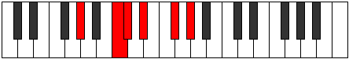

# Mode Aeracritonic

## Links

- [Documentation](index.md)
- [Scales Index](Scales.md)
- [Modes Index](Modes.md)
- [Chords Index](Chords.md)

## Parent Scale

[Aeracritonic](ScaleAeracritonic.md)

## Number

[1201](https://ianring.com/musictheory/scales/1201)

## Perfection

- 3 Perfect notes
- 2 Perfect notes

## Perfection Profile

[true false true false true]

## Permutations

| Tonic | Notes | Signature | Illustration | Audio |
|-------|-------|-----------|--------------|-------|
| [C](ModeCNaturalAeracritonic.md) | C, **E**, F, **G**, A#, C | C |  | [midi](ModeCNaturalAeracritonic.mid) [ogg](ModeCNaturalAeracritonic.ogg) |
| [C#](ModeCSharpAeracritonic.md) | C#, **F**, F#, **G#**, B, C# | C |  | [midi](ModeCSharpAeracritonic.mid) [ogg](ModeCSharpAeracritonic.ogg) |
| [Db](ModeDFlatAeracritonic.md) | Db, **F**, Gb, **Ab**, B, Db | C |  | [midi](ModeDFlatAeracritonic.mid) [ogg](ModeDFlatAeracritonic.ogg) |
| [D](ModeDNaturalAeracritonic.md) | D, **F#**, G, **A**, C, D | C |  | [midi](ModeDNaturalAeracritonic.mid) [ogg](ModeDNaturalAeracritonic.ogg) |
| [D#](ModeDSharpAeracritonic.md) | D#, **G**, G#, **A#**, C#, D# | C |  | [midi](ModeDSharpAeracritonic.mid) [ogg](ModeDSharpAeracritonic.ogg) |
| [Eb](ModeEFlatAeracritonic.md) | Eb, **G**, Ab, **Bb**, Db, Eb | C |  | [midi](ModeEFlatAeracritonic.mid) [ogg](ModeEFlatAeracritonic.ogg) |
| [E](ModeENaturalAeracritonic.md) | E, **G#**, A, **B**, D, E | C |  | [midi](ModeENaturalAeracritonic.mid) [ogg](ModeENaturalAeracritonic.ogg) |
| [F](ModeFNaturalAeracritonic.md) | F, **A**, A#, **C**, D#, F | C |  | [midi](ModeFNaturalAeracritonic.mid) [ogg](ModeFNaturalAeracritonic.ogg) |
| [F#](ModeFSharpAeracritonic.md) | F#, **A#**, B, **C#**, E, F# | C |  | [midi](ModeFSharpAeracritonic.mid) [ogg](ModeFSharpAeracritonic.ogg) |
| [Gb](ModeGFlatAeracritonic.md) | Gb, **Bb**, B, **Db**, E, Gb | C |  | [midi](ModeGFlatAeracritonic.mid) [ogg](ModeGFlatAeracritonic.ogg) |
| [G](ModeGNaturalAeracritonic.md) | G, **B**, C, **D**, F, G | C |  | [midi](ModeGNaturalAeracritonic.mid) [ogg](ModeGNaturalAeracritonic.ogg) |
| [G#](ModeGSharpAeracritonic.md) | G#, **C**, C#, **D#**, F#, G# | C |  | [midi](ModeGSharpAeracritonic.mid) [ogg](ModeGSharpAeracritonic.ogg) |
| [Ab](ModeAFlatAeracritonic.md) | Ab, **C**, Db, **Eb**, Gb, Ab | C |  | [midi](ModeAFlatAeracritonic.mid) [ogg](ModeAFlatAeracritonic.ogg) |
| [A](ModeANaturalAeracritonic.md) | A, **C#**, D, **E**, G, A | C |  | [midi](ModeANaturalAeracritonic.mid) [ogg](ModeANaturalAeracritonic.ogg) |
| [A#](ModeASharpAeracritonic.md) | A#, **D**, D#, **F**, G#, A# | C |  | [midi](ModeASharpAeracritonic.mid) [ogg](ModeASharpAeracritonic.ogg) |
| [Bb](ModeBFlatAeracritonic.md) | Bb, **D**, Eb, **F**, Ab, Bb | C |  | [midi](ModeBFlatAeracritonic.mid) [ogg](ModeBFlatAeracritonic.ogg) |
| [B](ModeBNaturalAeracritonic.md) | B, **D#**, E, **F#**, A, B | C |  | [midi](ModeBNaturalAeracritonic.mid) [ogg](ModeBNaturalAeracritonic.ogg) |
