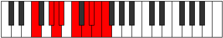

# Mode Aeracryllic

## Links

- [Documentation](index.md)
- [Scales Index](Scales.md)
- [Modes Index](Modes.md)
- [Chords Index](Chords.md)

## Parent Scale

[Aeracryllic](ScaleAeracryllic.md)

## Number

[3769](https://ianring.com/musictheory/scales/3769)

## Perfection

- 6 Perfect notes
- 2 Perfect notes

## Perfection Profile

[true true true true false true true false]

## Permutations

| Tonic | Notes | Signature | Illustration | Audio |
|-------|-------|-----------|--------------|-------|
| [C](ModeCNaturalAeracryllic.md) | C, D#, E, F, **G**, A, A#, **B**, C | C |  | [midi](ModeCNaturalAeracryllic.mid) [ogg](ModeCNaturalAeracryllic.ogg) |
| [C#](ModeCSharpAeracryllic.md) | C#, E, F, F#, **G#**, A#, B, **C**, C# | C |  | [midi](ModeCSharpAeracryllic.mid) [ogg](ModeCSharpAeracryllic.ogg) |
| [Db](ModeDFlatAeracryllic.md) | Db, E, F, Gb, **Ab**, Bb, B, **C**, Db | C |  | [midi](ModeDFlatAeracryllic.mid) [ogg](ModeDFlatAeracryllic.ogg) |
| [D](ModeDNaturalAeracryllic.md) | D, F, F#, G, **A**, B, C, **C#**, D | C |  | [midi](ModeDNaturalAeracryllic.mid) [ogg](ModeDNaturalAeracryllic.ogg) |
| [D#](ModeDSharpAeracryllic.md) | D#, F#, G, G#, **A#**, C, C#, **D**, D# | C |  | [midi](ModeDSharpAeracryllic.mid) [ogg](ModeDSharpAeracryllic.ogg) |
| [Eb](ModeEFlatAeracryllic.md) | Eb, Gb, G, Ab, **Bb**, C, Db, **D**, Eb | C |  | [midi](ModeEFlatAeracryllic.mid) [ogg](ModeEFlatAeracryllic.ogg) |
| [E](ModeENaturalAeracryllic.md) | E, G, G#, A, **B**, C#, D, **D#**, E | C |  | [midi](ModeENaturalAeracryllic.mid) [ogg](ModeENaturalAeracryllic.ogg) |
| [F](ModeFNaturalAeracryllic.md) | F, G#, A, A#, **C**, D, D#, **E**, F | C |  | [midi](ModeFNaturalAeracryllic.mid) [ogg](ModeFNaturalAeracryllic.ogg) |
| [F#](ModeFSharpAeracryllic.md) | F#, A, A#, B, **C#**, D#, E, **F**, F# | C |  | [midi](ModeFSharpAeracryllic.mid) [ogg](ModeFSharpAeracryllic.ogg) |
| [Gb](ModeGFlatAeracryllic.md) | Gb, A, Bb, B, **Db**, Eb, E, **F**, Gb | C |  | [midi](ModeGFlatAeracryllic.mid) [ogg](ModeGFlatAeracryllic.ogg) |
| [G](ModeGNaturalAeracryllic.md) | G, A#, B, C, **D**, E, F, **F#**, G | C |  | [midi](ModeGNaturalAeracryllic.mid) [ogg](ModeGNaturalAeracryllic.ogg) |
| [G#](ModeGSharpAeracryllic.md) | G#, B, C, C#, **D#**, F, F#, **G**, G# | C |  | [midi](ModeGSharpAeracryllic.mid) [ogg](ModeGSharpAeracryllic.ogg) |
| [Ab](ModeAFlatAeracryllic.md) | Ab, B, C, Db, **Eb**, F, Gb, **G**, Ab | C |  | [midi](ModeAFlatAeracryllic.mid) [ogg](ModeAFlatAeracryllic.ogg) |
| [A](ModeANaturalAeracryllic.md) | A, C, C#, D, **E**, F#, G, **G#**, A | C |  | [midi](ModeANaturalAeracryllic.mid) [ogg](ModeANaturalAeracryllic.ogg) |
| [A#](ModeASharpAeracryllic.md) | A#, C#, D, D#, **F**, G, G#, **A**, A# | C |  | [midi](ModeASharpAeracryllic.mid) [ogg](ModeASharpAeracryllic.ogg) |
| [Bb](ModeBFlatAeracryllic.md) | Bb, Db, D, Eb, **F**, G, Ab, **A**, Bb | C |  | [midi](ModeBFlatAeracryllic.mid) [ogg](ModeBFlatAeracryllic.ogg) |
| [B](ModeBNaturalAeracryllic.md) | B, D, D#, E, **F#**, G#, A, **A#**, B | C |  | [midi](ModeBNaturalAeracryllic.mid) [ogg](ModeBNaturalAeracryllic.ogg) |
