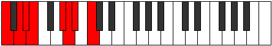

# Mode Aeradian

## Links

- [Documentation](index.md)
- [Scales Index](Scales.md)
- [Modes Index](Modes.md)
- [Chords Index](Chords.md)

## Parent Scale

[Thacrian](ScaleThacrian.md)

## Number

[1821](https://ianring.com/musictheory/scales/1821)

## Perfection

- 4 Perfect notes
- 3 Perfect notes

## Perfection Profile

[false true true false true true false]

## Permutations

| Tonic | Notes | Signature | Illustration | Audio |
|-------|-------|-----------|--------------|-------|
| [C](ModeCNaturalAeradian.md) | **C**, D, Eb, **Fb**, G#, A, **Bb**, **C** | C |  | [midi](ModeCNaturalAeradian.mid) [ogg](ModeCNaturalAeradian.ogg) |
| [C#](ModeCSharpAeradian.md) | **C#**, D#, E, **F**, G##, A#, **B**, **C#** | C |  | [midi](ModeCSharpAeradian.mid) [ogg](ModeCSharpAeradian.ogg) |
| [Db](ModeDFlatAeradian.md) | **Db**, Eb, Fb, **Gbb**, A, Bb, **Cb**, **Db** | C |  | [midi](ModeDFlatAeradian.mid) [ogg](ModeDFlatAeradian.ogg) |
| [D](ModeDNaturalAeradian.md) | **D**, E, F, **Gb**, A#, B, **C**, **D** | C |  | [midi](ModeDNaturalAeradian.mid) [ogg](ModeDNaturalAeradian.ogg) |
| [D#](ModeDSharpAeradian.md) | **D#**, E#, F#, **G**, A##, B#, **C#**, **D#** | C |  | [midi](ModeDSharpAeradian.mid) [ogg](ModeDSharpAeradian.ogg) |
| [Eb](ModeEFlatAeradian.md) | **Eb**, F, Gb, **Abb**, B, C, **Db**, **Eb** | C |  | [midi](ModeEFlatAeradian.mid) [ogg](ModeEFlatAeradian.ogg) |
| [E](ModeENaturalAeradian.md) | **E**, F#, G, **Ab**, B#, C#, **D**, **E** | C |  | [midi](ModeENaturalAeradian.mid) [ogg](ModeENaturalAeradian.ogg) |
| [F](ModeFNaturalAeradian.md) | **F**, G, Ab, **Bbb**, C#, D, **Eb**, **F** | C |  | [midi](ModeFNaturalAeradian.mid) [ogg](ModeFNaturalAeradian.ogg) |
| [F#](ModeFSharpAeradian.md) | **F#**, G#, A, **Bb**, C##, D#, **E**, **F#** | C |  | [midi](ModeFSharpAeradian.mid) [ogg](ModeFSharpAeradian.ogg) |
| [Gb](ModeGFlatAeradian.md) | **Gb**, Ab, Bbb, **Cbb**, D, Eb, **Fb**, **Gb** | C |  | [midi](ModeGFlatAeradian.mid) [ogg](ModeGFlatAeradian.ogg) |
| [G](ModeGNaturalAeradian.md) | **G**, A, Bb, **Cb**, D#, E, **F**, **G** | C |  | [midi](ModeGNaturalAeradian.mid) [ogg](ModeGNaturalAeradian.ogg) |
| [G#](ModeGSharpAeradian.md) | **G#**, A#, B, **C**, D##, E#, **F#**, **G#** | C |  | [midi](ModeGSharpAeradian.mid) [ogg](ModeGSharpAeradian.ogg) |
| [Ab](ModeAFlatAeradian.md) | **Ab**, Bb, Cb, **Dbb**, E, F, **Gb**, **Ab** | C |  | [midi](ModeAFlatAeradian.mid) [ogg](ModeAFlatAeradian.ogg) |
| [A](ModeANaturalAeradian.md) | **A**, B, C, **Db**, E#, F#, **G**, **A** | C |  | [midi](ModeANaturalAeradian.mid) [ogg](ModeANaturalAeradian.ogg) |
| [A#](ModeASharpAeradian.md) | **A#**, B#, C#, **D**, E##, F##, **G#**, **A#** | C |  | [midi](ModeASharpAeradian.mid) [ogg](ModeASharpAeradian.ogg) |
| [Bb](ModeBFlatAeradian.md) | **Bb**, C, Db, **Ebb**, F#, G, **Ab**, **Bb** | C |  | [midi](ModeBFlatAeradian.mid) [ogg](ModeBFlatAeradian.ogg) |
| [B](ModeBNaturalAeradian.md) | **B**, C#, D, **Eb**, F##, G#, **A**, **B** | C |  | [midi](ModeBNaturalAeradian.mid) [ogg](ModeBNaturalAeradian.ogg) |
