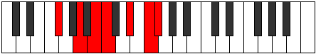

# Mode Aeradimic

## Links

- [Documentation](index.md)
- [Scales Index](Scales.md)
- [Modes Index](Modes.md)
- [Chords Index](Chords.md)

## Parent Scale

[Aeradimic](ScaleAeradimic.md)

## Number

[2665](https://ianring.com/musictheory/scales/2665)

## Perfection

- 2 Perfect notes
- 4 Perfect notes

## Perfection Profile

[false false true false false true]

## Permutations

| Tonic | Notes | Signature | Illustration | Audio |
|-------|-------|-----------|--------------|-------|
| [C](ModeCNaturalAeradimic.md) | **C**, **D#**, E#, **F#**, **G##**, A##, **C** | C |  | [midi](ModeCNaturalAeradimic.mid) [ogg](ModeCNaturalAeradimic.ogg) |
| [C#](ModeCSharpAeradimic.md) | **C#**, **D##**, E##, **F##**, **G###**, A###, **C#** | C |  | [midi](ModeCSharpAeradimic.mid) [ogg](ModeCSharpAeradimic.ogg) |
| [Db](ModeDFlatAeradimic.md) | **Db**, **E**, F#, **G**, **A#**, B#, **Db** | C |  | [midi](ModeDFlatAeradimic.mid) [ogg](ModeDFlatAeradimic.ogg) |
| [D](ModeDNaturalAeradimic.md) | **D**, **E#**, F##, **G#**, **A##**, B##, **D** | C |  | [midi](ModeDNaturalAeradimic.mid) [ogg](ModeDNaturalAeradimic.ogg) |
| [D#](ModeDSharpAeradimic.md) | **D#**, **E##**, F###, **G##**, **A###**, B###, **D#** | C |  | [midi](ModeDSharpAeradimic.mid) [ogg](ModeDSharpAeradimic.ogg) |
| [Eb](ModeEFlatAeradimic.md) | **Eb**, **F#**, G#, **A**, **B#**, C##, **Eb** | C |  | [midi](ModeEFlatAeradimic.mid) [ogg](ModeEFlatAeradimic.ogg) |
| [E](ModeENaturalAeradimic.md) | **E**, **F##**, G##, **A#**, **B##**, C###, **E** | C |  | [midi](ModeENaturalAeradimic.mid) [ogg](ModeENaturalAeradimic.ogg) |
| [F](ModeFNaturalAeradimic.md) | **F**, **G#**, A#, **B**, **C##**, D##, **F** | C |  | [midi](ModeFNaturalAeradimic.mid) [ogg](ModeFNaturalAeradimic.ogg) |
| [F#](ModeFSharpAeradimic.md) | **F#**, **G##**, A##, **B#**, **C###**, D###, **F#** | C |  | [midi](ModeFSharpAeradimic.mid) [ogg](ModeFSharpAeradimic.ogg) |
| [Gb](ModeGFlatAeradimic.md) | **Gb**, **A**, B, **C**, **D#**, E#, **Gb** | C |  | [midi](ModeGFlatAeradimic.mid) [ogg](ModeGFlatAeradimic.ogg) |
| [G](ModeGNaturalAeradimic.md) | **G**, **A#**, B#, **C#**, **D##**, E##, **G** | C |  | [midi](ModeGNaturalAeradimic.mid) [ogg](ModeGNaturalAeradimic.ogg) |
| [G#](ModeGSharpAeradimic.md) | **G#**, **A##**, B##, **C##**, **D###**, E###, **G#** | C |  | [midi](ModeGSharpAeradimic.mid) [ogg](ModeGSharpAeradimic.ogg) |
| [Ab](ModeAFlatAeradimic.md) | **Ab**, **B**, C#, **D**, **E#**, F##, **Ab** | C |  | [midi](ModeAFlatAeradimic.mid) [ogg](ModeAFlatAeradimic.ogg) |
| [A](ModeANaturalAeradimic.md) | **A**, **B#**, C##, **D#**, **E##**, F###, **A** | C |  | [midi](ModeANaturalAeradimic.mid) [ogg](ModeANaturalAeradimic.ogg) |
| [A#](ModeASharpAeradimic.md) | **A#**, **B##**, C###, **D##**, **E###**, Cbbb, **A#** | C |  | [midi](ModeASharpAeradimic.mid) [ogg](ModeASharpAeradimic.ogg) |
| [Bb](ModeBFlatAeradimic.md) | **Bb**, **C#**, D#, **E**, **F##**, G##, **Bb** | C |  | [midi](ModeBFlatAeradimic.mid) [ogg](ModeBFlatAeradimic.ogg) |
| [B](ModeBNaturalAeradimic.md) | **B**, **C##**, D##, **E#**, **F###**, G###, **B** | C |  | [midi](ModeBNaturalAeradimic.mid) [ogg](ModeBNaturalAeradimic.ogg) |
