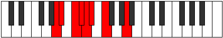
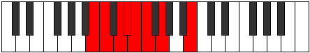

# Mode Aeragian

## Links

- [Documentation](README.md)
- [Scales Index](Scales.md)
- [Modes Index](Modes.md)
- [Chords Index](Chords.md)

## Parent Scale

[Zorian](ScaleZorian.md)

## Number

[379](https://ianring.com/musictheory/scales/379)

## Transposition

1, 2, 1, 1, 1, 2, 4

## Chord Pattern

## Perfection

- 4 Perfect notes
- 3 Perfect notes

## Perfection Profile

false, true, false, false, true, true, true

## Permutations

| Tonic | Notes | Signature | Illustration | Audio |
|-------|-------|-----------|--------------|-------|
| [C](ModeCNaturalAeragian.md) | **C**, Db, **Eb**, **Fb**, Gbb, Abbb, Bbbb, **C** | C |  | [midi](https://github.com/edipermadi/music/blob/main/docs/ModeCNaturalAeragian.mid?raw=true) |
| [C#](ModeCSharpAeragian.md) | **C#**, D, **E**, **F**, Gb, Abb, Bbb, **C#** | C |  | [midi](https://github.com/edipermadi/music/blob/main/docs/ModeCSharpAeragian.mid?raw=true) |
| [Db](ModeDFlatAeragian.md) | **Db**, Ebb, **Fb**, **Gbb**, Abbb, E###, Cbbb, **Db** | C |  | [midi](https://github.com/edipermadi/music/blob/main/docs/ModeDFlatAeragian.mid?raw=true) |
| [D](ModeDNaturalAeragian.md) | **D**, Eb, **F**, **Gb**, Abb, Bbbb, Cbb, **D** | C |  | [midi](https://github.com/edipermadi/music/blob/main/docs/ModeDNaturalAeragian.mid?raw=true) |
| [D#](ModeDSharpAeragian.md) | **D#**, E, **F#**, **G**, Ab, Bbb, Cb, **D#** | C |  | [midi](https://github.com/edipermadi/music/blob/main/docs/ModeDSharpAeragian.mid?raw=true) |
| [Eb](ModeEFlatAeragian.md) | **Eb**, Fb, **Gb**, **Abb**, Bbbb, Cbbb, Dbbb, **Eb** | C |  | [midi](https://github.com/edipermadi/music/blob/main/docs/ModeEFlatAeragian.mid?raw=true) |
| [E](ModeENaturalAeragian.md) | **E**, F, **G**, **Ab**, Bbb, Cbb, Dbb, **E** | C |  | [midi](https://github.com/edipermadi/music/blob/main/docs/ModeENaturalAeragian.mid?raw=true) |
| [F](ModeFNaturalAeragian.md) | **F**, Gb, **Ab**, **Bbb**, Cbb, Dbbb, Ebbb, **F** | C |  | [midi](https://github.com/edipermadi/music/blob/main/docs/ModeFNaturalAeragian.mid?raw=true) |
| [F#](ModeFSharpAeragian.md) | **F#**, G, **A**, **Bb**, Cb, Dbb, Ebb, **F#** | C |  | [midi](https://github.com/edipermadi/music/blob/main/docs/ModeFSharpAeragian.mid?raw=true) |
| [Gb](ModeGFlatAeragian.md) | **Gb**, Abb, **Bbb**, **Cbb**, Dbbb, Dbb, Ebb, **Gb** | C |  | [midi](https://github.com/edipermadi/music/blob/main/docs/ModeGFlatAeragian.mid?raw=true) |
| [G](ModeGNaturalAeragian.md) | **G**, Ab, **Bb**, **Cb**, Dbb, Ebbb, Fbb, **G** | C |  | [midi](https://github.com/edipermadi/music/blob/main/docs/ModeGNaturalAeragian.mid?raw=true) |
| [G#](ModeGSharpAeragian.md) | **G#**, A, **B**, **C**, Db, Ebb, Fb, **G#** | C |  | [midi](https://github.com/edipermadi/music/blob/main/docs/ModeGSharpAeragian.mid?raw=true) |
| [Ab](ModeAFlatAeragian.md) | **Ab**, Bbb, **Cb**, **Dbb**, Ebbb, Fbbb, Gbbb, **Ab** | C |  | [midi](https://github.com/edipermadi/music/blob/main/docs/ModeAFlatAeragian.mid?raw=true) |
| [A](ModeANaturalAeragian.md) | **A**, Bb, **C**, **Db**, Ebb, Fbb, Gbb, **A** | C |  | [midi](https://github.com/edipermadi/music/blob/main/docs/ModeANaturalAeragian.mid?raw=true) |
| [A#](ModeASharpAeragian.md) | **A#**, B, **C#**, **D**, Eb, Fb, Gb, **A#** | C |  | [midi](https://github.com/edipermadi/music/blob/main/docs/ModeASharpAeragian.mid?raw=true) |
| [Bb](ModeBFlatAeragian.md) | **Bb**, Cb, **Db**, **Ebb**, Fbb, Gbbb, Abbb, **Bb** | C |  | [midi](https://github.com/edipermadi/music/blob/main/docs/ModeBFlatAeragian.mid?raw=true) |
| [B](ModeBNaturalAeragian.md) | **B**, C, **D**, **Eb**, Fb, Gbb, Abb, **B** | C |  | [midi](https://github.com/edipermadi/music/blob/main/docs/ModeBNaturalAeragian.mid?raw=true) |
