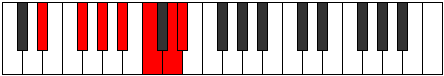
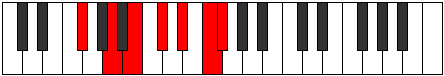

# Mode Aeragimic

## Links

- [Documentation](README.md)
- [Scales Index](Scales.md)
- [Modes Index](Modes.md)
- [Chords Index](Chords.md)

## Parent Scale

[Aeragimic](ScaleAeragimic.md)

## Number

[2729](https://ianring.com/musictheory/scales/2729)

## Interval Pattern

3, 2, 2, 2, 2, 1

## Chord Pattern

II⁺, III, IV⁺, VI⁺

## Perfection

- 2 Perfect notes
- 4 Perfect notes

## Perfection Profile

[true false true false false false]

## Permutations

| Tonic | Notes | Signature | Illustration | Audio |
|-------|-------|-----------|--------------|-------|
| [C](ModeCNaturalAeragimic.md) | C, **D#**, E#, **F##**, **G##**, **A##**, C | C |  | [midi](https://github.com/edipermadi/music/blob/main/docs/ModeCNaturalAeragimic.mid?raw=true) |
| [C#](ModeCSharpAeragimic.md) | C#, **D##**, E##, **F###**, **G###**, **A###**, C# | C |  | [midi](https://github.com/edipermadi/music/blob/main/docs/ModeCSharpAeragimic.mid?raw=true) |
| [Db](ModeDFlatAeragimic.md) | Db, **E**, F#, **G#**, **A#**, **B#**, Db | C |  | [midi](https://github.com/edipermadi/music/blob/main/docs/ModeDFlatAeragimic.mid?raw=true) |
| [D](ModeDNaturalAeragimic.md) | D, **E#**, F##, **G##**, **A##**, **B##**, D | C |  | [midi](https://github.com/edipermadi/music/blob/main/docs/ModeDNaturalAeragimic.mid?raw=true) |
| [D#](ModeDSharpAeragimic.md) | D#, **E##**, F###, **G###**, **A###**, **B###**, D# | C |  | [midi](https://github.com/edipermadi/music/blob/main/docs/ModeDSharpAeragimic.mid?raw=true) |
| [Eb](ModeEFlatAeragimic.md) | Eb, **F#**, G#, **A#**, **B#**, **C##**, Eb | C |  | [midi](https://github.com/edipermadi/music/blob/main/docs/ModeEFlatAeragimic.mid?raw=true) |
| [E](ModeENaturalAeragimic.md) | E, **F##**, G##, **A##**, **B##**, **C###**, E | C |  | [midi](https://github.com/edipermadi/music/blob/main/docs/ModeENaturalAeragimic.mid?raw=true) |
| [F](ModeFNaturalAeragimic.md) | F, **G#**, A#, **B#**, **C##**, **D##**, F | C |  | [midi](https://github.com/edipermadi/music/blob/main/docs/ModeFNaturalAeragimic.mid?raw=true) |
| [F#](ModeFSharpAeragimic.md) | F#, **G##**, A##, **B##**, **C###**, **D###**, F# | C |  | [midi](https://github.com/edipermadi/music/blob/main/docs/ModeFSharpAeragimic.mid?raw=true) |
| [Gb](ModeGFlatAeragimic.md) | Gb, **A**, B, **C#**, **D#**, **E#**, Gb | C |  | [midi](https://github.com/edipermadi/music/blob/main/docs/ModeGFlatAeragimic.mid?raw=true) |
| [G](ModeGNaturalAeragimic.md) | G, **A#**, B#, **C##**, **D##**, **E##**, G | C |  | [midi](https://github.com/edipermadi/music/blob/main/docs/ModeGNaturalAeragimic.mid?raw=true) |
| [G#](ModeGSharpAeragimic.md) | G#, **A##**, B##, **C###**, **D###**, **E###**, G# | C |  | [midi](https://github.com/edipermadi/music/blob/main/docs/ModeGSharpAeragimic.mid?raw=true) |
| [Ab](ModeAFlatAeragimic.md) | Ab, **B**, C#, **D#**, **E#**, **F##**, Ab | C |  | [midi](https://github.com/edipermadi/music/blob/main/docs/ModeAFlatAeragimic.mid?raw=true) |
| [A](ModeANaturalAeragimic.md) | A, **B#**, C##, **D##**, **E##**, **F###**, A | C |  | [midi](https://github.com/edipermadi/music/blob/main/docs/ModeANaturalAeragimic.mid?raw=true) |
| [A#](ModeASharpAeragimic.md) | A#, **B##**, C###, **D###**, **E###**, **Cbbb**, A# | C |  | [midi](https://github.com/edipermadi/music/blob/main/docs/ModeASharpAeragimic.mid?raw=true) |
| [Bb](ModeBFlatAeragimic.md) | Bb, **C#**, D#, **E#**, **F##**, **G##**, Bb | C |  | [midi](https://github.com/edipermadi/music/blob/main/docs/ModeBFlatAeragimic.mid?raw=true) |
| [B](ModeBNaturalAeragimic.md) | B, **C##**, D##, **E##**, **F###**, **G###**, B | C |  | [midi](https://github.com/edipermadi/music/blob/main/docs/ModeBNaturalAeragimic.mid?raw=true) |
