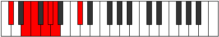
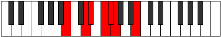

# Mode Aeralimic

## Links

- [Documentation](index.md)
- [Scales Index](Scales.md)
- [Modes Index](Modes.md)
- [Chords Index](Chords.md)

## Parent Scale

[Lathimic](ScaleLathimic.md)

## Number

[473](https://ianring.com/musictheory/scales/473)

## Perfection

- 2 Perfect notes
- 4 Perfect notes

## Perfection Profile

[true false false false false true]

## Permutations

| Tonic | Notes | Signature | Illustration | Audio |
|-------|-------|-----------|--------------|-------|
| [C](ModeCNaturalAeralimic.md) | C, **D#**, **E**, **F#**, **G**, Ab, C | C |  | [midi](ModeCNaturalAeralimic.mid) [ogg](ModeCNaturalAeralimic.ogg) |
| [C#](ModeCSharpAeralimic.md) | C#, **D##**, **E#**, **F##**, **G#**, A, C# | C |  | [midi](ModeCSharpAeralimic.mid) [ogg](ModeCSharpAeralimic.ogg) |
| [Db](ModeDFlatAeralimic.md) | Db, **E**, **F**, **G**, **Ab**, Bbb, Db | C |  | [midi](ModeDFlatAeralimic.mid) [ogg](ModeDFlatAeralimic.ogg) |
| [D](ModeDNaturalAeralimic.md) | D, **E#**, **F#**, **G#**, **A**, Bb, D | C |  | [midi](ModeDNaturalAeralimic.mid) [ogg](ModeDNaturalAeralimic.ogg) |
| [D#](ModeDSharpAeralimic.md) | D#, **E##**, **F##**, **G##**, **A#**, B, D# | C |  | [midi](ModeDSharpAeralimic.mid) [ogg](ModeDSharpAeralimic.ogg) |
| [Eb](ModeEFlatAeralimic.md) | Eb, **F#**, **G**, **A**, **Bb**, Cb, Eb | C |  | [midi](ModeEFlatAeralimic.mid) [ogg](ModeEFlatAeralimic.ogg) |
| [E](ModeENaturalAeralimic.md) | E, **F##**, **G#**, **A#**, **B**, C, E | C |  | [midi](ModeENaturalAeralimic.mid) [ogg](ModeENaturalAeralimic.ogg) |
| [F](ModeFNaturalAeralimic.md) | F, **G#**, **A**, **B**, **C**, Db, F | C |  | [midi](ModeFNaturalAeralimic.mid) [ogg](ModeFNaturalAeralimic.ogg) |
| [F#](ModeFSharpAeralimic.md) | F#, **G##**, **A#**, **B#**, **C#**, D, F# | C |  | [midi](ModeFSharpAeralimic.mid) [ogg](ModeFSharpAeralimic.ogg) |
| [Gb](ModeGFlatAeralimic.md) | Gb, **A**, **Bb**, **C**, **Db**, Ebb, Gb | C |  | [midi](ModeGFlatAeralimic.mid) [ogg](ModeGFlatAeralimic.ogg) |
| [G](ModeGNaturalAeralimic.md) | G, **A#**, **B**, **C#**, **D**, Eb, G | C |  | [midi](ModeGNaturalAeralimic.mid) [ogg](ModeGNaturalAeralimic.ogg) |
| [G#](ModeGSharpAeralimic.md) | G#, **A##**, **B#**, **C##**, **D#**, E, G# | C |  | [midi](ModeGSharpAeralimic.mid) [ogg](ModeGSharpAeralimic.ogg) |
| [Ab](ModeAFlatAeralimic.md) | Ab, **B**, **C**, **D**, **Eb**, Fb, Ab | C |  | [midi](ModeAFlatAeralimic.mid) [ogg](ModeAFlatAeralimic.ogg) |
| [A](ModeANaturalAeralimic.md) | A, **B#**, **C#**, **D#**, **E**, F, A | C |  | [midi](ModeANaturalAeralimic.mid) [ogg](ModeANaturalAeralimic.ogg) |
| [A#](ModeASharpAeralimic.md) | A#, **B##**, **C##**, **D##**, **E#**, F#, A# | C |  | [midi](ModeASharpAeralimic.mid) [ogg](ModeASharpAeralimic.ogg) |
| [Bb](ModeBFlatAeralimic.md) | Bb, **C#**, **D**, **E**, **F**, Gb, Bb | C |  | [midi](ModeBFlatAeralimic.mid) [ogg](ModeBFlatAeralimic.ogg) |
| [B](ModeBNaturalAeralimic.md) | B, **C##**, **D#**, **E#**, **F#**, G, B | C |  | [midi](ModeBNaturalAeralimic.mid) [ogg](ModeBNaturalAeralimic.ogg) |
