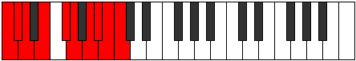

# Mode Aeralygic

## Links

- [Documentation](README.md)
- [Scales Index](Scales.md)
- [Modes Index](Modes.md)
- [Chords Index](Chords.md)

## Parent Scale

[Bagygic](ScaleBagygic.md)

## Number

[3799](https://ianring.com/musictheory/scales/3799)

## Luminosity

9

## Transposition

1, 1, 2, 2, 1, 2, 1, 1, 1

## Chord Pattern

i⁰b3, ii⁰, III, iv⁰

## Perfection

- 7 Perfect notes
- 2 Perfect notes

## Perfection Profile

true, false, true, true, true, true, true, false, true

## Permutations

| Tonic | Notes | Signature | Illustration | Audio |
|-------|-------|-----------|--------------|-------|
| [C](ModeCNaturalAeralygic.md) | C, **C#**, D, E, F#, G, A, **A#**, B, C | C |  | [midi](https://github.com/edipermadi/music/blob/main/docs/ModeCNaturalAeralygic.mid?raw=true) |
| [C#](ModeCSharpAeralygic.md) | C#, **D**, D#, F, G, G#, A#, **B**, C, C# | C |  | [midi](https://github.com/edipermadi/music/blob/main/docs/ModeCSharpAeralygic.mid?raw=true) |
| [Db](ModeDFlatAeralygic.md) | Db, **D**, Eb, F, G, Ab, Bb, **B**, C, Db | C |  | [midi](https://github.com/edipermadi/music/blob/main/docs/ModeDFlatAeralygic.mid?raw=true) |
| [D](ModeDNaturalAeralygic.md) | D, **D#**, E, F#, G#, A, B, **C**, C#, D | C |  | [midi](https://github.com/edipermadi/music/blob/main/docs/ModeDNaturalAeralygic.mid?raw=true) |
| [D#](ModeDSharpAeralygic.md) | D#, **E**, F, G, A, A#, C, **C#**, D, D# | C |  | [midi](https://github.com/edipermadi/music/blob/main/docs/ModeDSharpAeralygic.mid?raw=true) |
| [Eb](ModeEFlatAeralygic.md) | Eb, **E**, F, G, A, Bb, C, **Db**, D, Eb | C |  | [midi](https://github.com/edipermadi/music/blob/main/docs/ModeEFlatAeralygic.mid?raw=true) |
| [E](ModeENaturalAeralygic.md) | E, **F**, F#, G#, A#, B, C#, **D**, D#, E | C |  | [midi](https://github.com/edipermadi/music/blob/main/docs/ModeENaturalAeralygic.mid?raw=true) |
| [F](ModeFNaturalAeralygic.md) | F, **F#**, G, A, B, C, D, **D#**, E, F | C |  | [midi](https://github.com/edipermadi/music/blob/main/docs/ModeFNaturalAeralygic.mid?raw=true) |
| [F#](ModeFSharpAeralygic.md) | F#, **G**, G#, A#, C, C#, D#, **E**, F, F# | C |  | [midi](https://github.com/edipermadi/music/blob/main/docs/ModeFSharpAeralygic.mid?raw=true) |
| [Gb](ModeGFlatAeralygic.md) | Gb, **G**, Ab, Bb, C, Db, Eb, **E**, F, Gb | C |  | [midi](https://github.com/edipermadi/music/blob/main/docs/ModeGFlatAeralygic.mid?raw=true) |
| [G](ModeGNaturalAeralygic.md) | G, **G#**, A, B, C#, D, E, **F**, F#, G | C |  | [midi](https://github.com/edipermadi/music/blob/main/docs/ModeGNaturalAeralygic.mid?raw=true) |
| [G#](ModeGSharpAeralygic.md) | G#, **A**, A#, C, D, D#, F, **F#**, G, G# | C |  | [midi](https://github.com/edipermadi/music/blob/main/docs/ModeGSharpAeralygic.mid?raw=true) |
| [Ab](ModeAFlatAeralygic.md) | Ab, **A**, Bb, C, D, Eb, F, **Gb**, G, Ab | C |  | [midi](https://github.com/edipermadi/music/blob/main/docs/ModeAFlatAeralygic.mid?raw=true) |
| [A](ModeANaturalAeralygic.md) | A, **A#**, B, C#, D#, E, F#, **G**, G#, A | C |  | [midi](https://github.com/edipermadi/music/blob/main/docs/ModeANaturalAeralygic.mid?raw=true) |
| [A#](ModeASharpAeralygic.md) | A#, **B**, C, D, E, F, G, **G#**, A, A# | C |  | [midi](https://github.com/edipermadi/music/blob/main/docs/ModeASharpAeralygic.mid?raw=true) |
| [Bb](ModeBFlatAeralygic.md) | Bb, **B**, C, D, E, F, G, **Ab**, A, Bb | C |  | [midi](https://github.com/edipermadi/music/blob/main/docs/ModeBFlatAeralygic.mid?raw=true) |
| [B](ModeBNaturalAeralygic.md) | B, **C**, C#, D#, F, F#, G#, **A**, A#, B | C |  | [midi](https://github.com/edipermadi/music/blob/main/docs/ModeBNaturalAeralygic.mid?raw=true) |
