# Mode Aeralyllic

## Links

- [Documentation](index.md)
- [Scales Index](Scales.md)
- [Modes Index](Modes.md)
- [Chords Index](Chords.md)

## Parent Scale

[Sydyllic](ScaleSydyllic.md)

## Number

[3315](https://ianring.com/musictheory/scales/3315)

## Interval Pattern

1, 3, 1, 1, 1, 3, 1, 1

## Chord Pattern

I, ii⁰, iii⁰, iii, V, vi⁰, vii⁰, vii

## Perfection

- 6 Perfect notes
- 2 Perfect notes

## Perfection Profile

[true false true true true false true true]

## Permutations

| Tonic | Notes | Signature | Illustration | Audio |
|-------|-------|-----------|--------------|-------|
| [C](ModeCNaturalAeralyllic.md) | C, **C#**, E, F, F#, **G**, A#, B, C | C | 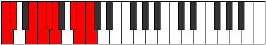 | [midi](https://github.com/edipermadi/music/blob/main/docs/ModeCNaturalAeralyllic.mid?raw=true) |
| [C#](ModeCSharpAeralyllic.md) | C#, **D**, F, F#, G, **G#**, B, C, C# | C | 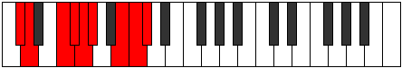 | [midi](https://github.com/edipermadi/music/blob/main/docs/ModeCSharpAeralyllic.mid?raw=true) |
| [Db](ModeDFlatAeralyllic.md) | Db, **D**, F, Gb, G, **Ab**, B, C, Db | C |  | [midi](https://github.com/edipermadi/music/blob/main/docs/ModeDFlatAeralyllic.mid?raw=true) |
| [D](ModeDNaturalAeralyllic.md) | D, **D#**, F#, G, G#, **A**, C, C#, D | C | 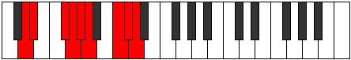 | [midi](https://github.com/edipermadi/music/blob/main/docs/ModeDNaturalAeralyllic.mid?raw=true) |
| [D#](ModeDSharpAeralyllic.md) | D#, **E**, G, G#, A, **A#**, C#, D, D# | C | 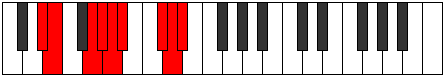 | [midi](https://github.com/edipermadi/music/blob/main/docs/ModeDSharpAeralyllic.mid?raw=true) |
| [Eb](ModeEFlatAeralyllic.md) | Eb, **E**, G, Ab, A, **Bb**, Db, D, Eb | C |  | [midi](https://github.com/edipermadi/music/blob/main/docs/ModeEFlatAeralyllic.mid?raw=true) |
| [E](ModeENaturalAeralyllic.md) | E, **F**, G#, A, A#, **B**, D, D#, E | C | 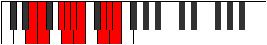 | [midi](https://github.com/edipermadi/music/blob/main/docs/ModeENaturalAeralyllic.mid?raw=true) |
| [F](ModeFNaturalAeralyllic.md) | F, **F#**, A, A#, B, **C**, D#, E, F | C | 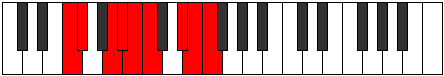 | [midi](https://github.com/edipermadi/music/blob/main/docs/ModeFNaturalAeralyllic.mid?raw=true) |
| [F#](ModeFSharpAeralyllic.md) | F#, **G**, A#, B, C, **C#**, E, F, F# | C | 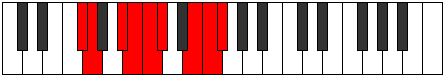 | [midi](https://github.com/edipermadi/music/blob/main/docs/ModeFSharpAeralyllic.mid?raw=true) |
| [Gb](ModeGFlatAeralyllic.md) | Gb, **G**, Bb, B, C, **Db**, E, F, Gb | C |  | [midi](https://github.com/edipermadi/music/blob/main/docs/ModeGFlatAeralyllic.mid?raw=true) |
| [G](ModeGNaturalAeralyllic.md) | G, **G#**, B, C, C#, **D**, F, F#, G | C | 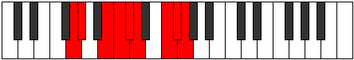 | [midi](https://github.com/edipermadi/music/blob/main/docs/ModeGNaturalAeralyllic.mid?raw=true) |
| [G#](ModeGSharpAeralyllic.md) | G#, **A**, C, C#, D, **D#**, F#, G, G# | C | 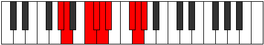 | [midi](https://github.com/edipermadi/music/blob/main/docs/ModeGSharpAeralyllic.mid?raw=true) |
| [Ab](ModeAFlatAeralyllic.md) | Ab, **A**, C, Db, D, **Eb**, Gb, G, Ab | C |  | [midi](https://github.com/edipermadi/music/blob/main/docs/ModeAFlatAeralyllic.mid?raw=true) |
| [A](ModeANaturalAeralyllic.md) | A, **A#**, C#, D, D#, **E**, G, G#, A | C | 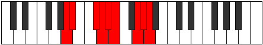 | [midi](https://github.com/edipermadi/music/blob/main/docs/ModeANaturalAeralyllic.mid?raw=true) |
| [A#](ModeASharpAeralyllic.md) | A#, **B**, D, D#, E, **F**, G#, A, A# | C | 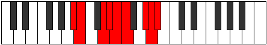 | [midi](https://github.com/edipermadi/music/blob/main/docs/ModeASharpAeralyllic.mid?raw=true) |
| [Bb](ModeBFlatAeralyllic.md) | Bb, **B**, D, Eb, E, **F**, Ab, A, Bb | C |  | [midi](https://github.com/edipermadi/music/blob/main/docs/ModeBFlatAeralyllic.mid?raw=true) |
| [B](ModeBNaturalAeralyllic.md) | B, **C**, D#, E, F, **F#**, A, A#, B | C | 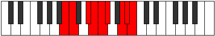 | [midi](https://github.com/edipermadi/music/blob/main/docs/ModeBNaturalAeralyllic.mid?raw=true) |
