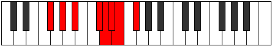

# Mode Aeranian

## Links

- [Documentation](README.md)
- [Scales Index](Scales.md)
- [Modes Index](Modes.md)
- [Chords Index](Chords.md)

## Parent Scale

[Pagian](ScalePagian.md)

## Number

[1941](https://ianring.com/musictheory/scales/1941)

## Interval Pattern

2, 2, 3, 1, 1, 1, 2

## Chord Pattern

I⁺, vi

## Perfection

- 4 Perfect notes
- 3 Perfect notes

## Perfection Profile

[true true false true false true false]

## Permutations

| Tonic | Notes | Signature | Illustration | Audio |
|-------|-------|-----------|--------------|-------|
| [C](ModeCNaturalAeranian.md) | C, D, **E**, F##, **G#**, A, **Bb**, C | C |  | [midi](https://github.com/edipermadi/music/blob/main/docs/ModeCNaturalAeranian.mid?raw=true) |
| [C#](ModeCSharpAeranian.md) | C#, D#, **E#**, F###, **G##**, A#, **B**, C# | C |  | [midi](https://github.com/edipermadi/music/blob/main/docs/ModeCSharpAeranian.mid?raw=true) |
| [Db](ModeDFlatAeranian.md) | Db, Eb, **F**, G#, **A**, Bb, **Cb**, Db | C |  | [midi](https://github.com/edipermadi/music/blob/main/docs/ModeDFlatAeranian.mid?raw=true) |
| [D](ModeDNaturalAeranian.md) | D, E, **F#**, G##, **A#**, B, **C**, D | C |  | [midi](https://github.com/edipermadi/music/blob/main/docs/ModeDNaturalAeranian.mid?raw=true) |
| [D#](ModeDSharpAeranian.md) | D#, E#, **F##**, G###, **A##**, B#, **C#**, D# | C |  | [midi](https://github.com/edipermadi/music/blob/main/docs/ModeDSharpAeranian.mid?raw=true) |
| [Eb](ModeEFlatAeranian.md) | Eb, F, **G**, A#, **B**, C, **Db**, Eb | C |  | [midi](https://github.com/edipermadi/music/blob/main/docs/ModeEFlatAeranian.mid?raw=true) |
| [E](ModeENaturalAeranian.md) | E, F#, **G#**, A##, **B#**, C#, **D**, E | C |  | [midi](https://github.com/edipermadi/music/blob/main/docs/ModeENaturalAeranian.mid?raw=true) |
| [F](ModeFNaturalAeranian.md) | F, G, **A**, B#, **C#**, D, **Eb**, F | C |  | [midi](https://github.com/edipermadi/music/blob/main/docs/ModeFNaturalAeranian.mid?raw=true) |
| [F#](ModeFSharpAeranian.md) | F#, G#, **A#**, B##, **C##**, D#, **E**, F# | C |  | [midi](https://github.com/edipermadi/music/blob/main/docs/ModeFSharpAeranian.mid?raw=true) |
| [Gb](ModeGFlatAeranian.md) | Gb, Ab, **Bb**, C#, **D**, Eb, **Fb**, Gb | C |  | [midi](https://github.com/edipermadi/music/blob/main/docs/ModeGFlatAeranian.mid?raw=true) |
| [G](ModeGNaturalAeranian.md) | G, A, **B**, C##, **D#**, E, **F**, G | C |  | [midi](https://github.com/edipermadi/music/blob/main/docs/ModeGNaturalAeranian.mid?raw=true) |
| [G#](ModeGSharpAeranian.md) | G#, A#, **B#**, C###, **D##**, E#, **F#**, G# | C |  | [midi](https://github.com/edipermadi/music/blob/main/docs/ModeGSharpAeranian.mid?raw=true) |
| [Ab](ModeAFlatAeranian.md) | Ab, Bb, **C**, D#, **E**, F, **Gb**, Ab | C |  | [midi](https://github.com/edipermadi/music/blob/main/docs/ModeAFlatAeranian.mid?raw=true) |
| [A](ModeANaturalAeranian.md) | A, B, **C#**, D##, **E#**, F#, **G**, A | C |  | [midi](https://github.com/edipermadi/music/blob/main/docs/ModeANaturalAeranian.mid?raw=true) |
| [A#](ModeASharpAeranian.md) | A#, B#, **C##**, D###, **E##**, F##, **G#**, A# | C |  | [midi](https://github.com/edipermadi/music/blob/main/docs/ModeASharpAeranian.mid?raw=true) |
| [Bb](ModeBFlatAeranian.md) | Bb, C, **D**, E#, **F#**, G, **Ab**, Bb | C |  | [midi](https://github.com/edipermadi/music/blob/main/docs/ModeBFlatAeranian.mid?raw=true) |
| [B](ModeBNaturalAeranian.md) | B, C#, **D#**, E##, **F##**, G#, **A**, B | C |  | [midi](https://github.com/edipermadi/music/blob/main/docs/ModeBNaturalAeranian.mid?raw=true) |
