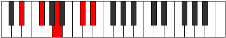
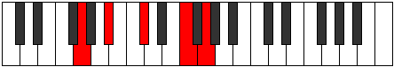
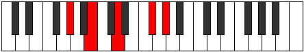

# Mode Aeraphic

## Links

- [Documentation](index.md)
- [Scales Index](Scales.md)
- [Modes Index](Modes.md)
- [Chords Index](Chords.md)

## Parent Scale

[Saric](ScaleSaric.md)

## Number

[1097](https://ianring.com/musictheory/scales/1097)

## Perfection

- 1 Perfect notes
- 3 Perfect notes

## Perfection Profile

[false true false false]

## Permutations

| Tonic | Notes | Signature | Illustration | Audio |
|-------|-------|-----------|--------------|-------|
| [C](ModeCNaturalAeraphic.md) | **C**, D#, **F#**, **A#**, **C** | C |  | [midi](ModeCNaturalAeraphic.mid) [ogg](ModeCNaturalAeraphic.ogg) |
| [C#](ModeCSharpAeraphic.md) | **C#**, E, **G**, **B**, **C#** | C |  | [midi](ModeCSharpAeraphic.mid) [ogg](ModeCSharpAeraphic.ogg) |
| [Db](ModeDFlatAeraphic.md) | **Db**, E, **G**, **B**, **Db** | C |  | [midi](ModeDFlatAeraphic.mid) [ogg](ModeDFlatAeraphic.ogg) |
| [D](ModeDNaturalAeraphic.md) | **D**, F, **G#**, **C**, **D** | C |  | [midi](ModeDNaturalAeraphic.mid) [ogg](ModeDNaturalAeraphic.ogg) |
| [D#](ModeDSharpAeraphic.md) | **D#**, F#, **A**, **C#**, **D#** | C |  | [midi](ModeDSharpAeraphic.mid) [ogg](ModeDSharpAeraphic.ogg) |
| [Eb](ModeEFlatAeraphic.md) | **Eb**, Gb, **A**, **Db**, **Eb** | C |  | [midi](ModeEFlatAeraphic.mid) [ogg](ModeEFlatAeraphic.ogg) |
| [E](ModeENaturalAeraphic.md) | **E**, G, **A#**, **D**, **E** | C |  | [midi](ModeENaturalAeraphic.mid) [ogg](ModeENaturalAeraphic.ogg) |
| [F](ModeFNaturalAeraphic.md) | **F**, G#, **B**, **D#**, **F** | C |  | [midi](ModeFNaturalAeraphic.mid) [ogg](ModeFNaturalAeraphic.ogg) |
| [F#](ModeFSharpAeraphic.md) | **F#**, A, **C**, **E**, **F#** | C |  | [midi](ModeFSharpAeraphic.mid) [ogg](ModeFSharpAeraphic.ogg) |
| [Gb](ModeGFlatAeraphic.md) | **Gb**, A, **C**, **E**, **Gb** | C |  | [midi](ModeGFlatAeraphic.mid) [ogg](ModeGFlatAeraphic.ogg) |
| [G](ModeGNaturalAeraphic.md) | **G**, A#, **C#**, **F**, **G** | C |  | [midi](ModeGNaturalAeraphic.mid) [ogg](ModeGNaturalAeraphic.ogg) |
| [G#](ModeGSharpAeraphic.md) | **G#**, B, **D**, **F#**, **G#** | C |  | [midi](ModeGSharpAeraphic.mid) [ogg](ModeGSharpAeraphic.ogg) |
| [Ab](ModeAFlatAeraphic.md) | **Ab**, B, **D**, **Gb**, **Ab** | C |  | [midi](ModeAFlatAeraphic.mid) [ogg](ModeAFlatAeraphic.ogg) |
| [A](ModeANaturalAeraphic.md) | **A**, C, **D#**, **G**, **A** | C |  | [midi](ModeANaturalAeraphic.mid) [ogg](ModeANaturalAeraphic.ogg) |
| [A#](ModeASharpAeraphic.md) | **A#**, C#, **E**, **G#**, **A#** | C |  | [midi](ModeASharpAeraphic.mid) [ogg](ModeASharpAeraphic.ogg) |
| [Bb](ModeBFlatAeraphic.md) | **Bb**, Db, **E**, **Ab**, **Bb** | C |  | [midi](ModeBFlatAeraphic.mid) [ogg](ModeBFlatAeraphic.ogg) |
| [B](ModeBNaturalAeraphic.md) | **B**, D, **F**, **A**, **B** | C |  | [midi](ModeBNaturalAeraphic.mid) [ogg](ModeBNaturalAeraphic.ogg) |
