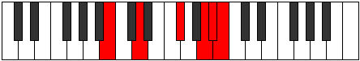

# Mode Aeraphitonic

## Links

- [Documentation](index.md)
- [Scales Index](Scales.md)
- [Modes Index](Modes.md)
- [Chords Index](Chords.md)

## Parent Scale

[Aeolyritonic](ScaleAeolyritonic.md)

## Number

[3209](https://ianring.com/musictheory/scales/3209)

## Perfection

- 2 Perfect notes
- 3 Perfect notes

## Perfection Profile

[true true false false false]

## Permutations

| Tonic | Notes | Signature | Illustration | Audio |
|-------|-------|-----------|--------------|-------|
| [C](ModeCNaturalAeraphitonic.md) | C, D#, **G**, **A#**, **B**, C | C |  | [midi](ModeCNaturalAeraphitonic.mid) [ogg](ModeCNaturalAeraphitonic.ogg) |
| [C#](ModeCSharpAeraphitonic.md) | C#, E, **G#**, **B**, **C**, C# | C |  | [midi](ModeCSharpAeraphitonic.mid) [ogg](ModeCSharpAeraphitonic.ogg) |
| [Db](ModeDFlatAeraphitonic.md) | Db, E, **Ab**, **B**, **C**, Db | C |  | [midi](ModeDFlatAeraphitonic.mid) [ogg](ModeDFlatAeraphitonic.ogg) |
| [D](ModeDNaturalAeraphitonic.md) | D, F, **A**, **C**, **C#**, D | C |  | [midi](ModeDNaturalAeraphitonic.mid) [ogg](ModeDNaturalAeraphitonic.ogg) |
| [D#](ModeDSharpAeraphitonic.md) | D#, F#, **A#**, **C#**, **D**, D# | C |  | [midi](ModeDSharpAeraphitonic.mid) [ogg](ModeDSharpAeraphitonic.ogg) |
| [Eb](ModeEFlatAeraphitonic.md) | Eb, Gb, **Bb**, **Db**, **D**, Eb | C |  | [midi](ModeEFlatAeraphitonic.mid) [ogg](ModeEFlatAeraphitonic.ogg) |
| [E](ModeENaturalAeraphitonic.md) | E, G, **B**, **D**, **D#**, E | C |  | [midi](ModeENaturalAeraphitonic.mid) [ogg](ModeENaturalAeraphitonic.ogg) |
| [F](ModeFNaturalAeraphitonic.md) | F, G#, **C**, **D#**, **E**, F | C |  | [midi](ModeFNaturalAeraphitonic.mid) [ogg](ModeFNaturalAeraphitonic.ogg) |
| [F#](ModeFSharpAeraphitonic.md) | F#, A, **C#**, **E**, **F**, F# | C |  | [midi](ModeFSharpAeraphitonic.mid) [ogg](ModeFSharpAeraphitonic.ogg) |
| [Gb](ModeGFlatAeraphitonic.md) | Gb, A, **Db**, **E**, **F**, Gb | C |  | [midi](ModeGFlatAeraphitonic.mid) [ogg](ModeGFlatAeraphitonic.ogg) |
| [G](ModeGNaturalAeraphitonic.md) | G, A#, **D**, **F**, **F#**, G | C |  | [midi](ModeGNaturalAeraphitonic.mid) [ogg](ModeGNaturalAeraphitonic.ogg) |
| [G#](ModeGSharpAeraphitonic.md) | G#, B, **D#**, **F#**, **G**, G# | C |  | [midi](ModeGSharpAeraphitonic.mid) [ogg](ModeGSharpAeraphitonic.ogg) |
| [Ab](ModeAFlatAeraphitonic.md) | Ab, B, **Eb**, **Gb**, **G**, Ab | C |  | [midi](ModeAFlatAeraphitonic.mid) [ogg](ModeAFlatAeraphitonic.ogg) |
| [A](ModeANaturalAeraphitonic.md) | A, C, **E**, **G**, **G#**, A | C |  | [midi](ModeANaturalAeraphitonic.mid) [ogg](ModeANaturalAeraphitonic.ogg) |
| [A#](ModeASharpAeraphitonic.md) | A#, C#, **F**, **G#**, **A**, A# | C |  | [midi](ModeASharpAeraphitonic.mid) [ogg](ModeASharpAeraphitonic.ogg) |
| [Bb](ModeBFlatAeraphitonic.md) | Bb, Db, **F**, **Ab**, **A**, Bb | C |  | [midi](ModeBFlatAeraphitonic.mid) [ogg](ModeBFlatAeraphitonic.ogg) |
| [B](ModeBNaturalAeraphitonic.md) | B, D, **F#**, **A**, **A#**, B | C |  | [midi](ModeBNaturalAeraphitonic.mid) [ogg](ModeBNaturalAeraphitonic.ogg) |
