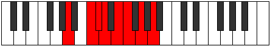

# Mode Aerathian

## Links

- [Documentation](index.md)
- [Scales Index](Scales.md)
- [Modes Index](Modes.md)
- [Chords Index](Chords.md)

## Parent Scale

[Aerathian](ScaleAerathian.md)

## Number

[1465](https://ianring.com/musictheory/scales/1465)

## Interval Pattern

3, 1, 1, 2, 1, 2, 2

## Chord Pattern

i, I, I⁺, II, III⁺, iii⁰, iv, VI, VI⁺

## Perfection

- 5 Perfect notes
- 2 Perfect notes

## Perfection Profile

[true true false true false true true]

## Permutations

| Tonic | Notes | Signature | Illustration | Audio |
|-------|-------|-----------|--------------|-------|
| [C](ModeCNaturalAerathian.md) | C, D#, **E**, F, **G**, Ab, Bb, C | C |  | [midi](https://github.com/edipermadi/music/blob/main/docs/ModeCNaturalAerathian.mid?raw=true) |
| [C#](ModeCSharpAerathian.md) | C#, D##, **E#**, F#, **G#**, A, B, C# | C |  | [midi](https://github.com/edipermadi/music/blob/main/docs/ModeCSharpAerathian.mid?raw=true) |
| [Db](ModeDFlatAerathian.md) | Db, E, **F**, Gb, **Ab**, Bbb, Cb, Db | C |  | [midi](https://github.com/edipermadi/music/blob/main/docs/ModeDFlatAerathian.mid?raw=true) |
| [D](ModeDNaturalAerathian.md) | D, E#, **F#**, G, **A**, Bb, C, D | C |  | [midi](https://github.com/edipermadi/music/blob/main/docs/ModeDNaturalAerathian.mid?raw=true) |
| [D#](ModeDSharpAerathian.md) | D#, E##, **F##**, G#, **A#**, B, C#, D# | C |  | [midi](https://github.com/edipermadi/music/blob/main/docs/ModeDSharpAerathian.mid?raw=true) |
| [Eb](ModeEFlatAerathian.md) | Eb, F#, **G**, Ab, **Bb**, Cb, Db, Eb | C |  | [midi](https://github.com/edipermadi/music/blob/main/docs/ModeEFlatAerathian.mid?raw=true) |
| [E](ModeENaturalAerathian.md) | E, F##, **G#**, A, **B**, C, D, E | C |  | [midi](https://github.com/edipermadi/music/blob/main/docs/ModeENaturalAerathian.mid?raw=true) |
| [F](ModeFNaturalAerathian.md) | F, G#, **A**, Bb, **C**, Db, Eb, F | C |  | [midi](https://github.com/edipermadi/music/blob/main/docs/ModeFNaturalAerathian.mid?raw=true) |
| [F#](ModeFSharpAerathian.md) | F#, G##, **A#**, B, **C#**, D, E, F# | C |  | [midi](https://github.com/edipermadi/music/blob/main/docs/ModeFSharpAerathian.mid?raw=true) |
| [Gb](ModeGFlatAerathian.md) | Gb, A, **Bb**, Cb, **Db**, Ebb, Fb, Gb | C |  | [midi](https://github.com/edipermadi/music/blob/main/docs/ModeGFlatAerathian.mid?raw=true) |
| [G](ModeGNaturalAerathian.md) | G, A#, **B**, C, **D**, Eb, F, G | C |  | [midi](https://github.com/edipermadi/music/blob/main/docs/ModeGNaturalAerathian.mid?raw=true) |
| [G#](ModeGSharpAerathian.md) | G#, A##, **B#**, C#, **D#**, E, F#, G# | C |  | [midi](https://github.com/edipermadi/music/blob/main/docs/ModeGSharpAerathian.mid?raw=true) |
| [Ab](ModeAFlatAerathian.md) | Ab, B, **C**, Db, **Eb**, Fb, Gb, Ab | C |  | [midi](https://github.com/edipermadi/music/blob/main/docs/ModeAFlatAerathian.mid?raw=true) |
| [A](ModeANaturalAerathian.md) | A, B#, **C#**, D, **E**, F, G, A | C |  | [midi](https://github.com/edipermadi/music/blob/main/docs/ModeANaturalAerathian.mid?raw=true) |
| [A#](ModeASharpAerathian.md) | A#, B##, **C##**, D#, **E#**, F#, G#, A# | C |  | [midi](https://github.com/edipermadi/music/blob/main/docs/ModeASharpAerathian.mid?raw=true) |
| [Bb](ModeBFlatAerathian.md) | Bb, C#, **D**, Eb, **F**, Gb, Ab, Bb | C |  | [midi](https://github.com/edipermadi/music/blob/main/docs/ModeBFlatAerathian.mid?raw=true) |
| [B](ModeBNaturalAerathian.md) | B, C##, **D#**, E, **F#**, G, A, B | C |  | [midi](https://github.com/edipermadi/music/blob/main/docs/ModeBNaturalAerathian.mid?raw=true) |
