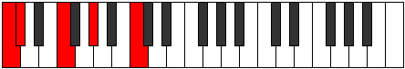
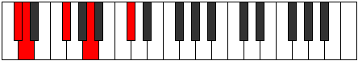
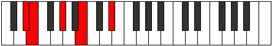
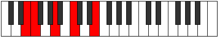
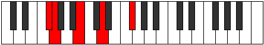
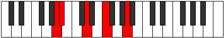
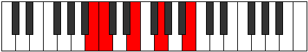

# Mode Aerathic

## Links

- [Documentation](index.md)
- [Scales Index](Scales.md)
- [Modes Index](Modes.md)
- [Chords Index](Chords.md)

## Parent Scale

[Thaptic](ScaleThaptic.md)

## Number

[291](https://ianring.com/musictheory/scales/291)

## Interval Pattern

1, 4, 3, 4

## Chord Pattern

## Perfection

- 2 Perfect notes
- 2 Perfect notes

## Perfection Profile

[false true true false]

## Permutations

| Tonic | Notes | Signature | Illustration | Audio |
|-------|-------|-----------|--------------|-------|
| [C](ModeCNaturalAerathic.md) | **C**, C#, F, **G#**, **C** | C |  | [midi](https://github.com/edipermadi/music/blob/main/docs/ModeCNaturalAerathic.mid?raw=true) |
| [C#](ModeCSharpAerathic.md) | **C#**, D, F#, **A**, **C#** | C |  | [midi](https://github.com/edipermadi/music/blob/main/docs/ModeCSharpAerathic.mid?raw=true) |
| [Db](ModeDFlatAerathic.md) | **Db**, D, Gb, **A**, **Db** | C |  | [midi](https://github.com/edipermadi/music/blob/main/docs/ModeDFlatAerathic.mid?raw=true) |
| [D](ModeDNaturalAerathic.md) | **D**, D#, G, **A#**, **D** | C |  | [midi](https://github.com/edipermadi/music/blob/main/docs/ModeDNaturalAerathic.mid?raw=true) |
| [D#](ModeDSharpAerathic.md) | **D#**, E, G#, **B**, **D#** | C |  | [midi](https://github.com/edipermadi/music/blob/main/docs/ModeDSharpAerathic.mid?raw=true) |
| [Eb](ModeEFlatAerathic.md) | **Eb**, E, Ab, **B**, **Eb** | C |  | [midi](https://github.com/edipermadi/music/blob/main/docs/ModeEFlatAerathic.mid?raw=true) |
| [E](ModeENaturalAerathic.md) | **E**, F, A, **C**, **E** | C |  | [midi](https://github.com/edipermadi/music/blob/main/docs/ModeENaturalAerathic.mid?raw=true) |
| [F](ModeFNaturalAerathic.md) | **F**, F#, A#, **C#**, **F** | C |  | [midi](https://github.com/edipermadi/music/blob/main/docs/ModeFNaturalAerathic.mid?raw=true) |
| [F#](ModeFSharpAerathic.md) | **F#**, G, B, **D**, **F#** | C |  | [midi](https://github.com/edipermadi/music/blob/main/docs/ModeFSharpAerathic.mid?raw=true) |
| [Gb](ModeGFlatAerathic.md) | **Gb**, G, B, **D**, **Gb** | C |  | [midi](https://github.com/edipermadi/music/blob/main/docs/ModeGFlatAerathic.mid?raw=true) |
| [G](ModeGNaturalAerathic.md) | **G**, G#, C, **D#**, **G** | C |  | [midi](https://github.com/edipermadi/music/blob/main/docs/ModeGNaturalAerathic.mid?raw=true) |
| [G#](ModeGSharpAerathic.md) | **G#**, A, C#, **E**, **G#** | C |  | [midi](https://github.com/edipermadi/music/blob/main/docs/ModeGSharpAerathic.mid?raw=true) |
| [Ab](ModeAFlatAerathic.md) | **Ab**, A, Db, **E**, **Ab** | C |  | [midi](https://github.com/edipermadi/music/blob/main/docs/ModeAFlatAerathic.mid?raw=true) |
| [A](ModeANaturalAerathic.md) | **A**, A#, D, **F**, **A** | C |  | [midi](https://github.com/edipermadi/music/blob/main/docs/ModeANaturalAerathic.mid?raw=true) |
| [A#](ModeASharpAerathic.md) | **A#**, B, D#, **F#**, **A#** | C |  | [midi](https://github.com/edipermadi/music/blob/main/docs/ModeASharpAerathic.mid?raw=true) |
| [Bb](ModeBFlatAerathic.md) | **Bb**, B, Eb, **Gb**, **Bb** | C |  | [midi](https://github.com/edipermadi/music/blob/main/docs/ModeBFlatAerathic.mid?raw=true) |
| [B](ModeBNaturalAerathic.md) | **B**, C, E, **G**, **B** | C |  | [midi](https://github.com/edipermadi/music/blob/main/docs/ModeBNaturalAerathic.mid?raw=true) |
