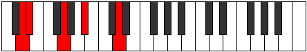
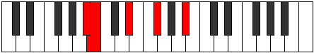

# Mode Aerathic

## Links

- [Documentation](index.md)
- [Scales Index](Scales.md)
- [Modes Index](Modes.md)
- [Chords Index](Chords.md)

## Parent Scale

[Thaptic](ScaleThaptic.md)

## Number

[291](https://ianring.com/musictheory/scales/291)

## Perfection

- 2 Perfect notes
- 2 Perfect notes

## Perfection Profile

[false true true false]

## Permutations

| Tonic | Notes | Signature | Illustration | Audio |
|-------|-------|-----------|--------------|-------|
| [C](ModeCNaturalAerathic.md) | **C**, C#, F, **G#**, **C** | C |  | [midi](ModeCNaturalAerathic.mid) [ogg](ModeCNaturalAerathic.ogg) |
| [C#](ModeCSharpAerathic.md) | **C#**, D, F#, **A**, **C#** | C |  | [midi](ModeCSharpAerathic.mid) [ogg](ModeCSharpAerathic.ogg) |
| [Db](ModeDFlatAerathic.md) | **Db**, D, Gb, **A**, **Db** | C |  | [midi](ModeDFlatAerathic.mid) [ogg](ModeDFlatAerathic.ogg) |
| [D](ModeDNaturalAerathic.md) | **D**, D#, G, **A#**, **D** | C |  | [midi](ModeDNaturalAerathic.mid) [ogg](ModeDNaturalAerathic.ogg) |
| [D#](ModeDSharpAerathic.md) | **D#**, E, G#, **B**, **D#** | C |  | [midi](ModeDSharpAerathic.mid) [ogg](ModeDSharpAerathic.ogg) |
| [Eb](ModeEFlatAerathic.md) | **Eb**, E, Ab, **B**, **Eb** | C |  | [midi](ModeEFlatAerathic.mid) [ogg](ModeEFlatAerathic.ogg) |
| [E](ModeENaturalAerathic.md) | **E**, F, A, **C**, **E** | C |  | [midi](ModeENaturalAerathic.mid) [ogg](ModeENaturalAerathic.ogg) |
| [F](ModeFNaturalAerathic.md) | **F**, F#, A#, **C#**, **F** | C |  | [midi](ModeFNaturalAerathic.mid) [ogg](ModeFNaturalAerathic.ogg) |
| [F#](ModeFSharpAerathic.md) | **F#**, G, B, **D**, **F#** | C |  | [midi](ModeFSharpAerathic.mid) [ogg](ModeFSharpAerathic.ogg) |
| [Gb](ModeGFlatAerathic.md) | **Gb**, G, B, **D**, **Gb** | C |  | [midi](ModeGFlatAerathic.mid) [ogg](ModeGFlatAerathic.ogg) |
| [G](ModeGNaturalAerathic.md) | **G**, G#, C, **D#**, **G** | C |  | [midi](ModeGNaturalAerathic.mid) [ogg](ModeGNaturalAerathic.ogg) |
| [G#](ModeGSharpAerathic.md) | **G#**, A, C#, **E**, **G#** | C |  | [midi](ModeGSharpAerathic.mid) [ogg](ModeGSharpAerathic.ogg) |
| [Ab](ModeAFlatAerathic.md) | **Ab**, A, Db, **E**, **Ab** | C |  | [midi](ModeAFlatAerathic.mid) [ogg](ModeAFlatAerathic.ogg) |
| [A](ModeANaturalAerathic.md) | **A**, A#, D, **F**, **A** | C |  | [midi](ModeANaturalAerathic.mid) [ogg](ModeANaturalAerathic.ogg) |
| [A#](ModeASharpAerathic.md) | **A#**, B, D#, **F#**, **A#** | C |  | [midi](ModeASharpAerathic.mid) [ogg](ModeASharpAerathic.ogg) |
| [Bb](ModeBFlatAerathic.md) | **Bb**, B, Eb, **Gb**, **Bb** | C |  | [midi](ModeBFlatAerathic.mid) [ogg](ModeBFlatAerathic.ogg) |
| [B](ModeBNaturalAerathic.md) | **B**, C, E, **G**, **B** | C |  | [midi](ModeBNaturalAerathic.mid) [ogg](ModeBNaturalAerathic.ogg) |
