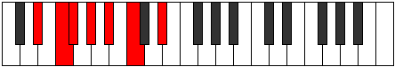
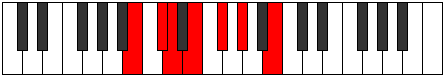

# Mode Aerathimic

## Links

- [Documentation](index.md)
- [Scales Index](Scales.md)
- [Modes Index](Modes.md)
- [Chords Index](Chords.md)

## Parent Scale

[Phracrimic](ScalePhracrimic.md)

## Number

[685](https://ianring.com/musictheory/scales/685)

## Perfection

- 4 Perfect notes
- 2 Perfect notes

## Perfection Profile

[true true false true true false]

## Permutations

| Tonic | Notes | Signature | Illustration | Audio |
|-------|-------|-----------|--------------|-------|
| [C](ModeCNaturalAerathimic.md) | C, D, **Eb**, F, G, **A**, C | C |  | [midi](ModeCNaturalAerathimic.mid) [ogg](ModeCNaturalAerathimic.ogg) |
| [C#](ModeCSharpAerathimic.md) | C#, D#, **E**, F#, G#, **A#**, C# | C |  | [midi](ModeCSharpAerathimic.mid) [ogg](ModeCSharpAerathimic.ogg) |
| [Db](ModeDFlatAerathimic.md) | Db, Eb, **Fb**, Gb, Ab, **Bb**, Db | C |  | [midi](ModeDFlatAerathimic.mid) [ogg](ModeDFlatAerathimic.ogg) |
| [D](ModeDNaturalAerathimic.md) | D, E, **F**, G, A, **B**, D | C |  | [midi](ModeDNaturalAerathimic.mid) [ogg](ModeDNaturalAerathimic.ogg) |
| [D#](ModeDSharpAerathimic.md) | D#, E#, **F#**, G#, A#, **B#**, D# | C |  | [midi](ModeDSharpAerathimic.mid) [ogg](ModeDSharpAerathimic.ogg) |
| [Eb](ModeEFlatAerathimic.md) | Eb, F, **Gb**, Ab, Bb, **C**, Eb | C |  | [midi](ModeEFlatAerathimic.mid) [ogg](ModeEFlatAerathimic.ogg) |
| [E](ModeENaturalAerathimic.md) | E, F#, **G**, A, B, **C#**, E | C |  | [midi](ModeENaturalAerathimic.mid) [ogg](ModeENaturalAerathimic.ogg) |
| [F](ModeFNaturalAerathimic.md) | F, G, **Ab**, Bb, C, **D**, F | C |  | [midi](ModeFNaturalAerathimic.mid) [ogg](ModeFNaturalAerathimic.ogg) |
| [F#](ModeFSharpAerathimic.md) | F#, G#, **A**, B, C#, **D#**, F# | C |  | [midi](ModeFSharpAerathimic.mid) [ogg](ModeFSharpAerathimic.ogg) |
| [Gb](ModeGFlatAerathimic.md) | Gb, Ab, **Bbb**, Cb, Db, **Eb**, Gb | C |  | [midi](ModeGFlatAerathimic.mid) [ogg](ModeGFlatAerathimic.ogg) |
| [G](ModeGNaturalAerathimic.md) | G, A, **Bb**, C, D, **E**, G | C |  | [midi](ModeGNaturalAerathimic.mid) [ogg](ModeGNaturalAerathimic.ogg) |
| [G#](ModeGSharpAerathimic.md) | G#, A#, **B**, C#, D#, **E#**, G# | C |  | [midi](ModeGSharpAerathimic.mid) [ogg](ModeGSharpAerathimic.ogg) |
| [Ab](ModeAFlatAerathimic.md) | Ab, Bb, **Cb**, Db, Eb, **F**, Ab | C |  | [midi](ModeAFlatAerathimic.mid) [ogg](ModeAFlatAerathimic.ogg) |
| [A](ModeANaturalAerathimic.md) | A, B, **C**, D, E, **F#**, A | C |  | [midi](ModeANaturalAerathimic.mid) [ogg](ModeANaturalAerathimic.ogg) |
| [A#](ModeASharpAerathimic.md) | A#, B#, **C#**, D#, E#, **F##**, A# | C |  | [midi](ModeASharpAerathimic.mid) [ogg](ModeASharpAerathimic.ogg) |
| [Bb](ModeBFlatAerathimic.md) | Bb, C, **Db**, Eb, F, **G**, Bb | C |  | [midi](ModeBFlatAerathimic.mid) [ogg](ModeBFlatAerathimic.ogg) |
| [B](ModeBNaturalAerathimic.md) | B, C#, **D**, E, F#, **G#**, B | C |  | [midi](ModeBNaturalAerathimic.mid) [ogg](ModeBNaturalAerathimic.ogg) |
