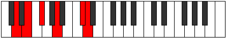

# Mode Aerathitonic

## Links

- [Documentation](index.md)
- [Scales Index](Scales.md)
- [Modes Index](Modes.md)
- [Chords Index](Chords.md)

## Parent Scale

[Lothitonic](ScaleLothitonic.md)

## Number

[2197](https://ianring.com/musictheory/scales/2197)

## Perfection

- 3 Perfect notes
- 2 Perfect notes

## Interval Pattern

2, 2, 3, 4, 1

## Perfection Profile

[true false true true false]

## Permutations

| Tonic | Notes | Signature | Illustration | Audio |
|-------|-------|-----------|--------------|-------|
| [C](ModeCNaturalAerathitonic.md) | C, **D**, E, G, **B**, C | C |  | [midi](https://github.com/edipermadi/music/blob/main/docs/ModeCNaturalAerathitonic.mid?raw=true) |
| [C#](ModeCSharpAerathitonic.md) | C#, **D#**, F, G#, **C**, C# | C |  | [midi](https://github.com/edipermadi/music/blob/main/docs/ModeCSharpAerathitonic.mid?raw=true) |
| [Db](ModeDFlatAerathitonic.md) | Db, **Eb**, F, Ab, **C**, Db | C |  | [midi](https://github.com/edipermadi/music/blob/main/docs/ModeDFlatAerathitonic.mid?raw=true) |
| [D](ModeDNaturalAerathitonic.md) | D, **E**, F#, A, **C#**, D | C |  | [midi](https://github.com/edipermadi/music/blob/main/docs/ModeDNaturalAerathitonic.mid?raw=true) |
| [D#](ModeDSharpAerathitonic.md) | D#, **F**, G, A#, **D**, D# | C |  | [midi](https://github.com/edipermadi/music/blob/main/docs/ModeDSharpAerathitonic.mid?raw=true) |
| [Eb](ModeEFlatAerathitonic.md) | Eb, **F**, G, Bb, **D**, Eb | C |  | [midi](https://github.com/edipermadi/music/blob/main/docs/ModeEFlatAerathitonic.mid?raw=true) |
| [E](ModeENaturalAerathitonic.md) | E, **F#**, G#, B, **D#**, E | C |  | [midi](https://github.com/edipermadi/music/blob/main/docs/ModeENaturalAerathitonic.mid?raw=true) |
| [F](ModeFNaturalAerathitonic.md) | F, **G**, A, C, **E**, F | C |  | [midi](https://github.com/edipermadi/music/blob/main/docs/ModeFNaturalAerathitonic.mid?raw=true) |
| [F#](ModeFSharpAerathitonic.md) | F#, **G#**, A#, C#, **F**, F# | C |  | [midi](https://github.com/edipermadi/music/blob/main/docs/ModeFSharpAerathitonic.mid?raw=true) |
| [Gb](ModeGFlatAerathitonic.md) | Gb, **Ab**, Bb, Db, **F**, Gb | C |  | [midi](https://github.com/edipermadi/music/blob/main/docs/ModeGFlatAerathitonic.mid?raw=true) |
| [G](ModeGNaturalAerathitonic.md) | G, **A**, B, D, **F#**, G | C |  | [midi](https://github.com/edipermadi/music/blob/main/docs/ModeGNaturalAerathitonic.mid?raw=true) |
| [G#](ModeGSharpAerathitonic.md) | G#, **A#**, C, D#, **G**, G# | C |  | [midi](https://github.com/edipermadi/music/blob/main/docs/ModeGSharpAerathitonic.mid?raw=true) |
| [Ab](ModeAFlatAerathitonic.md) | Ab, **Bb**, C, Eb, **G**, Ab | C |  | [midi](https://github.com/edipermadi/music/blob/main/docs/ModeAFlatAerathitonic.mid?raw=true) |
| [A](ModeANaturalAerathitonic.md) | A, **B**, C#, E, **G#**, A | C |  | [midi](https://github.com/edipermadi/music/blob/main/docs/ModeANaturalAerathitonic.mid?raw=true) |
| [A#](ModeASharpAerathitonic.md) | A#, **C**, D, F, **A**, A# | C |  | [midi](https://github.com/edipermadi/music/blob/main/docs/ModeASharpAerathitonic.mid?raw=true) |
| [Bb](ModeBFlatAerathitonic.md) | Bb, **C**, D, F, **A**, Bb | C |  | [midi](https://github.com/edipermadi/music/blob/main/docs/ModeBFlatAerathitonic.mid?raw=true) |
| [B](ModeBNaturalAerathitonic.md) | B, **C#**, D#, F#, **A#**, B | C |  | [midi](https://github.com/edipermadi/music/blob/main/docs/ModeBNaturalAerathitonic.mid?raw=true) |
