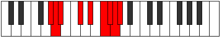

# Mode Aerathyllic

## Links

- [Documentation](index.md)
- [Scales Index](Scales.md)
- [Modes Index](Modes.md)
- [Chords Index](Chords.md)

## Parent Scale

[Phranyllic](ScalePhranyllic.md)

## Number

[3751](https://ianring.com/musictheory/scales/3751)

## Perfection

- 5 Perfect notes
- 3 Perfect notes

## Perfection Profile

[true false true true true false true false]

## Permutations

| Tonic | Notes | Signature | Illustration | Audio |
|-------|-------|-----------|--------------|-------|
| [C](ModeCNaturalAerathyllic.md) | C, **C#**, D, F, G, **A**, A#, **B**, C | C |  | [midi](ModeCNaturalAerathyllic.mid) [ogg](ModeCNaturalAerathyllic.ogg) |
| [C#](ModeCSharpAerathyllic.md) | C#, **D**, D#, F#, G#, **A#**, B, **C**, C# | C |  | [midi](ModeCSharpAerathyllic.mid) [ogg](ModeCSharpAerathyllic.ogg) |
| [Db](ModeDFlatAerathyllic.md) | Db, **D**, Eb, Gb, Ab, **Bb**, B, **C**, Db | C |  | [midi](ModeDFlatAerathyllic.mid) [ogg](ModeDFlatAerathyllic.ogg) |
| [D](ModeDNaturalAerathyllic.md) | D, **D#**, E, G, A, **B**, C, **C#**, D | C |  | [midi](ModeDNaturalAerathyllic.mid) [ogg](ModeDNaturalAerathyllic.ogg) |
| [D#](ModeDSharpAerathyllic.md) | D#, **E**, F, G#, A#, **C**, C#, **D**, D# | C |  | [midi](ModeDSharpAerathyllic.mid) [ogg](ModeDSharpAerathyllic.ogg) |
| [Eb](ModeEFlatAerathyllic.md) | Eb, **E**, F, Ab, Bb, **C**, Db, **D**, Eb | C |  | [midi](ModeEFlatAerathyllic.mid) [ogg](ModeEFlatAerathyllic.ogg) |
| [E](ModeENaturalAerathyllic.md) | E, **F**, F#, A, B, **C#**, D, **D#**, E | C |  | [midi](ModeENaturalAerathyllic.mid) [ogg](ModeENaturalAerathyllic.ogg) |
| [F](ModeFNaturalAerathyllic.md) | F, **F#**, G, A#, C, **D**, D#, **E**, F | C |  | [midi](ModeFNaturalAerathyllic.mid) [ogg](ModeFNaturalAerathyllic.ogg) |
| [F#](ModeFSharpAerathyllic.md) | F#, **G**, G#, B, C#, **D#**, E, **F**, F# | C |  | [midi](ModeFSharpAerathyllic.mid) [ogg](ModeFSharpAerathyllic.ogg) |
| [Gb](ModeGFlatAerathyllic.md) | Gb, **G**, Ab, B, Db, **Eb**, E, **F**, Gb | C |  | [midi](ModeGFlatAerathyllic.mid) [ogg](ModeGFlatAerathyllic.ogg) |
| [G](ModeGNaturalAerathyllic.md) | G, **G#**, A, C, D, **E**, F, **F#**, G | C |  | [midi](ModeGNaturalAerathyllic.mid) [ogg](ModeGNaturalAerathyllic.ogg) |
| [G#](ModeGSharpAerathyllic.md) | G#, **A**, A#, C#, D#, **F**, F#, **G**, G# | C |  | [midi](ModeGSharpAerathyllic.mid) [ogg](ModeGSharpAerathyllic.ogg) |
| [Ab](ModeAFlatAerathyllic.md) | Ab, **A**, Bb, Db, Eb, **F**, Gb, **G**, Ab | C |  | [midi](ModeAFlatAerathyllic.mid) [ogg](ModeAFlatAerathyllic.ogg) |
| [A](ModeANaturalAerathyllic.md) | A, **A#**, B, D, E, **F#**, G, **G#**, A | C |  | [midi](ModeANaturalAerathyllic.mid) [ogg](ModeANaturalAerathyllic.ogg) |
| [A#](ModeASharpAerathyllic.md) | A#, **B**, C, D#, F, **G**, G#, **A**, A# | C |  | [midi](ModeASharpAerathyllic.mid) [ogg](ModeASharpAerathyllic.ogg) |
| [Bb](ModeBFlatAerathyllic.md) | Bb, **B**, C, Eb, F, **G**, Ab, **A**, Bb | C |  | [midi](ModeBFlatAerathyllic.mid) [ogg](ModeBFlatAerathyllic.ogg) |
| [B](ModeBNaturalAerathyllic.md) | B, **C**, C#, E, F#, **G#**, A, **A#**, B | C |  | [midi](ModeBNaturalAerathyllic.mid) [ogg](ModeBNaturalAerathyllic.ogg) |
