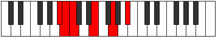
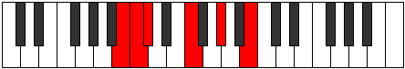

# Mode Aeritonic

## Links

- [Documentation](index.md)
- [Scales Index](Scales.md)
- [Modes Index](Modes.md)
- [Chords Index](Chords.md)

## Parent Scale

[Molitonic](ScaleMolitonic.md)

## Number

[583](https://ianring.com/musictheory/scales/583)

## Interval Pattern

1, 1, 4, 3, 3

## Chord Pattern

## Perfection

- 2 Perfect notes
- 3 Perfect notes

## Perfection Profile

[false false true true false]

## Permutations

| Tonic | Notes | Signature | Illustration | Audio |
|-------|-------|-----------|--------------|-------|
| [C](ModeCNaturalAeritonic.md) | **C**, **C#**, D, F#, **A**, **C** | C |  | [midi](https://github.com/edipermadi/music/blob/main/docs/ModeCNaturalAeritonic.mid?raw=true) |
| [C#](ModeCSharpAeritonic.md) | **C#**, **D**, D#, G, **A#**, **C#** | C |  | [midi](https://github.com/edipermadi/music/blob/main/docs/ModeCSharpAeritonic.mid?raw=true) |
| [Db](ModeDFlatAeritonic.md) | **Db**, **D**, Eb, G, **Bb**, **Db** | C |  | [midi](https://github.com/edipermadi/music/blob/main/docs/ModeDFlatAeritonic.mid?raw=true) |
| [D](ModeDNaturalAeritonic.md) | **D**, **D#**, E, G#, **B**, **D** | C |  | [midi](https://github.com/edipermadi/music/blob/main/docs/ModeDNaturalAeritonic.mid?raw=true) |
| [D#](ModeDSharpAeritonic.md) | **D#**, **E**, F, A, **C**, **D#** | C |  | [midi](https://github.com/edipermadi/music/blob/main/docs/ModeDSharpAeritonic.mid?raw=true) |
| [Eb](ModeEFlatAeritonic.md) | **Eb**, **E**, F, A, **C**, **Eb** | C |  | [midi](https://github.com/edipermadi/music/blob/main/docs/ModeEFlatAeritonic.mid?raw=true) |
| [E](ModeENaturalAeritonic.md) | **E**, **F**, F#, A#, **C#**, **E** | C |  | [midi](https://github.com/edipermadi/music/blob/main/docs/ModeENaturalAeritonic.mid?raw=true) |
| [F](ModeFNaturalAeritonic.md) | **F**, **F#**, G, B, **D**, **F** | C |  | [midi](https://github.com/edipermadi/music/blob/main/docs/ModeFNaturalAeritonic.mid?raw=true) |
| [F#](ModeFSharpAeritonic.md) | **F#**, **G**, G#, C, **D#**, **F#** | C |  | [midi](https://github.com/edipermadi/music/blob/main/docs/ModeFSharpAeritonic.mid?raw=true) |
| [Gb](ModeGFlatAeritonic.md) | **Gb**, **G**, Ab, C, **Eb**, **Gb** | C |  | [midi](https://github.com/edipermadi/music/blob/main/docs/ModeGFlatAeritonic.mid?raw=true) |
| [G](ModeGNaturalAeritonic.md) | **G**, **G#**, A, C#, **E**, **G** | C |  | [midi](https://github.com/edipermadi/music/blob/main/docs/ModeGNaturalAeritonic.mid?raw=true) |
| [G#](ModeGSharpAeritonic.md) | **G#**, **A**, A#, D, **F**, **G#** | C |  | [midi](https://github.com/edipermadi/music/blob/main/docs/ModeGSharpAeritonic.mid?raw=true) |
| [Ab](ModeAFlatAeritonic.md) | **Ab**, **A**, Bb, D, **F**, **Ab** | C |  | [midi](https://github.com/edipermadi/music/blob/main/docs/ModeAFlatAeritonic.mid?raw=true) |
| [A](ModeANaturalAeritonic.md) | **A**, **A#**, B, D#, **F#**, **A** | C |  | [midi](https://github.com/edipermadi/music/blob/main/docs/ModeANaturalAeritonic.mid?raw=true) |
| [A#](ModeASharpAeritonic.md) | **A#**, **B**, C, E, **G**, **A#** | C |  | [midi](https://github.com/edipermadi/music/blob/main/docs/ModeASharpAeritonic.mid?raw=true) |
| [Bb](ModeBFlatAeritonic.md) | **Bb**, **B**, C, E, **G**, **Bb** | C |  | [midi](https://github.com/edipermadi/music/blob/main/docs/ModeBFlatAeritonic.mid?raw=true) |
| [B](ModeBNaturalAeritonic.md) | **B**, **C**, C#, F, **G#**, **B** | C |  | [midi](https://github.com/edipermadi/music/blob/main/docs/ModeBNaturalAeritonic.mid?raw=true) |
