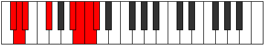
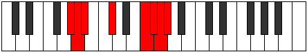

# Mode Aerocrian

## Links

- [Documentation](README.md)
- [Scales Index](Scales.md)
- [Modes Index](Modes.md)
- [Chords Index](Chords.md)

## Parent Scale

[Katyptian](ScaleKatyptian.md)

## Number

[3623](https://ianring.com/musictheory/scales/3623)

## Luminosity

-1

## Transposition

1, 1, 3, 4, 1, 1, 1

## Chord Pattern

vii⁰b3

## Perfection

- 3 Perfect notes
- 4 Perfect notes

## Perfection Profile

false, false, true, true, false, true, false

## Permutations

| Tonic | Notes | Signature | Illustration | Audio |
|-------|-------|-----------|--------------|-------|
| [C](ModeCNaturalAerocrian.md) | **C**, **Db**, Ebb, F, **G##**, A#, **B**, **C** | C |  | [midi](https://github.com/edipermadi/music/blob/main/docs/ModeCNaturalAerocrian.mid?raw=true) |
| [C#](ModeCSharpAerocrian.md) | **C#**, **D**, Eb, F#, **G###**, A##, **B#**, **C#** | C |  | [midi](https://github.com/edipermadi/music/blob/main/docs/ModeCSharpAerocrian.mid?raw=true) |
| [Db](ModeDFlatAerocrian.md) | **Db**, **Ebb**, Fbb, Gb, **A#**, B, **C**, **Db** | C |  | [midi](https://github.com/edipermadi/music/blob/main/docs/ModeDFlatAerocrian.mid?raw=true) |
| [D](ModeDNaturalAerocrian.md) | **D**, **Eb**, Fb, G, **A##**, B#, **C#**, **D** | C |  | [midi](https://github.com/edipermadi/music/blob/main/docs/ModeDNaturalAerocrian.mid?raw=true) |
| [D#](ModeDSharpAerocrian.md) | **D#**, **E**, F, G#, **A###**, B##, **C##**, **D#** | C |  | [midi](https://github.com/edipermadi/music/blob/main/docs/ModeDSharpAerocrian.mid?raw=true) |
| [Eb](ModeEFlatAerocrian.md) | **Eb**, **Fb**, Gbb, Ab, **B#**, C#, **D**, **Eb** | C |  | [midi](https://github.com/edipermadi/music/blob/main/docs/ModeEFlatAerocrian.mid?raw=true) |
| [E](ModeENaturalAerocrian.md) | **E**, **F**, Gb, A, **B##**, C##, **D#**, **E** | C |  | [midi](https://github.com/edipermadi/music/blob/main/docs/ModeENaturalAerocrian.mid?raw=true) |
| [F](ModeFNaturalAerocrian.md) | **F**, **Gb**, Abb, Bb, **C##**, D#, **E**, **F** | C |  | [midi](https://github.com/edipermadi/music/blob/main/docs/ModeFNaturalAerocrian.mid?raw=true) |
| [F#](ModeFSharpAerocrian.md) | **F#**, **G**, Ab, B, **C###**, D##, **E#**, **F#** | C |  | [midi](https://github.com/edipermadi/music/blob/main/docs/ModeFSharpAerocrian.mid?raw=true) |
| [Gb](ModeGFlatAerocrian.md) | **Gb**, **Abb**, Bbbb, Cb, **D#**, E, **F**, **Gb** | C |  | [midi](https://github.com/edipermadi/music/blob/main/docs/ModeGFlatAerocrian.mid?raw=true) |
| [G](ModeGNaturalAerocrian.md) | **G**, **Ab**, Bbb, C, **D##**, E#, **F#**, **G** | C |  | [midi](https://github.com/edipermadi/music/blob/main/docs/ModeGNaturalAerocrian.mid?raw=true) |
| [G#](ModeGSharpAerocrian.md) | **G#**, **A**, Bb, C#, **D###**, E##, **F##**, **G#** | C |  | [midi](https://github.com/edipermadi/music/blob/main/docs/ModeGSharpAerocrian.mid?raw=true) |
| [Ab](ModeAFlatAerocrian.md) | **Ab**, **Bbb**, Cbb, Db, **E#**, F#, **G**, **Ab** | C |  | [midi](https://github.com/edipermadi/music/blob/main/docs/ModeAFlatAerocrian.mid?raw=true) |
| [A](ModeANaturalAerocrian.md) | **A**, **Bb**, Cb, D, **E##**, F##, **G#**, **A** | C |  | [midi](https://github.com/edipermadi/music/blob/main/docs/ModeANaturalAerocrian.mid?raw=true) |
| [A#](ModeASharpAerocrian.md) | **A#**, **B**, C, D#, **E###**, F###, **G##**, **A#** | C |  | [midi](https://github.com/edipermadi/music/blob/main/docs/ModeASharpAerocrian.mid?raw=true) |
| [Bb](ModeBFlatAerocrian.md) | **Bb**, **Cb**, Dbb, Eb, **F##**, G#, **A**, **Bb** | C |  | [midi](https://github.com/edipermadi/music/blob/main/docs/ModeBFlatAerocrian.mid?raw=true) |
| [B](ModeBNaturalAerocrian.md) | **B**, **C**, Db, E, **F###**, G##, **A#**, **B** | C |  | [midi](https://github.com/edipermadi/music/blob/main/docs/ModeBNaturalAerocrian.mid?raw=true) |
