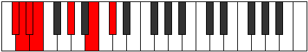
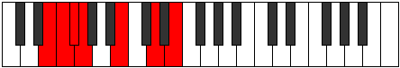
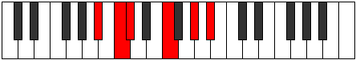

# Mode Aerodimic

## Links

- [Documentation](index.md)
- [Scales Index](Scales.md)
- [Modes Index](Modes.md)
- [Chords Index](Chords.md)

## Parent Scale

[Starimic](ScaleStarimic.md)

## Number

[1167](https://ianring.com/musictheory/scales/1167)

## Interval Pattern

1, 1, 1, 4, 3, 2

## Chord Pattern

## Perfection

- 3 Perfect notes
- 3 Perfect notes

## Perfection Profile

[true false false true true false]

## Permutations

| Tonic | Notes | Signature | Illustration | Audio |
|-------|-------|-----------|--------------|-------|
| [C](ModeCNaturalAerodimic.md) | C, **Db**, **Ebb**, Fbb, G, **A#**, C | C |  | [midi](https://github.com/edipermadi/music/blob/main/docs/ModeCNaturalAerodimic.mid?raw=true) |
| [C#](ModeCSharpAerodimic.md) | C#, **D**, **Eb**, Fb, G#, **A##**, C# | C |  | [midi](https://github.com/edipermadi/music/blob/main/docs/ModeCSharpAerodimic.mid?raw=true) |
| [Db](ModeDFlatAerodimic.md) | Db, **Ebb**, **Fbb**, Gbbb, Ab, **B**, Db | C |  | [midi](https://github.com/edipermadi/music/blob/main/docs/ModeDFlatAerodimic.mid?raw=true) |
| [D](ModeDNaturalAerodimic.md) | D, **Eb**, **Fb**, Gbb, A, **B#**, D | C |  | [midi](https://github.com/edipermadi/music/blob/main/docs/ModeDNaturalAerodimic.mid?raw=true) |
| [D#](ModeDSharpAerodimic.md) | D#, **E**, **F**, Gb, A#, **B##**, D# | C |  | [midi](https://github.com/edipermadi/music/blob/main/docs/ModeDSharpAerodimic.mid?raw=true) |
| [Eb](ModeEFlatAerodimic.md) | Eb, **Fb**, **Gbb**, Abbb, Bb, **C#**, Eb | C |  | [midi](https://github.com/edipermadi/music/blob/main/docs/ModeEFlatAerodimic.mid?raw=true) |
| [E](ModeENaturalAerodimic.md) | E, **F**, **Gb**, Abb, B, **C##**, E | C |  | [midi](https://github.com/edipermadi/music/blob/main/docs/ModeENaturalAerodimic.mid?raw=true) |
| [F](ModeFNaturalAerodimic.md) | F, **Gb**, **Abb**, Bbbb, C, **D#**, F | C |  | [midi](https://github.com/edipermadi/music/blob/main/docs/ModeFNaturalAerodimic.mid?raw=true) |
| [F#](ModeFSharpAerodimic.md) | F#, **G**, **Ab**, Bbb, C#, **D##**, F# | C |  | [midi](https://github.com/edipermadi/music/blob/main/docs/ModeFSharpAerodimic.mid?raw=true) |
| [Gb](ModeGFlatAerodimic.md) | Gb, **Abb**, **Bbbb**, Cbbb, Db, **E**, Gb | C |  | [midi](https://github.com/edipermadi/music/blob/main/docs/ModeGFlatAerodimic.mid?raw=true) |
| [G](ModeGNaturalAerodimic.md) | G, **Ab**, **Bbb**, Cbb, D, **E#**, G | C |  | [midi](https://github.com/edipermadi/music/blob/main/docs/ModeGNaturalAerodimic.mid?raw=true) |
| [G#](ModeGSharpAerodimic.md) | G#, **A**, **Bb**, Cb, D#, **E##**, G# | C |  | [midi](https://github.com/edipermadi/music/blob/main/docs/ModeGSharpAerodimic.mid?raw=true) |
| [Ab](ModeAFlatAerodimic.md) | Ab, **Bbb**, **Cbb**, Dbbb, Eb, **F#**, Ab | C |  | [midi](https://github.com/edipermadi/music/blob/main/docs/ModeAFlatAerodimic.mid?raw=true) |
| [A](ModeANaturalAerodimic.md) | A, **Bb**, **Cb**, Dbb, E, **F##**, A | C |  | [midi](https://github.com/edipermadi/music/blob/main/docs/ModeANaturalAerodimic.mid?raw=true) |
| [A#](ModeASharpAerodimic.md) | A#, **B**, **C**, Db, E#, **F###**, A# | C |  | [midi](https://github.com/edipermadi/music/blob/main/docs/ModeASharpAerodimic.mid?raw=true) |
| [Bb](ModeBFlatAerodimic.md) | Bb, **Cb**, **Dbb**, Ebbb, F, **G#**, Bb | C |  | [midi](https://github.com/edipermadi/music/blob/main/docs/ModeBFlatAerodimic.mid?raw=true) |
| [B](ModeBNaturalAerodimic.md) | B, **C**, **Db**, Ebb, F#, **G##**, B | C |  | [midi](https://github.com/edipermadi/music/blob/main/docs/ModeBNaturalAerodimic.mid?raw=true) |
