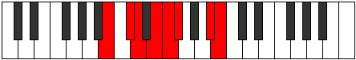

# Mode Aerogian

## Links

- [Documentation](index.md)
- [Scales Index](Scales.md)
- [Modes Index](Modes.md)
- [Chords Index](Chords.md)

## Parent Scale

[Stygian](ScaleStygian.md)

## Number

[2285](https://ianring.com/musictheory/scales/2285)

## Perfection

- 4 Perfect notes
- 3 Perfect notes

## Perfection Profile

[true false false true false true true]

## Permutations

| Tonic | Notes | Signature | Illustration | Audio |
|-------|-------|-----------|--------------|-------|
| [C](ModeCNaturalAerogian.md) | C, **D**, **Eb**, F, **Gb**, Abb, B, C | C |  | [midi](ModeCNaturalAerogian.mid) [ogg](ModeCNaturalAerogian.ogg) |
| [C#](ModeCSharpAerogian.md) | C#, **D#**, **E**, F#, **G**, Ab, B#, C# | C |  | [midi](ModeCSharpAerogian.mid) [ogg](ModeCSharpAerogian.ogg) |
| [Db](ModeDFlatAerogian.md) | Db, **Eb**, **Fb**, Gb, **Abb**, Bbbb, C, Db | C |  | [midi](ModeDFlatAerogian.mid) [ogg](ModeDFlatAerogian.ogg) |
| [D](ModeDNaturalAerogian.md) | D, **E**, **F**, G, **Ab**, Bbb, C#, D | C |  | [midi](ModeDNaturalAerogian.mid) [ogg](ModeDNaturalAerogian.ogg) |
| [D#](ModeDSharpAerogian.md) | D#, **E#**, **F#**, G#, **A**, Bb, C##, D# | C |  | [midi](ModeDSharpAerogian.mid) [ogg](ModeDSharpAerogian.ogg) |
| [Eb](ModeEFlatAerogian.md) | Eb, **F**, **Gb**, Ab, **Bbb**, Cbb, D, Eb | C |  | [midi](ModeEFlatAerogian.mid) [ogg](ModeEFlatAerogian.ogg) |
| [E](ModeENaturalAerogian.md) | E, **F#**, **G**, A, **Bb**, Cb, D#, E | C |  | [midi](ModeENaturalAerogian.mid) [ogg](ModeENaturalAerogian.ogg) |
| [F](ModeFNaturalAerogian.md) | F, **G**, **Ab**, Bb, **Cb**, Dbb, E, F | C |  | [midi](ModeFNaturalAerogian.mid) [ogg](ModeFNaturalAerogian.ogg) |
| [F#](ModeFSharpAerogian.md) | F#, **G#**, **A**, B, **C**, Db, E#, F# | C |  | [midi](ModeFSharpAerogian.mid) [ogg](ModeFSharpAerogian.ogg) |
| [Gb](ModeGFlatAerogian.md) | Gb, **Ab**, **Bbb**, Cb, **Dbb**, Ebbb, F, Gb | C |  | [midi](ModeGFlatAerogian.mid) [ogg](ModeGFlatAerogian.ogg) |
| [G](ModeGNaturalAerogian.md) | G, **A**, **Bb**, C, **Db**, Ebb, F#, G | C |  | [midi](ModeGNaturalAerogian.mid) [ogg](ModeGNaturalAerogian.ogg) |
| [G#](ModeGSharpAerogian.md) | G#, **A#**, **B**, C#, **D**, Eb, F##, G# | C |  | [midi](ModeGSharpAerogian.mid) [ogg](ModeGSharpAerogian.ogg) |
| [Ab](ModeAFlatAerogian.md) | Ab, **Bb**, **Cb**, Db, **Ebb**, Fbb, G, Ab | C |  | [midi](ModeAFlatAerogian.mid) [ogg](ModeAFlatAerogian.ogg) |
| [A](ModeANaturalAerogian.md) | A, **B**, **C**, D, **Eb**, Fb, G#, A | C |  | [midi](ModeANaturalAerogian.mid) [ogg](ModeANaturalAerogian.ogg) |
| [A#](ModeASharpAerogian.md) | A#, **B#**, **C#**, D#, **E**, F, G##, A# | C |  | [midi](ModeASharpAerogian.mid) [ogg](ModeASharpAerogian.ogg) |
| [Bb](ModeBFlatAerogian.md) | Bb, **C**, **Db**, Eb, **Fb**, Gbb, A, Bb | C |  | [midi](ModeBFlatAerogian.mid) [ogg](ModeBFlatAerogian.ogg) |
| [B](ModeBNaturalAerogian.md) | B, **C#**, **D**, E, **F**, Gb, A#, B | C |  | [midi](ModeBNaturalAerogian.mid) [ogg](ModeBNaturalAerogian.ogg) |
