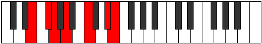
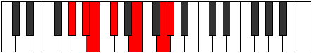

# Mode Aerogimic

## Links

- [Documentation](index.md)
- [Scales Index](Scales.md)
- [Modes Index](Modes.md)
- [Chords Index](Chords.md)

## Parent Scale

[Thalimic](ScaleThalimic.md)

## Number

[2349](https://ianring.com/musictheory/scales/2349)

## Perfection

- 2 Perfect notes
- 4 Perfect notes

## Perfection Profile

[false false false true true false]

## Permutations

| Tonic | Notes | Signature | Illustration | Audio |
|-------|-------|-----------|--------------|-------|
| [C](ModeCNaturalAerogimic.md) | **C**, **D**, **Eb**, F, G#, **A##**, **C** | C |  | [midi](ModeCNaturalAerogimic.mid) [ogg](ModeCNaturalAerogimic.ogg) |
| [C#](ModeCSharpAerogimic.md) | **C#**, **D#**, **E**, F#, G##, **A###**, **C#** | C |  | [midi](ModeCSharpAerogimic.mid) [ogg](ModeCSharpAerogimic.ogg) |
| [Db](ModeDFlatAerogimic.md) | **Db**, **Eb**, **Fb**, Gb, A, **B#**, **Db** | C |  | [midi](ModeDFlatAerogimic.mid) [ogg](ModeDFlatAerogimic.ogg) |
| [D](ModeDNaturalAerogimic.md) | **D**, **E**, **F**, G, A#, **B##**, **D** | C |  | [midi](ModeDNaturalAerogimic.mid) [ogg](ModeDNaturalAerogimic.ogg) |
| [D#](ModeDSharpAerogimic.md) | **D#**, **E#**, **F#**, G#, A##, **B###**, **D#** | C |  | [midi](ModeDSharpAerogimic.mid) [ogg](ModeDSharpAerogimic.ogg) |
| [Eb](ModeEFlatAerogimic.md) | **Eb**, **F**, **Gb**, Ab, B, **C##**, **Eb** | C |  | [midi](ModeEFlatAerogimic.mid) [ogg](ModeEFlatAerogimic.ogg) |
| [E](ModeENaturalAerogimic.md) | **E**, **F#**, **G**, A, B#, **C###**, **E** | C |  | [midi](ModeENaturalAerogimic.mid) [ogg](ModeENaturalAerogimic.ogg) |
| [F](ModeFNaturalAerogimic.md) | **F**, **G**, **Ab**, Bb, C#, **D##**, **F** | C |  | [midi](ModeFNaturalAerogimic.mid) [ogg](ModeFNaturalAerogimic.ogg) |
| [F#](ModeFSharpAerogimic.md) | **F#**, **G#**, **A**, B, C##, **D###**, **F#** | C |  | [midi](ModeFSharpAerogimic.mid) [ogg](ModeFSharpAerogimic.ogg) |
| [Gb](ModeGFlatAerogimic.md) | **Gb**, **Ab**, **Bbb**, Cb, D, **E#**, **Gb** | C |  | [midi](ModeGFlatAerogimic.mid) [ogg](ModeGFlatAerogimic.ogg) |
| [G](ModeGNaturalAerogimic.md) | **G**, **A**, **Bb**, C, D#, **E##**, **G** | C |  | [midi](ModeGNaturalAerogimic.mid) [ogg](ModeGNaturalAerogimic.ogg) |
| [G#](ModeGSharpAerogimic.md) | **G#**, **A#**, **B**, C#, D##, **E###**, **G#** | C |  | [midi](ModeGSharpAerogimic.mid) [ogg](ModeGSharpAerogimic.ogg) |
| [Ab](ModeAFlatAerogimic.md) | **Ab**, **Bb**, **Cb**, Db, E, **F##**, **Ab** | C |  | [midi](ModeAFlatAerogimic.mid) [ogg](ModeAFlatAerogimic.ogg) |
| [A](ModeANaturalAerogimic.md) | **A**, **B**, **C**, D, E#, **F###**, **A** | C |  | [midi](ModeANaturalAerogimic.mid) [ogg](ModeANaturalAerogimic.ogg) |
| [A#](ModeASharpAerogimic.md) | **A#**, **B#**, **C#**, D#, E##, **Cbbb**, **A#** | C |  | [midi](ModeASharpAerogimic.mid) [ogg](ModeASharpAerogimic.ogg) |
| [Bb](ModeBFlatAerogimic.md) | **Bb**, **C**, **Db**, Eb, F#, **G##**, **Bb** | C |  | [midi](ModeBFlatAerogimic.mid) [ogg](ModeBFlatAerogimic.ogg) |
| [B](ModeBNaturalAerogimic.md) | **B**, **C#**, **D**, E, F##, **G###**, **B** | C |  | [midi](ModeBNaturalAerogimic.mid) [ogg](ModeBNaturalAerogimic.ogg) |
