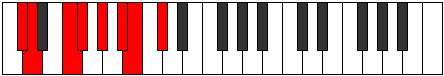

# Mode Aeronian

## Links

- [Documentation](README.md)
- [Scales Index](Scales.md)
- [Modes Index](Modes.md)
- [Chords Index](Chords.md)

## Parent Scale

[Palian](ScalePalian.md)

## Number

[1715](https://ianring.com/musictheory/scales/1715)

## Transposition

1, 3, 1, 2, 2, 1, 2

## Chord Pattern

I, II⁺, II⁺, iii⁰, IV, v⁰, vi, vii, vii

## Perfection

- 4 Perfect notes
- 3 Perfect notes

## Perfection Profile

[true false false true false true true]

## Permutations

| Tonic | Notes | Signature | Illustration | Audio |
|-------|-------|-----------|--------------|-------|
| [C](ModeCNaturalAeronian.md) | C, **Db**, **E**, F, **G**, A, Bb, C | C |  | [midi](https://github.com/edipermadi/music/blob/main/docs/ModeCNaturalAeronian.mid?raw=true) |
| [C#](ModeCSharpAeronian.md) | C#, **D**, **E#**, F#, **G#**, A#, B, C# | C |  | [midi](https://github.com/edipermadi/music/blob/main/docs/ModeCSharpAeronian.mid?raw=true) |
| [Db](ModeDFlatAeronian.md) | Db, **Ebb**, **F**, Gb, **Ab**, Bb, Cb, Db | C |  | [midi](https://github.com/edipermadi/music/blob/main/docs/ModeDFlatAeronian.mid?raw=true) |
| [D](ModeDNaturalAeronian.md) | D, **Eb**, **F#**, G, **A**, B, C, D | C |  | [midi](https://github.com/edipermadi/music/blob/main/docs/ModeDNaturalAeronian.mid?raw=true) |
| [D#](ModeDSharpAeronian.md) | D#, **E**, **F##**, G#, **A#**, B#, C#, D# | C |  | [midi](https://github.com/edipermadi/music/blob/main/docs/ModeDSharpAeronian.mid?raw=true) |
| [Eb](ModeEFlatAeronian.md) | Eb, **Fb**, **G**, Ab, **Bb**, C, Db, Eb | C |  | [midi](https://github.com/edipermadi/music/blob/main/docs/ModeEFlatAeronian.mid?raw=true) |
| [E](ModeENaturalAeronian.md) | E, **F**, **G#**, A, **B**, C#, D, E | C |  | [midi](https://github.com/edipermadi/music/blob/main/docs/ModeENaturalAeronian.mid?raw=true) |
| [F](ModeFNaturalAeronian.md) | F, **Gb**, **A**, Bb, **C**, D, Eb, F | C |  | [midi](https://github.com/edipermadi/music/blob/main/docs/ModeFNaturalAeronian.mid?raw=true) |
| [F#](ModeFSharpAeronian.md) | F#, **G**, **A#**, B, **C#**, D#, E, F# | C |  | [midi](https://github.com/edipermadi/music/blob/main/docs/ModeFSharpAeronian.mid?raw=true) |
| [Gb](ModeGFlatAeronian.md) | Gb, **Abb**, **Bb**, Cb, **Db**, Eb, Fb, Gb | C |  | [midi](https://github.com/edipermadi/music/blob/main/docs/ModeGFlatAeronian.mid?raw=true) |
| [G](ModeGNaturalAeronian.md) | G, **Ab**, **B**, C, **D**, E, F, G | C |  | [midi](https://github.com/edipermadi/music/blob/main/docs/ModeGNaturalAeronian.mid?raw=true) |
| [G#](ModeGSharpAeronian.md) | G#, **A**, **B#**, C#, **D#**, E#, F#, G# | C |  | [midi](https://github.com/edipermadi/music/blob/main/docs/ModeGSharpAeronian.mid?raw=true) |
| [Ab](ModeAFlatAeronian.md) | Ab, **Bbb**, **C**, Db, **Eb**, F, Gb, Ab | C |  | [midi](https://github.com/edipermadi/music/blob/main/docs/ModeAFlatAeronian.mid?raw=true) |
| [A](ModeANaturalAeronian.md) | A, **Bb**, **C#**, D, **E**, F#, G, A | C |  | [midi](https://github.com/edipermadi/music/blob/main/docs/ModeANaturalAeronian.mid?raw=true) |
| [A#](ModeASharpAeronian.md) | A#, **B**, **C##**, D#, **E#**, F##, G#, A# | C |  | [midi](https://github.com/edipermadi/music/blob/main/docs/ModeASharpAeronian.mid?raw=true) |
| [Bb](ModeBFlatAeronian.md) | Bb, **Cb**, **D**, Eb, **F**, G, Ab, Bb | C |  | [midi](https://github.com/edipermadi/music/blob/main/docs/ModeBFlatAeronian.mid?raw=true) |
| [B](ModeBNaturalAeronian.md) | B, **C**, **D#**, E, **F#**, G#, A, B | C |  | [midi](https://github.com/edipermadi/music/blob/main/docs/ModeBNaturalAeronian.mid?raw=true) |
