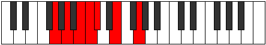

# Mode Aeronimic

## Links

- [Documentation](README.md)
- [Scales Index](Scales.md)
- [Modes Index](Modes.md)
- [Chords Index](Chords.md)

## Parent Scale

[Palimic](ScalePalimic.md)

## Number

[629](https://ianring.com/musictheory/scales/629)

## Interval Pattern

2, 2, 1, 1, 3, 3

## Chord Pattern

ii

## Perfection

- 3 Perfect notes
- 3 Perfect notes

## Perfection Profile

[false true false true false true]

## Permutations

| Tonic | Notes | Signature | Illustration | Audio |
|-------|-------|-----------|--------------|-------|
| [C](ModeCNaturalAeronimic.md) | **C**, D, **E**, F, **Gb**, A, **C** | C |  | [midi](https://github.com/edipermadi/music/blob/main/docs/ModeCNaturalAeronimic.mid?raw=true) |
| [C#](ModeCSharpAeronimic.md) | **C#**, D#, **E#**, F#, **G**, A#, **C#** | C |  | [midi](https://github.com/edipermadi/music/blob/main/docs/ModeCSharpAeronimic.mid?raw=true) |
| [Db](ModeDFlatAeronimic.md) | **Db**, Eb, **F**, Gb, **Abb**, Bb, **Db** | C |  | [midi](https://github.com/edipermadi/music/blob/main/docs/ModeDFlatAeronimic.mid?raw=true) |
| [D](ModeDNaturalAeronimic.md) | **D**, E, **F#**, G, **Ab**, B, **D** | C |  | [midi](https://github.com/edipermadi/music/blob/main/docs/ModeDNaturalAeronimic.mid?raw=true) |
| [D#](ModeDSharpAeronimic.md) | **D#**, E#, **F##**, G#, **A**, B#, **D#** | C |  | [midi](https://github.com/edipermadi/music/blob/main/docs/ModeDSharpAeronimic.mid?raw=true) |
| [Eb](ModeEFlatAeronimic.md) | **Eb**, F, **G**, Ab, **Bbb**, C, **Eb** | C |  | [midi](https://github.com/edipermadi/music/blob/main/docs/ModeEFlatAeronimic.mid?raw=true) |
| [E](ModeENaturalAeronimic.md) | **E**, F#, **G#**, A, **Bb**, C#, **E** | C |  | [midi](https://github.com/edipermadi/music/blob/main/docs/ModeENaturalAeronimic.mid?raw=true) |
| [F](ModeFNaturalAeronimic.md) | **F**, G, **A**, Bb, **Cb**, D, **F** | C |  | [midi](https://github.com/edipermadi/music/blob/main/docs/ModeFNaturalAeronimic.mid?raw=true) |
| [F#](ModeFSharpAeronimic.md) | **F#**, G#, **A#**, B, **C**, D#, **F#** | C |  | [midi](https://github.com/edipermadi/music/blob/main/docs/ModeFSharpAeronimic.mid?raw=true) |
| [Gb](ModeGFlatAeronimic.md) | **Gb**, Ab, **Bb**, Cb, **Dbb**, Eb, **Gb** | C |  | [midi](https://github.com/edipermadi/music/blob/main/docs/ModeGFlatAeronimic.mid?raw=true) |
| [G](ModeGNaturalAeronimic.md) | **G**, A, **B**, C, **Db**, E, **G** | C |  | [midi](https://github.com/edipermadi/music/blob/main/docs/ModeGNaturalAeronimic.mid?raw=true) |
| [G#](ModeGSharpAeronimic.md) | **G#**, A#, **B#**, C#, **D**, E#, **G#** | C |  | [midi](https://github.com/edipermadi/music/blob/main/docs/ModeGSharpAeronimic.mid?raw=true) |
| [Ab](ModeAFlatAeronimic.md) | **Ab**, Bb, **C**, Db, **Ebb**, F, **Ab** | C |  | [midi](https://github.com/edipermadi/music/blob/main/docs/ModeAFlatAeronimic.mid?raw=true) |
| [A](ModeANaturalAeronimic.md) | **A**, B, **C#**, D, **Eb**, F#, **A** | C |  | [midi](https://github.com/edipermadi/music/blob/main/docs/ModeANaturalAeronimic.mid?raw=true) |
| [A#](ModeASharpAeronimic.md) | **A#**, B#, **C##**, D#, **E**, F##, **A#** | C |  | [midi](https://github.com/edipermadi/music/blob/main/docs/ModeASharpAeronimic.mid?raw=true) |
| [Bb](ModeBFlatAeronimic.md) | **Bb**, C, **D**, Eb, **Fb**, G, **Bb** | C |  | [midi](https://github.com/edipermadi/music/blob/main/docs/ModeBFlatAeronimic.mid?raw=true) |
| [B](ModeBNaturalAeronimic.md) | **B**, C#, **D#**, E, **F**, G#, **B** | C |  | [midi](https://github.com/edipermadi/music/blob/main/docs/ModeBNaturalAeronimic.mid?raw=true) |
