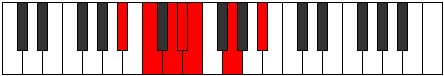

# Mode Aeronimic

## Links

- [Documentation](index.md)
- [Scales Index](Scales.md)
- [Modes Index](Modes.md)
- [Chords Index](Chords.md)

## Parent Scale

[Palimic](ScalePalimic.md)

## Number

[629](https://ianring.com/musictheory/scales/629)

## Perfection

- 3 Perfect notes
- 3 Perfect notes

## Perfection Profile

[false true false true false true]

## Permutations

| Tonic | Notes | Signature | Illustration | Audio |
|-------|-------|-----------|--------------|-------|
| [C](ModeCNaturalAeronimic.md) | **C**, D, **E**, F, **Gb**, A, **C** | C |  | [midi](ModeCNaturalAeronimic.mid) [ogg](ModeCNaturalAeronimic.ogg) |
| [C#](ModeCSharpAeronimic.md) | **C#**, D#, **E#**, F#, **G**, A#, **C#** | C |  | [midi](ModeCSharpAeronimic.mid) [ogg](ModeCSharpAeronimic.ogg) |
| [Db](ModeDFlatAeronimic.md) | **Db**, Eb, **F**, Gb, **Abb**, Bb, **Db** | C |  | [midi](ModeDFlatAeronimic.mid) [ogg](ModeDFlatAeronimic.ogg) |
| [D](ModeDNaturalAeronimic.md) | **D**, E, **F#**, G, **Ab**, B, **D** | C |  | [midi](ModeDNaturalAeronimic.mid) [ogg](ModeDNaturalAeronimic.ogg) |
| [D#](ModeDSharpAeronimic.md) | **D#**, E#, **F##**, G#, **A**, B#, **D#** | C |  | [midi](ModeDSharpAeronimic.mid) [ogg](ModeDSharpAeronimic.ogg) |
| [Eb](ModeEFlatAeronimic.md) | **Eb**, F, **G**, Ab, **Bbb**, C, **Eb** | C |  | [midi](ModeEFlatAeronimic.mid) [ogg](ModeEFlatAeronimic.ogg) |
| [E](ModeENaturalAeronimic.md) | **E**, F#, **G#**, A, **Bb**, C#, **E** | C |  | [midi](ModeENaturalAeronimic.mid) [ogg](ModeENaturalAeronimic.ogg) |
| [F](ModeFNaturalAeronimic.md) | **F**, G, **A**, Bb, **Cb**, D, **F** | C |  | [midi](ModeFNaturalAeronimic.mid) [ogg](ModeFNaturalAeronimic.ogg) |
| [F#](ModeFSharpAeronimic.md) | **F#**, G#, **A#**, B, **C**, D#, **F#** | C |  | [midi](ModeFSharpAeronimic.mid) [ogg](ModeFSharpAeronimic.ogg) |
| [Gb](ModeGFlatAeronimic.md) | **Gb**, Ab, **Bb**, Cb, **Dbb**, Eb, **Gb** | C |  | [midi](ModeGFlatAeronimic.mid) [ogg](ModeGFlatAeronimic.ogg) |
| [G](ModeGNaturalAeronimic.md) | **G**, A, **B**, C, **Db**, E, **G** | C |  | [midi](ModeGNaturalAeronimic.mid) [ogg](ModeGNaturalAeronimic.ogg) |
| [G#](ModeGSharpAeronimic.md) | **G#**, A#, **B#**, C#, **D**, E#, **G#** | C |  | [midi](ModeGSharpAeronimic.mid) [ogg](ModeGSharpAeronimic.ogg) |
| [Ab](ModeAFlatAeronimic.md) | **Ab**, Bb, **C**, Db, **Ebb**, F, **Ab** | C |  | [midi](ModeAFlatAeronimic.mid) [ogg](ModeAFlatAeronimic.ogg) |
| [A](ModeANaturalAeronimic.md) | **A**, B, **C#**, D, **Eb**, F#, **A** | C |  | [midi](ModeANaturalAeronimic.mid) [ogg](ModeANaturalAeronimic.ogg) |
| [A#](ModeASharpAeronimic.md) | **A#**, B#, **C##**, D#, **E**, F##, **A#** | C |  | [midi](ModeASharpAeronimic.mid) [ogg](ModeASharpAeronimic.ogg) |
| [Bb](ModeBFlatAeronimic.md) | **Bb**, C, **D**, Eb, **Fb**, G, **Bb** | C |  | [midi](ModeBFlatAeronimic.mid) [ogg](ModeBFlatAeronimic.ogg) |
| [B](ModeBNaturalAeronimic.md) | **B**, C#, **D#**, E, **F**, G#, **B** | C |  | [midi](ModeBNaturalAeronimic.mid) [ogg](ModeBNaturalAeronimic.ogg) |
