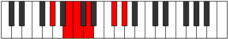

# Mode Aeronitonic

## Links

- [Documentation](index.md)
- [Scales Index](Scales.md)
- [Modes Index](Modes.md)
- [Chords Index](Chords.md)

## Parent Scale

[Phronitonic](ScalePhronitonic.md)

## Number

[1113](https://ianring.com/musictheory/scales/1113)

## Perfection

- 1 Perfect notes
- 4 Perfect notes

## Perfection Profile

[false true false false false]

## Permutations

| Tonic | Notes | Signature | Illustration | Audio |
|-------|-------|-----------|--------------|-------|
| [C](ModeCNaturalAeronitonic.md) | **C**, D#, **E**, **F#**, **A#**, **C** | C |  | [midi](ModeCNaturalAeronitonic.mid) [ogg](ModeCNaturalAeronitonic.ogg) |
| [C#](ModeCSharpAeronitonic.md) | **C#**, E, **F**, **G**, **B**, **C#** | C |  | [midi](ModeCSharpAeronitonic.mid) [ogg](ModeCSharpAeronitonic.ogg) |
| [Db](ModeDFlatAeronitonic.md) | **Db**, E, **F**, **G**, **B**, **Db** | C |  | [midi](ModeDFlatAeronitonic.mid) [ogg](ModeDFlatAeronitonic.ogg) |
| [D](ModeDNaturalAeronitonic.md) | **D**, F, **F#**, **G#**, **C**, **D** | C |  | [midi](ModeDNaturalAeronitonic.mid) [ogg](ModeDNaturalAeronitonic.ogg) |
| [D#](ModeDSharpAeronitonic.md) | **D#**, F#, **G**, **A**, **C#**, **D#** | C |  | [midi](ModeDSharpAeronitonic.mid) [ogg](ModeDSharpAeronitonic.ogg) |
| [Eb](ModeEFlatAeronitonic.md) | **Eb**, Gb, **G**, **A**, **Db**, **Eb** | C |  | [midi](ModeEFlatAeronitonic.mid) [ogg](ModeEFlatAeronitonic.ogg) |
| [E](ModeENaturalAeronitonic.md) | **E**, G, **G#**, **A#**, **D**, **E** | C |  | [midi](ModeENaturalAeronitonic.mid) [ogg](ModeENaturalAeronitonic.ogg) |
| [F](ModeFNaturalAeronitonic.md) | **F**, G#, **A**, **B**, **D#**, **F** | C |  | [midi](ModeFNaturalAeronitonic.mid) [ogg](ModeFNaturalAeronitonic.ogg) |
| [F#](ModeFSharpAeronitonic.md) | **F#**, A, **A#**, **C**, **E**, **F#** | C |  | [midi](ModeFSharpAeronitonic.mid) [ogg](ModeFSharpAeronitonic.ogg) |
| [Gb](ModeGFlatAeronitonic.md) | **Gb**, A, **Bb**, **C**, **E**, **Gb** | C |  | [midi](ModeGFlatAeronitonic.mid) [ogg](ModeGFlatAeronitonic.ogg) |
| [G](ModeGNaturalAeronitonic.md) | **G**, A#, **B**, **C#**, **F**, **G** | C |  | [midi](ModeGNaturalAeronitonic.mid) [ogg](ModeGNaturalAeronitonic.ogg) |
| [G#](ModeGSharpAeronitonic.md) | **G#**, B, **C**, **D**, **F#**, **G#** | C |  | [midi](ModeGSharpAeronitonic.mid) [ogg](ModeGSharpAeronitonic.ogg) |
| [Ab](ModeAFlatAeronitonic.md) | **Ab**, B, **C**, **D**, **Gb**, **Ab** | C |  | [midi](ModeAFlatAeronitonic.mid) [ogg](ModeAFlatAeronitonic.ogg) |
| [A](ModeANaturalAeronitonic.md) | **A**, C, **C#**, **D#**, **G**, **A** | C |  | [midi](ModeANaturalAeronitonic.mid) [ogg](ModeANaturalAeronitonic.ogg) |
| [A#](ModeASharpAeronitonic.md) | **A#**, C#, **D**, **E**, **G#**, **A#** | C |  | [midi](ModeASharpAeronitonic.mid) [ogg](ModeASharpAeronitonic.ogg) |
| [Bb](ModeBFlatAeronitonic.md) | **Bb**, Db, **D**, **E**, **Ab**, **Bb** | C |  | [midi](ModeBFlatAeronitonic.mid) [ogg](ModeBFlatAeronitonic.ogg) |
| [B](ModeBNaturalAeronitonic.md) | **B**, D, **D#**, **F**, **A**, **B** | C |  | [midi](ModeBNaturalAeronitonic.mid) [ogg](ModeBNaturalAeronitonic.ogg) |
