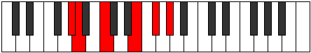
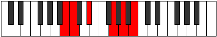

# Mode Aerophitonic

## Links

- [Documentation](index.md)
- [Scales Index](Scales.md)
- [Modes Index](Modes.md)
- [Chords Index](Chords.md)

## Parent Scale

[Aerynitonic](ScaleAerynitonic.md)

## Number

[1299](https://ianring.com/musictheory/scales/1299)

## Interval Pattern

1, 3, 4, 2, 2

## Chord Pattern

I⁺, ii, III⁺, IV⁺, v⁰

## Perfection

- 1 Perfect notes
- 4 Perfect notes

## Perfection Profile

[false true false false false]

## Permutations

| Tonic | Notes | Signature | Illustration | Audio |
|-------|-------|-----------|--------------|-------|
| [C](ModeCNaturalAerophitonic.md) | **C**, C#, **E**, **G#**, **A#**, **C** | C |  | [midi](https://github.com/edipermadi/music/blob/main/docs/ModeCNaturalAerophitonic.mid?raw=true) |
| [C#](ModeCSharpAerophitonic.md) | **C#**, D, **F**, **A**, **B**, **C#** | C |  | [midi](https://github.com/edipermadi/music/blob/main/docs/ModeCSharpAerophitonic.mid?raw=true) |
| [Db](ModeDFlatAerophitonic.md) | **Db**, D, **F**, **A**, **B**, **Db** | C |  | [midi](https://github.com/edipermadi/music/blob/main/docs/ModeDFlatAerophitonic.mid?raw=true) |
| [D](ModeDNaturalAerophitonic.md) | **D**, D#, **F#**, **A#**, **C**, **D** | C |  | [midi](https://github.com/edipermadi/music/blob/main/docs/ModeDNaturalAerophitonic.mid?raw=true) |
| [D#](ModeDSharpAerophitonic.md) | **D#**, E, **G**, **B**, **C#**, **D#** | C |  | [midi](https://github.com/edipermadi/music/blob/main/docs/ModeDSharpAerophitonic.mid?raw=true) |
| [Eb](ModeEFlatAerophitonic.md) | **Eb**, E, **G**, **B**, **Db**, **Eb** | C |  | [midi](https://github.com/edipermadi/music/blob/main/docs/ModeEFlatAerophitonic.mid?raw=true) |
| [E](ModeENaturalAerophitonic.md) | **E**, F, **G#**, **C**, **D**, **E** | C |  | [midi](https://github.com/edipermadi/music/blob/main/docs/ModeENaturalAerophitonic.mid?raw=true) |
| [F](ModeFNaturalAerophitonic.md) | **F**, F#, **A**, **C#**, **D#**, **F** | C |  | [midi](https://github.com/edipermadi/music/blob/main/docs/ModeFNaturalAerophitonic.mid?raw=true) |
| [F#](ModeFSharpAerophitonic.md) | **F#**, G, **A#**, **D**, **E**, **F#** | C |  | [midi](https://github.com/edipermadi/music/blob/main/docs/ModeFSharpAerophitonic.mid?raw=true) |
| [Gb](ModeGFlatAerophitonic.md) | **Gb**, G, **Bb**, **D**, **E**, **Gb** | C |  | [midi](https://github.com/edipermadi/music/blob/main/docs/ModeGFlatAerophitonic.mid?raw=true) |
| [G](ModeGNaturalAerophitonic.md) | **G**, G#, **B**, **D#**, **F**, **G** | C |  | [midi](https://github.com/edipermadi/music/blob/main/docs/ModeGNaturalAerophitonic.mid?raw=true) |
| [G#](ModeGSharpAerophitonic.md) | **G#**, A, **C**, **E**, **F#**, **G#** | C |  | [midi](https://github.com/edipermadi/music/blob/main/docs/ModeGSharpAerophitonic.mid?raw=true) |
| [Ab](ModeAFlatAerophitonic.md) | **Ab**, A, **C**, **E**, **Gb**, **Ab** | C |  | [midi](https://github.com/edipermadi/music/blob/main/docs/ModeAFlatAerophitonic.mid?raw=true) |
| [A](ModeANaturalAerophitonic.md) | **A**, A#, **C#**, **F**, **G**, **A** | C |  | [midi](https://github.com/edipermadi/music/blob/main/docs/ModeANaturalAerophitonic.mid?raw=true) |
| [A#](ModeASharpAerophitonic.md) | **A#**, B, **D**, **F#**, **G#**, **A#** | C |  | [midi](https://github.com/edipermadi/music/blob/main/docs/ModeASharpAerophitonic.mid?raw=true) |
| [Bb](ModeBFlatAerophitonic.md) | **Bb**, B, **D**, **Gb**, **Ab**, **Bb** | C |  | [midi](https://github.com/edipermadi/music/blob/main/docs/ModeBFlatAerophitonic.mid?raw=true) |
| [B](ModeBNaturalAerophitonic.md) | **B**, C, **D#**, **G**, **A**, **B** | C |  | [midi](https://github.com/edipermadi/music/blob/main/docs/ModeBNaturalAerophitonic.mid?raw=true) |
