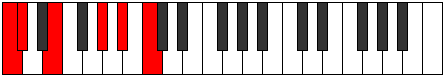
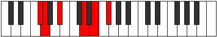

# Mode Aerophitonic

## Links

- [Documentation](index.md)
- [Scales Index](Scales.md)
- [Modes Index](Modes.md)
- [Chords Index](Chords.md)

## Parent Scale

[Aerynitonic](ScaleAerynitonic.md)

## Number

[1299](https://ianring.com/musictheory/scales/1299)

## Perfection

- 1 Perfect notes
- 4 Perfect notes

## Perfection Profile

[false true false false false]

## Permutations

| Tonic | Notes | Signature | Illustration | Audio |
|-------|-------|-----------|--------------|-------|
| [C](ModeCNaturalAerophitonic.md) | **C**, C#, **E**, **G#**, **A#**, **C** | C |  | [midi](ModeCNaturalAerophitonic.mid) [ogg](ModeCNaturalAerophitonic.ogg) |
| [C#](ModeCSharpAerophitonic.md) | **C#**, D, **F**, **A**, **B**, **C#** | C |  | [midi](ModeCSharpAerophitonic.mid) [ogg](ModeCSharpAerophitonic.ogg) |
| [Db](ModeDFlatAerophitonic.md) | **Db**, D, **F**, **A**, **B**, **Db** | C |  | [midi](ModeDFlatAerophitonic.mid) [ogg](ModeDFlatAerophitonic.ogg) |
| [D](ModeDNaturalAerophitonic.md) | **D**, D#, **F#**, **A#**, **C**, **D** | C |  | [midi](ModeDNaturalAerophitonic.mid) [ogg](ModeDNaturalAerophitonic.ogg) |
| [D#](ModeDSharpAerophitonic.md) | **D#**, E, **G**, **B**, **C#**, **D#** | C |  | [midi](ModeDSharpAerophitonic.mid) [ogg](ModeDSharpAerophitonic.ogg) |
| [Eb](ModeEFlatAerophitonic.md) | **Eb**, E, **G**, **B**, **Db**, **Eb** | C |  | [midi](ModeEFlatAerophitonic.mid) [ogg](ModeEFlatAerophitonic.ogg) |
| [E](ModeENaturalAerophitonic.md) | **E**, F, **G#**, **C**, **D**, **E** | C |  | [midi](ModeENaturalAerophitonic.mid) [ogg](ModeENaturalAerophitonic.ogg) |
| [F](ModeFNaturalAerophitonic.md) | **F**, F#, **A**, **C#**, **D#**, **F** | C |  | [midi](ModeFNaturalAerophitonic.mid) [ogg](ModeFNaturalAerophitonic.ogg) |
| [F#](ModeFSharpAerophitonic.md) | **F#**, G, **A#**, **D**, **E**, **F#** | C |  | [midi](ModeFSharpAerophitonic.mid) [ogg](ModeFSharpAerophitonic.ogg) |
| [Gb](ModeGFlatAerophitonic.md) | **Gb**, G, **Bb**, **D**, **E**, **Gb** | C |  | [midi](ModeGFlatAerophitonic.mid) [ogg](ModeGFlatAerophitonic.ogg) |
| [G](ModeGNaturalAerophitonic.md) | **G**, G#, **B**, **D#**, **F**, **G** | C |  | [midi](ModeGNaturalAerophitonic.mid) [ogg](ModeGNaturalAerophitonic.ogg) |
| [G#](ModeGSharpAerophitonic.md) | **G#**, A, **C**, **E**, **F#**, **G#** | C |  | [midi](ModeGSharpAerophitonic.mid) [ogg](ModeGSharpAerophitonic.ogg) |
| [Ab](ModeAFlatAerophitonic.md) | **Ab**, A, **C**, **E**, **Gb**, **Ab** | C |  | [midi](ModeAFlatAerophitonic.mid) [ogg](ModeAFlatAerophitonic.ogg) |
| [A](ModeANaturalAerophitonic.md) | **A**, A#, **C#**, **F**, **G**, **A** | C |  | [midi](ModeANaturalAerophitonic.mid) [ogg](ModeANaturalAerophitonic.ogg) |
| [A#](ModeASharpAerophitonic.md) | **A#**, B, **D**, **F#**, **G#**, **A#** | C |  | [midi](ModeASharpAerophitonic.mid) [ogg](ModeASharpAerophitonic.ogg) |
| [Bb](ModeBFlatAerophitonic.md) | **Bb**, B, **D**, **Gb**, **Ab**, **Bb** | C |  | [midi](ModeBFlatAerophitonic.mid) [ogg](ModeBFlatAerophitonic.ogg) |
| [B](ModeBNaturalAerophitonic.md) | **B**, C, **D#**, **G**, **A**, **B** | C |  | [midi](ModeBNaturalAerophitonic.mid) [ogg](ModeBNaturalAerophitonic.ogg) |
