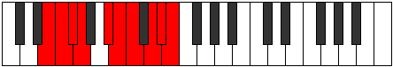

# Mode Aeroptygic

## Links

- [Documentation](README.md)
- [Scales Index](Scales.md)
- [Modes Index](Modes.md)
- [Chords Index](Chords.md)

## Parent Scale

[Kalygic](ScaleKalygic.md)

## Number

[3535](https://ianring.com/musictheory/scales/3535)

## Interval Pattern

1, 1, 1, 3, 1, 1, 2, 1, 1

## Chord Pattern

IV

## Perfection

- 7 Perfect notes
- 2 Perfect notes

## Perfection Profile

[true true false true true true true false true]

## Permutations

| Tonic | Notes | Signature | Illustration | Audio |
|-------|-------|-----------|--------------|-------|
| [C](ModeCNaturalAeroptygic.md) | C, C#, **D**, D#, F#, G, G#, **A#**, B, C | C |  | [midi](https://github.com/edipermadi/music/blob/main/docs/ModeCNaturalAeroptygic.mid?raw=true) |
| [C#](ModeCSharpAeroptygic.md) | C#, D, **D#**, E, G, G#, A, **B**, C, C# | C |  | [midi](https://github.com/edipermadi/music/blob/main/docs/ModeCSharpAeroptygic.mid?raw=true) |
| [Db](ModeDFlatAeroptygic.md) | Db, D, **Eb**, E, G, Ab, A, **B**, C, Db | C |  | [midi](https://github.com/edipermadi/music/blob/main/docs/ModeDFlatAeroptygic.mid?raw=true) |
| [D](ModeDNaturalAeroptygic.md) | D, D#, **E**, F, G#, A, A#, **C**, C#, D | C |  | [midi](https://github.com/edipermadi/music/blob/main/docs/ModeDNaturalAeroptygic.mid?raw=true) |
| [D#](ModeDSharpAeroptygic.md) | D#, E, **F**, F#, A, A#, B, **C#**, D, D# | C |  | [midi](https://github.com/edipermadi/music/blob/main/docs/ModeDSharpAeroptygic.mid?raw=true) |
| [Eb](ModeEFlatAeroptygic.md) | Eb, E, **F**, Gb, A, Bb, B, **Db**, D, Eb | C |  | [midi](https://github.com/edipermadi/music/blob/main/docs/ModeEFlatAeroptygic.mid?raw=true) |
| [E](ModeENaturalAeroptygic.md) | E, F, **F#**, G, A#, B, C, **D**, D#, E | C |  | [midi](https://github.com/edipermadi/music/blob/main/docs/ModeENaturalAeroptygic.mid?raw=true) |
| [F](ModeFNaturalAeroptygic.md) | F, F#, **G**, G#, B, C, C#, **D#**, E, F | C |  | [midi](https://github.com/edipermadi/music/blob/main/docs/ModeFNaturalAeroptygic.mid?raw=true) |
| [F#](ModeFSharpAeroptygic.md) | F#, G, **G#**, A, C, C#, D, **E**, F, F# | C |  | [midi](https://github.com/edipermadi/music/blob/main/docs/ModeFSharpAeroptygic.mid?raw=true) |
| [Gb](ModeGFlatAeroptygic.md) | Gb, G, **Ab**, A, C, Db, D, **E**, F, Gb | C |  | [midi](https://github.com/edipermadi/music/blob/main/docs/ModeGFlatAeroptygic.mid?raw=true) |
| [G](ModeGNaturalAeroptygic.md) | G, G#, **A**, A#, C#, D, D#, **F**, F#, G | C |  | [midi](https://github.com/edipermadi/music/blob/main/docs/ModeGNaturalAeroptygic.mid?raw=true) |
| [G#](ModeGSharpAeroptygic.md) | G#, A, **A#**, B, D, D#, E, **F#**, G, G# | C |  | [midi](https://github.com/edipermadi/music/blob/main/docs/ModeGSharpAeroptygic.mid?raw=true) |
| [Ab](ModeAFlatAeroptygic.md) | Ab, A, **Bb**, B, D, Eb, E, **Gb**, G, Ab | C |  | [midi](https://github.com/edipermadi/music/blob/main/docs/ModeAFlatAeroptygic.mid?raw=true) |
| [A](ModeANaturalAeroptygic.md) | A, A#, **B**, C, D#, E, F, **G**, G#, A | C |  | [midi](https://github.com/edipermadi/music/blob/main/docs/ModeANaturalAeroptygic.mid?raw=true) |
| [A#](ModeASharpAeroptygic.md) | A#, B, **C**, C#, E, F, F#, **G#**, A, A# | C |  | [midi](https://github.com/edipermadi/music/blob/main/docs/ModeASharpAeroptygic.mid?raw=true) |
| [Bb](ModeBFlatAeroptygic.md) | Bb, B, **C**, Db, E, F, Gb, **Ab**, A, Bb | C |  | [midi](https://github.com/edipermadi/music/blob/main/docs/ModeBFlatAeroptygic.mid?raw=true) |
| [B](ModeBNaturalAeroptygic.md) | B, C, **C#**, D, F, F#, G, **A**, A#, B | C |  | [midi](https://github.com/edipermadi/music/blob/main/docs/ModeBNaturalAeroptygic.mid?raw=true) |
