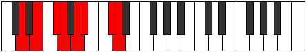

# Mode Aerorian

## Links

- [Documentation](README.md)
- [Scales Index](Scales.md)
- [Modes Index](Modes.md)
- [Chords Index](Chords.md)

## Parent Scale

[Palian](ScalePalian.md)

## Number

[2485](https://ianring.com/musictheory/scales/2485)

## Interval Pattern

2, 2, 1, 2, 1, 3, 1

## Chord Pattern

I, ii⁰, iii, iv, V, VI⁺, vii⁰

## Perfection

- 4 Perfect notes
- 3 Perfect notes

## Perfection Profile

[true false true true true false false]

## Permutations

| Tonic | Notes | Signature | Illustration | Audio |
|-------|-------|-----------|--------------|-------|
| [C](ModeCNaturalAerorian.md) | C, **D**, E, F, G, **Ab**, **B**, C | C |  | [midi](https://github.com/edipermadi/music/blob/main/docs/ModeCNaturalAerorian.mid?raw=true) |
| [C#](ModeCSharpAerorian.md) | C#, **D#**, E#, F#, G#, **A**, **B#**, C# | C |  | [midi](https://github.com/edipermadi/music/blob/main/docs/ModeCSharpAerorian.mid?raw=true) |
| [Db](ModeDFlatAerorian.md) | Db, **Eb**, F, Gb, Ab, **Bbb**, **C**, Db | C |  | [midi](https://github.com/edipermadi/music/blob/main/docs/ModeDFlatAerorian.mid?raw=true) |
| [D](ModeDNaturalAerorian.md) | D, **E**, F#, G, A, **Bb**, **C#**, D | C |  | [midi](https://github.com/edipermadi/music/blob/main/docs/ModeDNaturalAerorian.mid?raw=true) |
| [D#](ModeDSharpAerorian.md) | D#, **E#**, F##, G#, A#, **B**, **C##**, D# | C |  | [midi](https://github.com/edipermadi/music/blob/main/docs/ModeDSharpAerorian.mid?raw=true) |
| [Eb](ModeEFlatAerorian.md) | Eb, **F**, G, Ab, Bb, **Cb**, **D**, Eb | C |  | [midi](https://github.com/edipermadi/music/blob/main/docs/ModeEFlatAerorian.mid?raw=true) |
| [E](ModeENaturalAerorian.md) | E, **F#**, G#, A, B, **C**, **D#**, E | C |  | [midi](https://github.com/edipermadi/music/blob/main/docs/ModeENaturalAerorian.mid?raw=true) |
| [F](ModeFNaturalAerorian.md) | F, **G**, A, Bb, C, **Db**, **E**, F | C |  | [midi](https://github.com/edipermadi/music/blob/main/docs/ModeFNaturalAerorian.mid?raw=true) |
| [F#](ModeFSharpAerorian.md) | F#, **G#**, A#, B, C#, **D**, **E#**, F# | C |  | [midi](https://github.com/edipermadi/music/blob/main/docs/ModeFSharpAerorian.mid?raw=true) |
| [Gb](ModeGFlatAerorian.md) | Gb, **Ab**, Bb, Cb, Db, **Ebb**, **F**, Gb | C |  | [midi](https://github.com/edipermadi/music/blob/main/docs/ModeGFlatAerorian.mid?raw=true) |
| [G](ModeGNaturalAerorian.md) | G, **A**, B, C, D, **Eb**, **F#**, G | C |  | [midi](https://github.com/edipermadi/music/blob/main/docs/ModeGNaturalAerorian.mid?raw=true) |
| [G#](ModeGSharpAerorian.md) | G#, **A#**, B#, C#, D#, **E**, **F##**, G# | C |  | [midi](https://github.com/edipermadi/music/blob/main/docs/ModeGSharpAerorian.mid?raw=true) |
| [Ab](ModeAFlatAerorian.md) | Ab, **Bb**, C, Db, Eb, **Fb**, **G**, Ab | C |  | [midi](https://github.com/edipermadi/music/blob/main/docs/ModeAFlatAerorian.mid?raw=true) |
| [A](ModeANaturalAerorian.md) | A, **B**, C#, D, E, **F**, **G#**, A | C |  | [midi](https://github.com/edipermadi/music/blob/main/docs/ModeANaturalAerorian.mid?raw=true) |
| [A#](ModeASharpAerorian.md) | A#, **B#**, C##, D#, E#, **F#**, **G##**, A# | C |  | [midi](https://github.com/edipermadi/music/blob/main/docs/ModeASharpAerorian.mid?raw=true) |
| [Bb](ModeBFlatAerorian.md) | Bb, **C**, D, Eb, F, **Gb**, **A**, Bb | C |  | [midi](https://github.com/edipermadi/music/blob/main/docs/ModeBFlatAerorian.mid?raw=true) |
| [B](ModeBNaturalAerorian.md) | B, **C#**, D#, E, F#, **G**, **A#**, B | C |  | [midi](https://github.com/edipermadi/music/blob/main/docs/ModeBNaturalAerorian.mid?raw=true) |
