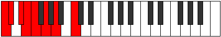

# Mode Aerothian

## Links

- [Documentation](index.md)
- [Scales Index](Scales.md)
- [Modes Index](Modes.md)
- [Chords Index](Chords.md)

## Parent Scale

[Ionanian](ScaleIonanian.md)

## Number

[699](https://ianring.com/musictheory/scales/699)

## Perfection

- 3 Perfect notes
- 4 Perfect notes

## Perfection Profile

[true false false false true false true]

## Permutations

| Tonic | Notes | Signature | Illustration | Audio |
|-------|-------|-----------|--------------|-------|
| [C](ModeCNaturalAerothian.md) | C, **Db**, **Eb**, **Fb**, Gbb, **Abb**, Bbb, C | C |  | [midi](ModeCNaturalAerothian.mid) [ogg](ModeCNaturalAerothian.ogg) |
| [C#](ModeCSharpAerothian.md) | C#, **D**, **E**, **F**, Gb, **Ab**, Bb, C# | C |  | [midi](ModeCSharpAerothian.mid) [ogg](ModeCSharpAerothian.ogg) |
| [Db](ModeDFlatAerothian.md) | Db, **Ebb**, **Fb**, **Gbb**, Abbb, **Bbbb**, Cbb, Db | C |  | [midi](ModeDFlatAerothian.mid) [ogg](ModeDFlatAerothian.ogg) |
| [D](ModeDNaturalAerothian.md) | D, **Eb**, **F**, **Gb**, Abb, **Bbb**, Cb, D | C |  | [midi](ModeDNaturalAerothian.mid) [ogg](ModeDNaturalAerothian.ogg) |
| [D#](ModeDSharpAerothian.md) | D#, **E**, **F#**, **G**, Ab, **Bb**, C, D# | C |  | [midi](ModeDSharpAerothian.mid) [ogg](ModeDSharpAerothian.ogg) |
| [Eb](ModeEFlatAerothian.md) | Eb, **Fb**, **Gb**, **Abb**, Bbbb, **Cbb**, Dbb, Eb | C |  | [midi](ModeEFlatAerothian.mid) [ogg](ModeEFlatAerothian.ogg) |
| [E](ModeENaturalAerothian.md) | E, **F**, **G**, **Ab**, Bbb, **Cb**, Db, E | C |  | [midi](ModeENaturalAerothian.mid) [ogg](ModeENaturalAerothian.ogg) |
| [F](ModeFNaturalAerothian.md) | F, **Gb**, **Ab**, **Bbb**, Cbb, **Dbb**, Ebb, F | C |  | [midi](ModeFNaturalAerothian.mid) [ogg](ModeFNaturalAerothian.ogg) |
| [F#](ModeFSharpAerothian.md) | F#, **G**, **A**, **Bb**, Cb, **Db**, Eb, F# | C |  | [midi](ModeFSharpAerothian.mid) [ogg](ModeFSharpAerothian.ogg) |
| [Gb](ModeGFlatAerothian.md) | Gb, **Abb**, **Bbb**, **Cbb**, Dbbb, **Ebbb**, Fbb, Gb | C |  | [midi](ModeGFlatAerothian.mid) [ogg](ModeGFlatAerothian.ogg) |
| [G](ModeGNaturalAerothian.md) | G, **Ab**, **Bb**, **Cb**, Dbb, **Ebb**, Fb, G | C |  | [midi](ModeGNaturalAerothian.mid) [ogg](ModeGNaturalAerothian.ogg) |
| [G#](ModeGSharpAerothian.md) | G#, **A**, **B**, **C**, Db, **Eb**, F, G# | C |  | [midi](ModeGSharpAerothian.mid) [ogg](ModeGSharpAerothian.ogg) |
| [Ab](ModeAFlatAerothian.md) | Ab, **Bbb**, **Cb**, **Dbb**, Ebbb, **Fbb**, Gbb, Ab | C |  | [midi](ModeAFlatAerothian.mid) [ogg](ModeAFlatAerothian.ogg) |
| [A](ModeANaturalAerothian.md) | A, **Bb**, **C**, **Db**, Ebb, **Fb**, Gb, A | C |  | [midi](ModeANaturalAerothian.mid) [ogg](ModeANaturalAerothian.ogg) |
| [A#](ModeASharpAerothian.md) | A#, **B**, **C#**, **D**, Eb, **F**, G, A# | C |  | [midi](ModeASharpAerothian.mid) [ogg](ModeASharpAerothian.ogg) |
| [Bb](ModeBFlatAerothian.md) | Bb, **Cb**, **Db**, **Ebb**, Fbb, **Gbb**, Abb, Bb | C |  | [midi](ModeBFlatAerothian.mid) [ogg](ModeBFlatAerothian.ogg) |
| [B](ModeBNaturalAerothian.md) | B, **C**, **D**, **Eb**, Fb, **Gb**, Ab, B | C |  | [midi](ModeBNaturalAerothian.mid) [ogg](ModeBNaturalAerothian.ogg) |
